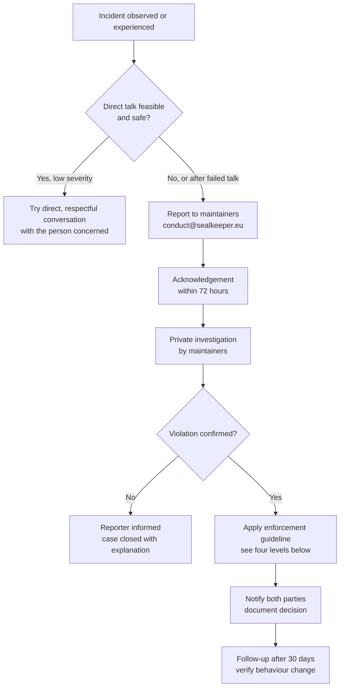

# Contributor Covenant Code of Conduct

## Our Pledge

We as members, contributors, and leaders pledge to make participation in the SealKeeper community a harassment-free experience for everyone, regardless of age, body size, visible or invisible disability, ethnicity, sex characteristics, gender identity and expression, level of experience, education, socio-economic status, nationality, personal appearance, race, caste, colour, religion, or sexual identity and orientation.

We pledge to act and interact in ways that contribute to an open, welcoming, diverse, inclusive, and healthy community.

## Our Standards

Examples of behaviour that contributes to a positive environment for our community include:

- Demonstrating empathy and kindness toward other people
- Being respectful of differing opinions, viewpoints, and experiences
- Giving and gracefully accepting constructive feedback
- Accepting responsibility and apologising to those affected by our mistakes, and learning from the experience
- Focusing on what is best not just for us as individuals, but for the overall community

Examples of unacceptable behaviour include:

- The use of sexualised language or imagery, and sexual attention or advances of any kind
- Trolling, insulting or derogatory comments, and personal or political attacks
- Public or private harassment
- Publishing others' private information, such as a physical or email address, without their explicit permission
- Other conduct which could reasonably be considered inappropriate in a professional setting

## Enforcement Responsibilities

Community leaders are responsible for clarifying and enforcing our standards of acceptable behaviour and will take appropriate and fair corrective action in response to any behaviour that they deem inappropriate, threatening, offensive, or harmful.

Community leaders have the right and responsibility to remove, edit, or reject comments, commits, code, wiki edits, issues, and other contributions that are not aligned to this Code of Conduct, and will communicate reasons for moderation decisions when appropriate.

## Scope

This Code of Conduct applies within all community spaces, and also applies when an individual is officially representing the community in public spaces. Examples of representing our community include using an official email address, posting via an official social media account, or acting as an appointed representative at an online or offline event.

Concretely, this Code applies to:

- The GitHub repository `sched75/sealkeeper` and all its issues, pull requests, discussions, and reviews
- The project website at `https://sealkeeper.eu`
- Any conference talk, podcast appearance, or public communication where the speaker represents SealKeeper
- Direct private communications between contributors when discussing project matters

## Reporting

Instances of abusive, harassing, or otherwise unacceptable behaviour may be reported to the community leaders responsible for enforcement at **`conduct@sealkeeper.eu`**.

All complaints will be reviewed and investigated promptly and fairly. All community leaders are obligated to respect the privacy and security of the reporter of any incident.

If you are uncomfortable reporting to the project maintainer directly (for example, if the incident involves the maintainer), you may also report to **`conduct-escalation@sealkeeper.eu`**, an alias monitored by an external trusted third party who can intervene as a neutral mediator.

## Enforcement Guidelines

Community leaders will follow these Community Impact Guidelines in determining the consequences for any action they deem in violation of this Code of Conduct:

### 1. Correction

**Community Impact**: Use of inappropriate language or other behaviour deemed unprofessional or unwelcome in the community.

**Consequence**: A private, written warning from community leaders, providing clarity around the nature of the violation and an explanation of why the behaviour was inappropriate. A public apology may be requested.

### 2. Warning

**Community Impact**: A violation through a single incident or series of actions.

**Consequence**: A warning with consequences for continued behaviour. No interaction with the people involved, including unsolicited interaction with those enforcing the Code of Conduct, for a specified period. This includes avoiding interactions in community spaces as well as external channels like social media. Violating these terms may lead to a temporary or permanent ban.

### 3. Temporary Ban

**Community Impact**: A serious violation of community standards, including sustained inappropriate behaviour.

**Consequence**: A temporary ban from any sort of interaction or public communication with the community for a specified period. No public or private interaction with the people involved, including unsolicited interaction with those enforcing the Code of Conduct, is allowed during this period. Violating these terms may lead to a permanent ban.

### 4. Permanent Ban

**Community Impact**: Demonstrating a pattern of violation of community standards, including sustained inappropriate behaviour, harassment of an individual, or aggression toward or disparagement of classes of individuals.

**Consequence**: A permanent ban from any sort of public interaction within the community.

## Attribution

This Code of Conduct is adapted from the [Contributor Covenant](https://www.contributor-covenant.org), version 2.1, available at [https://www.contributor-covenant.org/version/2/1/code_of_conduct.html](https://www.contributor-covenant.org/version/2/1/code_of_conduct.html).

Community Impact Guidelines were inspired by [Mozilla's code of conduct enforcement ladder](https://github.com/mozilla/diversity).

For answers to common questions about this code of conduct, see the FAQ at [https://www.contributor-covenant.org/faq](https://www.contributor-covenant.org/faq). Translations are available at [https://www.contributor-covenant.org/translations](https://www.contributor-covenant.org/translations).
