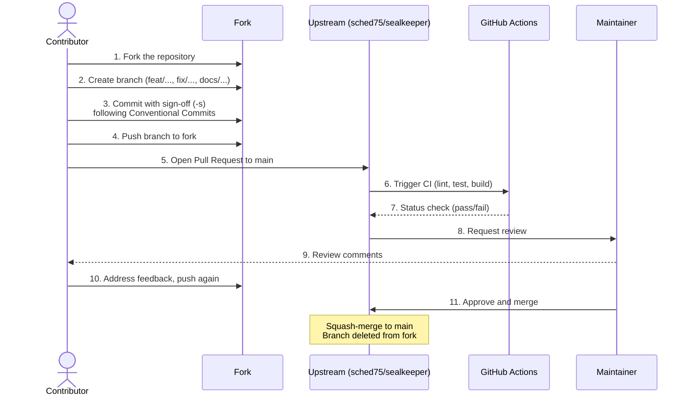
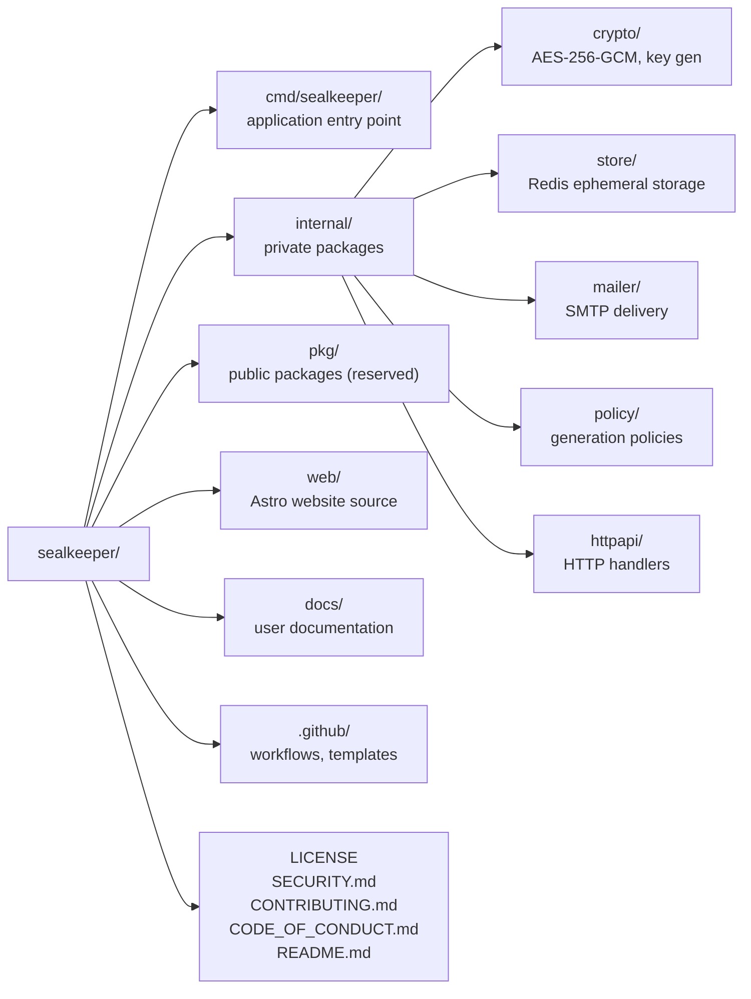

# Contributing to SealKeeper

Thank you for considering a contribution to SealKeeper. The project welcomes contributions of all kinds — bug reports, feature requests, documentation improvements, code patches, security audits, translations.

Please take a moment to read this guide before opening an issue or pull request. Following these conventions makes review faster and increases the chance your contribution is merged smoothly.

## Code of Conduct

By participating, you agree to abide by our [Code of Conduct](CODE_OF_CONDUCT.md). In short: be respectful, be patient, assume good faith, and remember that everyone is volunteering their time.

## Filing Issues

Before opening a new issue, please:

1. Search [existing issues](https://github.com/sched75/sealkeeper/issues) to avoid duplicates
2. For bugs: use the **Bug report** template and include enough information to reproduce
3. For features: use the **Feature request** template and explain the user need clearly
4. For security: **do not file a public issue** — see [`SECURITY.md`](SECURITY.md)

## Submitting Pull Requests

### Before you start

- For non-trivial changes, please open an issue first to discuss the approach. This avoids wasted work if the change is not aligned with project direction.
- For typo fixes and documentation improvements, you can submit a PR directly.

### Pull request workflow



### Pull request checklist

- [ ] Branch from `main`, with a descriptive name like `feat/add-policy-validation` or `fix/redis-reconnect`
- [ ] Each commit is signed-off (`git commit --sign-off`) — see DCO section below
- [ ] Each commit message follows the [Conventional Commits](https://www.conventionalcommits.org/) format
- [ ] New code is covered by tests (Go) where applicable
- [ ] `make lint` passes locally
- [ ] `make test` passes locally
- [ ] If the change affects user-facing behaviour, documentation is updated
- [ ] If the change affects security properties, a note is added in the PR description
- [ ] The PR description explains the motivation and links the related issue

### Developer Certificate of Origin (DCO)

SealKeeper is licensed under AGPL v3, which requires us to track the provenance of contributions. We use the [Developer Certificate of Origin](https://developercertificate.org/) for this. Each commit must include a sign-off line:

```
Signed-off-by: Your Name <your.email@example.com>
```

You can add this automatically with `git commit -s` or `git commit --sign-off`. By signing off, you certify that you have the right to submit the contribution under the project license.

### Commit message convention

We follow [Conventional Commits](https://www.conventionalcommits.org/):

```
<type>(<scope>): <short description>

<optional longer description>

<optional footer (e.g. BREAKING CHANGE, Refs #123)>

Signed-off-by: Your Name <your.email@example.com>
```

Common types: `feat`, `fix`, `docs`, `style`, `refactor`, `test`, `chore`, `perf`, `security`.

Examples:

```
feat(policy): add Diceware passphrase generation mode

fix(store): handle Redis reconnection on transient errors

docs(readme): clarify zero-knowledge guarantees

security(crypto): replace deprecated GCM implementation
```

## Development Setup

### Prerequisites

- Go 1.22 or later
- Docker (for Redis and integration tests)
- Node.js 20+ (only if working on the website)
- `make`

### Building and testing

```bash
# Clone the repository
git clone https://github.com/sched75/sealkeeper.git
cd sealkeeper

# Build the binary
make build

# Run unit tests
make test

# Run with hot reload during development
make dev

# Lint the codebase
make lint

# Build the documentation website
cd web && npm install && npm run dev
```

### Project layout



### Coding standards

- Run `gofmt -s` on all Go code before committing
- Run `golangci-lint run` and fix all reported issues
- Add the AGPL header (see `LICENSE-HEADER.txt`) at the top of every new Go file
- Add the SPDX identifier `// SPDX-License-Identifier: AGPL-3.0-or-later` as the first line of every Go file
- Write tests for new functionality (target ≥ 80% coverage on `internal/`)
- Keep functions small (≤ 50 lines) and packages cohesive
- Prefer explicit over clever — security code should be boring

## Reporting Security Issues

Please **never** report security vulnerabilities in a public issue. See [`SECURITY.md`](SECURITY.md) for the responsible disclosure process.

## Recognition

All contributors are listed in the [`CONTRIBUTORS.md`](CONTRIBUTORS.md) file (created on first non-maintainer contribution) and credited in the release notes for the versions they contributed to.

## Questions?

If anything in this guide is unclear, please open an issue with the `question` label or start a [discussion](https://github.com/sched75/sealkeeper/discussions).

Thank you for contributing to SealKeeper!
