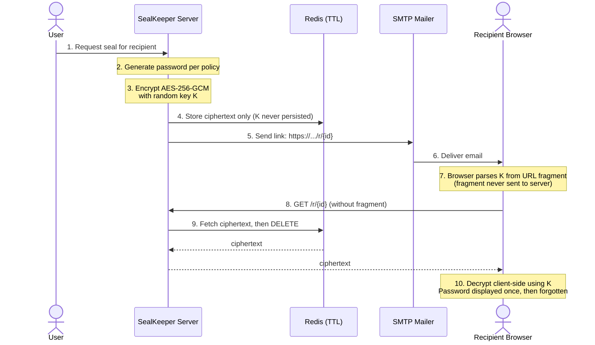

<div align="center">

# SealKeeper

**Heralds your passwords — one link, one read, never stored.**

*Ephemeral, zero-knowledge password delivery. The server can't read what it transmits.*

[](https://www.gnu.org/licenses/agpl-3.0)
[](go.mod)
[](https://github.com/sched75/sealkeeper/actions)
[](https://github.com/sched75/sealkeeper/releases)

[Website](https://sealkeeper.eu) · [Documentation](https://sealkeeper.eu/docs) · [Security](SECURITY.md) · [Contributing](CONTRIBUTING.md)

</div>

---

## What is SealKeeper?

SealKeeper is a self-hosted, open-source tool for transmitting passwords through ephemeral, one-time email links. It does one thing well: an IT administrator defines a generation policy (length, character set, dictionary, lifetime), a user requests a password for a recipient identified by email, and the recipient receives a single-use link that self-destructs after reading or expiration.

The architecture is **zero-knowledge by design**: the decryption key lives in the URL fragment (after the `#`), which browsers never transmit to the server. The server stores only an AES-256-GCM ciphertext for a short TTL and purges it on first successful read. The server **cannot read what it transmits**, and we publish the client-side decryption code openly so anyone can verify this claim.

## Why does this exist?

In every organisation, passwords are transmitted between humans dozens of times a month — onboarding, account resets, supplier credential handovers, technical handovers to integrators. The default channels (email in clear, SMS, Slack, paper notes) are inadequate, while the alternatives (full-blown password managers like 1Password, Keeper, LockSelf) are oversized for a one-shot delivery need.

SealKeeper occupies the missing middle ground: a focused, certifiable, auditable channel for ephemeral credential delivery. No vault, no file storage, no autofill, no sync — just one channel, well-built.

## Quickstart

The fastest way to try SealKeeper is via Docker Compose:

```bash
git clone https://github.com/sched75/sealkeeper.git
cd sealkeeper
docker compose up -d
```

Then open `http://localhost:8080` and follow the initial setup wizard. By default, the service uses a local Redis instance for ephemeral storage and the configured SMTP relay for email delivery.

To generate a password manually via the API:

```bash
curl -X POST http://localhost:8080/api/v1/seals \
     -H "Content-Type: application/json" \
     -d '{
       "recipient": "alice@example.com",
       "policy": "default",
       "reason": "Initial account setup",
       "ttl_minutes": 30
     }'
```

The API returns the URL that has been emailed to the recipient (for audit purposes only — the URL never contains the password itself).

## How it works



The server stores audit metadata (who, when, recipient address, request reason) but **never** the plaintext password. The decryption key K is generated in memory, used to encrypt, embedded in the URL fragment, and forgotten. The recipient's browser reads K from the URL fragment locally — fragments are by specification never transmitted in HTTP requests, so K never reaches the server.

## Configuration

SealKeeper is configured via a single YAML file (`config.yaml`) or environment variables. The full reference lives in [`docs/configuration.md`](docs/configuration.md). Key options:

| Option | Default | Description |
|---|---|---|
| `server.address` | `:8080` | HTTP listen address |
| `storage.redis_url` | `redis://localhost:6379` | Redis connection string |
| `storage.default_ttl` | `30m` | Default lifetime of a seal |
| `storage.max_ttl` | `24h` | Maximum allowed TTL |
| `mailer.smtp_host` | — | SMTP relay hostname |
| `mailer.from_address` | — | Sender address for emails |
| `policy.default.length` | `20` | Default password length |
| `policy.default.mode` | `alphanumeric` | `alphanumeric` \| `symbolic` \| `passphrase` |

## Security

SealKeeper takes security seriously. Please read [`SECURITY.md`](SECURITY.md) before reporting a vulnerability — we maintain a responsible disclosure policy, accept reports at `security@sealkeeper.eu`, and recognise contributors who help us improve the code.

The cryptographic design has not yet been independently audited. **Do not deploy in production for highly sensitive use cases without your own security review.** The codebase is intentionally kept small and readable to make such review tractable.

## Contributing

Contributions are welcome and gratefully received. Please read [`CONTRIBUTING.md`](CONTRIBUTING.md) for guidance on filing issues, submitting pull requests, and our conventions for commits and code style.

All contributors must agree to the [Developer Certificate of Origin](https://developercertificate.org/) by signing off their commits (`git commit --sign-off`). This is required because the project is licensed under AGPL v3 and we need to track provenance.

By participating, you also agree to abide by our [Code of Conduct](CODE_OF_CONDUCT.md).

## License

SealKeeper is licensed under the **GNU Affero General Public License v3.0 or later**. See [`LICENSE`](LICENSE) for the full text.

> What this means in practice: you can use, modify, and self-host SealKeeper freely for any purpose, including commercial. If you **modify** the code **and** **expose it as a network service** (SaaS, hosted offering), you must publish your modifications under the same license. Internal deployments within an organisation, even if used commercially, are **not** affected by this clause.

Copyright © 2026 Pascal-Louis Tessier.

---

<div align="center">

*Made with care in France. Heralds your passwords — never stores them.*

</div>
