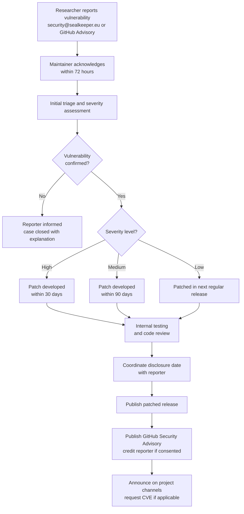

# Security Policy

SealKeeper handles cryptographic operations and credential transmission. We take security reports seriously and commit to acknowledging, investigating, and remediating valid issues in a timely manner.

## Supported Versions

| Version | Supported |
|---|---|
| Latest minor release | ✅ Active support |
| Previous minor release | ✅ Security fixes only |
| Older versions | ❌ Please upgrade |

Until we reach v1.0.0, only the latest tagged release receives security updates.

## Reporting a Vulnerability

**Please do not file public GitHub issues for security vulnerabilities.** Public disclosure before a patch is available puts users at risk.

Instead, report security issues by one of these channels, in order of preference:

1. **Email** — `security@sealkeeper.eu` (PGP encryption recommended; key fingerprint below)
2. **GitHub Security Advisories** — [private advisory form](https://github.com/sched75/sealkeeper/security/advisories/new)

### PGP Key

```
Fingerprint: TO_BE_GENERATED_BEFORE_FIRST_RELEASE
Full key:    https://sealkeeper.eu/.well-known/pgp-key.asc
```

The key will be published before the first tagged release. Until then, send reports unencrypted to the email address above; we will follow up by encrypted channel if needed.

## What to Include

A useful security report typically contains:

- A clear description of the vulnerability and its potential impact
- Steps to reproduce, ideally with a minimal proof of concept
- The affected version(s) of SealKeeper
- Your suggested remediation, if any
- Whether you wish to be credited publicly when the fix is published

We will respond within **72 hours** with an acknowledgement and an initial assessment. We aim to publish a patched release within **30 days** for high-severity issues and **90 days** for medium-severity issues.

## Scope

The following are considered in scope:

- The Go service in `cmd/sealkeeper` and packages under `internal/`
- The client-side decryption JavaScript published with the project
- The default Docker image and Docker Compose configuration
- The Astro-based website source under `web/`

The following are out of scope:

- Issues in third-party dependencies (please report them upstream)
- Configuration mistakes by operators that are documented as risky
- Social engineering of project maintainers
- Physical attacks on infrastructure
- Denial-of-service attacks from unauthenticated traffic

## Coordinated Disclosure



We follow a 90-day coordinated disclosure timeline by default. We may shorten this period for issues with active exploitation, or extend it (with the reporter's agreement) for issues requiring complex coordinated fixes.

After remediation, we publish a security advisory on the GitHub repository, credit the reporter (unless anonymity was requested), and announce the fix on the project's communication channels.

## Bug Bounty

SealKeeper is a community-funded open source project and does not currently offer monetary bug bounties. We deeply appreciate security research and recognise valid reports publicly with the reporter's permission. We are exploring partnerships with security research foundations to fund a modest bounty programme in the future.

## Past Advisories

No advisories published yet — the project is in pre-release. Once tagged releases begin, this section will list all past advisories with their CVE identifiers (if applicable).

---

Thank you for helping keep SealKeeper and its users safe.

The Maintainer
