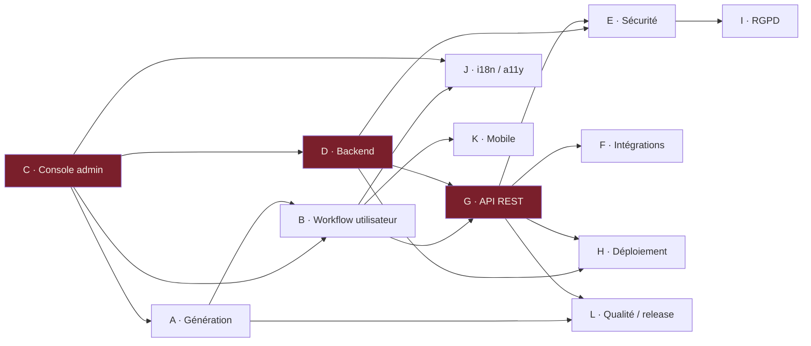

# SealKeeper — Plan de travail de spécification

**Version** : 1.0 — 16 mai 2026
**Auteur** : Pascal-Louis Tessier (assisté par Daneel / Claude)
**Statut** : à valider

---

## 1. Objectif et portée

Ce document organise la **spécification fonctionnelle complète** de SealKeeper avant écriture du code Go. Il définit la méthode, l'ordre, les livrables et les dépendances entre modules. Il sert de **référence stable** pour le suivi d'avancement.

**Ce que ce plan couvre.** Toute la spécification fonctionnelle, technique et opérationnelle nécessaire pour atteindre une version 0.1.0 pré-alpha déployable en évaluation.

**Ce que ce plan ne couvre pas.** L'écriture du code Go lui-même, le déploiement de production, la stratégie commerciale. Ces sujets feront l'objet de documents séparés.

---

## 2. Méthodologie

### 2.1 Structure du référentiel

Toute la documentation de spécification est stockée dans le repo GitHub sous `docs/prd/`. Un fichier Markdown par module, plus un index.

Le répertoire `docs/prd/` du repo contient :

- `README.md` — index, statut, ordre de lecture
- `00-work-plan.md` — ce document
- `A-generation.md`
- `B-user-workflow.md`
- `C-admin-console.md`
- `D-backend.md`
- `E-security-audit.md`
- `F-integrations.md`
- `G-api-rest.md`
- `H-deployment.md`
- `I-rgpd-compliance.md`
- `J-i18n-accessibility.md`
- `K-mobile.md`
- `L-quality-release.md`
- `adr/` — Architecture Decision Records
    - `0001-<short-title>.md`, etc.

### 2.2 Format de chaque PRD module

Chaque module suit la structure répétable suivante :

```markdown
# Module X — <nom>

## 1. Purpose
Pourquoi ce module existe, quel problème il résout.

## 2. Actors and use cases
Qui interagit avec ce module, dans quels scénarios.

## 3. Functional requirements
Liste numérotée FR-X.1, FR-X.2, ... avec niveau (MUST / SHOULD / MAY).

## 4. Non-functional requirements
Performance, sécurité, accessibilité, conformité.

## 5. Data model
Schémas, structures, relations.

## 6. Interfaces
UI mockups, API contracts, événements émis/consommés.

## 7. Edge cases and error handling
Cas limites, erreurs, comportements dégradés.

## 8. Open questions
Décisions encore à prendre, marquées TODO.

## 9. References
ANSSI, NIST, RFC, autres modules.
```

### 2.3 Outils de représentation

| Type de contenu | Outil |
|---|---|
| Schémas de flux, séquences | Mermaid (rendu natif GitHub) |
| Diagrammes complexes, architectures | SVG inline ou Mermaid `architecture-beta` |
| Tableaux de paramètres | Markdown standard |
| Décisions structurantes | ADR (Architecture Decision Record) dans `docs/prd/adr/` |
| Maquettes UI | Mermaid `block` ou SVG via Figma/Excalidraw exporté |

**Règle absolue** : pas d'ASCII art. Schémas en Mermaid ou SVG, jamais en caractères encadrés.

### 2.4 Gouvernance

— Chaque module est rédigé dans une branche Git dédiée (`prd/X-module-name`).
— Une **Pull Request** est ouverte pour review.
— Le PRD validé est mergé sur `main`.
— Les modifications post-validation passent par PR avec ADR si elles touchent une décision structurante.
— Le statut de chaque module est tenu à jour dans `docs/prd/README.md`.

---

## 3. Vue d'ensemble des 12 modules

| Code | Module | Densité | Sessions estimées |
|---|---|---|---|
| **A** | Génération (G1/G2/G3, transformations, entropie) | Moyenne | 2 |
| **B** | Workflow utilisateur (page publique, email, révélation) | Moyenne | 2 |
| **C** | Console admin (auth, policies, listes, bibliothèques) | **Dense** | 3 |
| **D** | Backend serveur (allowlist, tokens, SMTP, store) | **Dense** | 3 |
| **E** | Sécurité & audit (HMAC, CSP, headers, threat model) | Moyenne | 2 |
| **F** | Intégrations (syslog, webhook, SIEM, Grafana, LDAP) | Moyenne | 2 |
| **G** | API REST (OpenAPI 3.1, auth, rate-limit) | **Dense** | 3 |
| **H** | Déploiement & ops (Docker, Helm, env vars) | Moyenne | 2 |
| **I** | RGPD & conformité (données, rétention, DPO) | Moyenne | 2 |
| **J** | i18n & accessibilité (FR/EN/..., RGAA AA) | Légère | 1 |
| **K** | Mobile & tablette (responsive, QR transfert) | Légère | 1 |
| **L** | Qualité & release (tests, CI/CD, SemVer, signing) | Légère | 1 |

**Total estimé** : 24 sessions de 60-90 minutes ≈ **24 à 36 heures** de spécification soigneuse, à étaler sur plusieurs semaines.

---

## 4. Graphe de dépendances



Lecture : C est central et débloque A, B, D. G fédère D et B vers F, E, H, L. Les modules J, K, L sont des chantiers latéraux peu dépendants.

---

## 5. Ordre d'exécution recommandé

### Phase 1 — Fondations (5 sessions)

| Ordre | Module | Pourquoi maintenant |
|---|---|---|
| 1 | **C — Console admin** | Définit les data structures (domaines, policies, listes, bibliothèques) que tout le reste consomme |
| 2 | **A — Génération** | Approfondit ce qu'on a déjà calibré, formalise le format des dictionnaires/corpus |
| 3 | **B — Workflow utilisateur** | Page publique + email + page de révélation ; consomme A et C |

### Phase 2 — Plomberie (8 sessions)

| Ordre | Module | Pourquoi |
|---|---|---|
| 4 | **D — Backend** | Implémentation serveur : allowlist, tokens, SMTP, store |
| 5 | **G — API REST** | Formalise les contrats entre frontend et backend |
| 6 | **E — Sécurité & audit** | Audit log signé, threat model, CSP, headers |

### Phase 3 — Exploitation (6 sessions)

| Ordre | Module | Pourquoi |
|---|---|---|
| 7 | **F — Intégrations** | SIEM, Grafana, LDAP optionnel |
| 8 | **H — Déploiement** | Docker, Helm, env vars, healthchecks |
| 9 | **L — Qualité & release** | Tests, CI/CD, SemVer, signing |

### Phase 4 — Conformité et finitions (5 sessions)

| Ordre | Module | Pourquoi |
|---|---|---|
| 10 | **I — RGPD & conformité** | Cartographie données, rétention, DPO |
| 11 | **J — i18n & accessibilité** | Langues, RGAA AA |
| 12 | **K — Mobile & tablette** | Responsive, QR transfert, PWA optionnel |

---

## 6. Détail par module

### A — Génération

**Objectif.** Spécifier les trois générateurs G1/G2/G3, leurs paramètres, leurs algorithmes, le format des bibliothèques (dictionnaires et corpus), le calcul d'entropie côté admin et côté utilisateur, et l'API JavaScript exposée par le bundle frontend.

**Périmètre.**
- Catalogue exhaustif des 10 transformations applicables (déterministes vs aléatoires)
- Format des fichiers de dictionnaires (encoding, séparateurs, métadonnées)
- Format des fichiers de corpus de citations
- API JS du générateur : signature, retour, gestion d'erreurs
- Fonction de calcul d'entropie (utilisée admin + utilisateur)
- Mécanisme de re-génération sans nouvelle demande email

**Livrable.** `docs/prd/A-generation.md`

**Dépendances.** Aucune (module fondateur).

**Acquis depuis sessions précédentes.** Calibrages G1/G2/G3, formules d'entropie, niveaux ANSSI B1/B2/B3. À transcrire et compléter.

**Questions ouvertes connues.**
- Formalisation précise des 10 transformations
- Choix par défaut des corpus livrés (Wikiquote, EFF Diceware, etc.)
- Vraie aléatoire vs déterministe par transformation
- Comportement en cas de dictionnaire trop petit pour atteindre l'entropie cible

---

### B — Workflow utilisateur

**Objectif.** Spécifier le parcours utilisateur de bout en bout : la page publique de demande, l'email envoyé, la page de révélation, les comportements de copie au presse-papier et de fermeture automatique.

**Périmètre.**
- Maquette UI page publique (champ email + bouton)
- Réponse anti-énumération (identique en succès et en échec)
- Structure de l'email (sujet, corps, branding, MIME multipart)
- Maquette UI page de révélation (proposition N candidats, force visualisée)
- Comportement copy-to-clipboard + auto-clear 30s
- Fermeture automatique de la page à T+15min
- Option notification post-consultation
- Rate-limit par adresse email

**Livrable.** `docs/prd/B-user-workflow.md`

**Dépendances.** A (générateur appelé), C (policy déterminée).

**Questions ouvertes connues.**
- Quel nombre de propositions par défaut ?
- L'utilisateur voit-il son niveau (B1/B2/B3) affiché ?
- Limite par heure / par jour par adresse ?
- Notification *« votre mdp a été consulté à HH:MM »* — activable par policy ou globalement ?

---

### C — Console admin

**Objectif.** Spécifier l'intégralité de la console d'administration : authentification, gestion des domaines et policies, listes d'élévation B2/B3, bibliothèques uploadables, configuration SMTP, branding, audit log, intégrations SIEM.

**Périmètre.**
- Authentification : mot de passe + TOTP (RFC 6238), option WebAuthn
- Bootstrap : génération du mot de passe initial au premier démarrage
- Section *Domaines autorisés* : CRUD, wildcards
- Section *Policies* : CRUD par domaine × niveau, calcul d'entropie live
- Section *Listes B2 / B3* : édition manuelle, import CSV bulk, audit log
- Section *Bibliothèques* : upload dictionnaires et corpus, activation/désactivation
- Section *SMTP* : host, port, auth, TLS mode
- Section *Branding* : logo, couleurs, templates email
- Section *Audit log* : consultation, filtrage, export
- Section *Intégrations* : config syslog / webhook / Splunk / Sentinel / Elastic
- Section *Captured mail* (mode eval uniquement)

**Livrable.** `docs/prd/C-admin-console.md`

**Dépendances.** Aucune (module central).

**Acquis.** Maquette de la fenêtre d'édition de policy avec calcul d'entropie. À compléter pour les autres sections.

**Questions ouvertes connues.**
- Schéma de rôles admin (un seul admin, ou plusieurs avec permissions ?)
- Récupération de compte si TOTP perdu
- Versioning de la configuration (rollback, export/import JSON)
- Mode lecture seule pour auditeur tiers

---

### D — Backend serveur

**Objectif.** Spécifier le service Go : architecture interne (packages), endpoints HTTP, stockage (SQLite / PostgreSQL), gestion des tokens de session, relais SMTP, healthchecks.

**Périmètre.**
- Architecture des packages Go (`cmd/sealkeeper`, `internal/...`)
- Schéma de base de données complet
- Endpoints HTTP publics et admin (couvre G en partie)
- Génération et validation des tokens (JWT ? Random opaque ? UUIDv7 ?)
- TTL des sessions, mécanisme de purge
- Relais SMTP : config, retry, DKIM signing
- Templating des emails
- Healthchecks `/healthz`, `/readyz`
- Métriques Prometheus `/metrics`
- Gestion de configuration (env vars vs fichier YAML)

**Livrable.** `docs/prd/D-backend.md`

**Dépendances.** C (admin), A (génération), B (workflow).

**Questions ouvertes connues.**
- Stack Go : choix de la lib HTTP (Echo ? Chi ? net/http ?)
- ORM ou pas (sqlc, GORM, ent, raw SQL) ?
- Format de tokens (JWT signé ? opaque random ?)

---

### E — Sécurité & audit

**Objectif.** Spécifier les mécanismes de sécurité transverses et le système d'audit. Threat model formalisé.

**Périmètre.**
- Schéma d'audit log signé HMAC chaîné (intégrité)
- Liste exhaustive des événements à logger
- En-têtes HTTP : CSP, HSTS, X-Frame-Options, Referrer-Policy, Permissions-Policy
- SRI sur tous les assets statiques
- Anti-énumération : timing constant, réponse identique
- Rate-limiting allowlist (par IP, par email)
- DKIM / SPF / DMARC outbound
- Threat model STRIDE complet
- Crypto notes : *« aucune crypto côté serveur »* (refonte de crypto-notes.html)

**Livrable.** `docs/prd/E-security-audit.md`

**Dépendances.** D (backend), G (API).

---

### F — Intégrations

**Objectif.** Spécifier toutes les intégrations sortantes (SIEM, observabilité) et entrantes optionnelles (LDAP/AD, SCIM).

**Périmètre.**
- Syslog RFC 5424 : structure des messages
- JSON webhook : payload, signature HMAC, retries
- Push Splunk HEC : token, sourcetype, index
- Push Sentinel : Log Analytics workspace, schéma ECS ou DCR
- Push Elastic : Elastic Common Schema (ECS) mapping
- Prometheus `/metrics` : liste des métriques exposées
- Dashboards Grafana JSON : fichiers prêts à l'import (1 dashboard ops, 1 dashboard sécurité)
- LDAP/AD optionnel : query, group mapping vers niveau ANSSI
- SCIM optionnel : provisioning des élévations

**Livrable.** `docs/prd/F-integrations.md`

**Dépendances.** E (audit log), G (API).

---

### G — API REST

**Objectif.** Spécifier l'intégralité de l'API REST publique et admin, au format OpenAPI 3.1.

**Périmètre.**
- Endpoints publics :
  - `POST /api/v1/request` — soumission email
  - `GET /api/v1/policy?token=...` — récupération policy par le JS
  - `POST /api/v1/event` — feedback côté JS (proposition copiée, etc.)
- Endpoints admin (préfixe `/api/v1/admin/`) :
  - CRUD domaines, policies, listes, bibliothèques
  - GET audit log
  - POST configuration générale
- Authentification : bearer token pour admin, session cookie + CSRF pour console UI
- Rate-limiting par endpoint
- Schéma d'erreurs normalisé (RFC 7807 — Problem Details for HTTP APIs)
- Spec OpenAPI 3.1 complète exportable
- Documentation des codes HTTP

**Livrable.** `docs/prd/G-api-rest.md` + `docs/prd/openapi.yaml`

**Dépendances.** B, D, F.

---

### H — Déploiement & ops

**Objectif.** Spécifier les modes de déploiement supportés et les artefacts livrés.

**Périmètre.**
- Mode évaluation : image Docker single-binary, SQLite, SMTP capture
- Mode production : Docker Compose recommandé
- Mode production avancé : Helm chart Kubernetes
- Variables d'environnement documentées (avec valeurs par défaut)
- Reverse proxy : guide pour Caddy, Traefik, Nginx
- Healthchecks et liveness/readiness probes
- Backup / restore : commandes, fréquence recommandée
- Migrations DB (forward only)
- Procédure de mise à jour

**Livrable.** `docs/prd/H-deployment.md`

**Dépendances.** D, G.

---

### I — RGPD & conformité

**Objectif.** Spécifier le traitement des données personnelles, la conformité ANSSI, la posture juridique.

**Périmètre.**
- Cartographie des données personnelles traitées (email, IP, métadonnées)
- Durée de conservation par catégorie (logs, audit, config)
- Procédure d'export DPO
- Droit à l'oubli (effacement d'une adresse)
- Mention légale / conditions générales d'utilisation
- Privacy policy
- Mapping ANSSI B1/B2/B3 (rappel)
- Mention d'auditabilité

**Livrable.** `docs/prd/I-rgpd-compliance.md`

**Dépendances.** E (audit).

---

### J — i18n & accessibilité

**Objectif.** Spécifier le support multi-langue et la conformité accessibilité.

**Périmètre.**
- Format des fichiers de traduction (`.po` Gettext ou JSON i18next)
- Langues bundlées : FR, EN, ES, DE, IT
- Détection automatique via `Accept-Language`, override utilisateur
- RGAA 4.1 niveau AA : critères couverts
- Navigation clavier complète
- Compatibilité lecteurs d'écran (NVDA, JAWS, VoiceOver)
- Audio playback du mot de passe (Speech Synthesis API)

**Livrable.** `docs/prd/J-i18n-accessibility.md`

**Dépendances.** B, C.

---

### K — Mobile & tablette

**Objectif.** Spécifier le comportement responsive et les fonctionnalités spécifiques mobile.

**Périmètre.**
- Breakpoints CSS (mobile / tablette / desktop)
- Responsive page publique
- Responsive page de révélation
- Responsive console admin
- QR code de transfert PC ↔ mobile (re-confirmation TOTP requise)
- Touch interactions, gestures
- Compatibilité clipboard iOS / Android
- PWA optionnel (manifest, service worker)

**Livrable.** `docs/prd/K-mobile.md`

**Dépendances.** B.

---

### L — Qualité & release

**Objectif.** Spécifier la stratégie de tests, la CI/CD, le versioning et la procédure de release.

**Périmètre.**
- Stratégie de tests Go (unit, integration, mutation testing optionnel)
- Tests JS des générateurs (Vitest)
- Tests E2E (Playwright)
- Couverture cible (>80 %)
- Pipeline CI/CD GitHub Actions
- Versioning SemVer
- Cadence de release (trimestrielle prévue)
- Signing GPG des artefacts de release
- Reproductible builds (SLSA niveau 3 visé)

**Livrable.** `docs/prd/L-quality-release.md`

**Dépendances.** A, G.

---

## 7. Calendrier indicatif

À titre purement indicatif, en supposant deux sessions de 90 minutes par semaine :

| Semaines | Phase | Modules |
|---|---|---|
| 1-3 | Phase 1 — Fondations | C, A, B |
| 4-7 | Phase 2 — Plomberie | D, G, E |
| 8-10 | Phase 3 — Exploitation | F, H, L |
| 11-13 | Phase 4 — Conformité | I, J, K |

**Total estimé** : 3 mois de spécification avant écriture du code Go. Conforme à la posture *« mesurer deux fois, couper une fois »* d'un projet de sécurité.

---

## 8. Gouvernance

| Décision | Qui décide | Comment |
|---|---|---|
| Validation d'un PRD module | Pascal-Louis Tessier | Merge de la PR |
| Décision structurante (change d'architecture) | Pascal-Louis Tessier | ADR formel dans `docs/prd/adr/` |
| Calibrage technique fin | Pascal-Louis Tessier assisté de Daneel | Discussion en session, formalisation en PRD |
| Revue de cohérence inter-modules | Daneel | À la fin de chaque phase |

---

## 9. Annexes

### 9.1 Template PRD module

Disponible dans `docs/prd/_template.md` (à créer en début de Phase 1).

### 9.2 Template ADR (Architecture Decision Record)

```markdown
# ADR-NNNN — <titre court>

**Date** : YYYY-MM-DD
**Statut** : proposé | accepté | déprécié | superseded by ADR-MMMM
**Contexte** : ...
**Décision** : ...
**Conséquences** : ...
**Alternatives considérées** : ...
```

### 9.3 Statut des modules

À tenir à jour dans `docs/prd/README.md` au format :

```markdown
| Module | Statut | Dernière mise à jour | Version |
|---|---|---|---|
| A | À faire | — | — |
| B | À faire | — | — |
| C | En cours | 2026-05-17 | 0.1 |
| ... |
```

---

## 10. Évolution de ce document

| Version | Date | Auteur | Changements |
|---|---|---|---|
| 1.0 | 2026-05-16 | P.-L. Tessier (Daneel) | Création initiale |

---

*Document maintenu dans le repo `sched75/sealkeeper`. Toute proposition de modification passe par PR sur `main`.*
