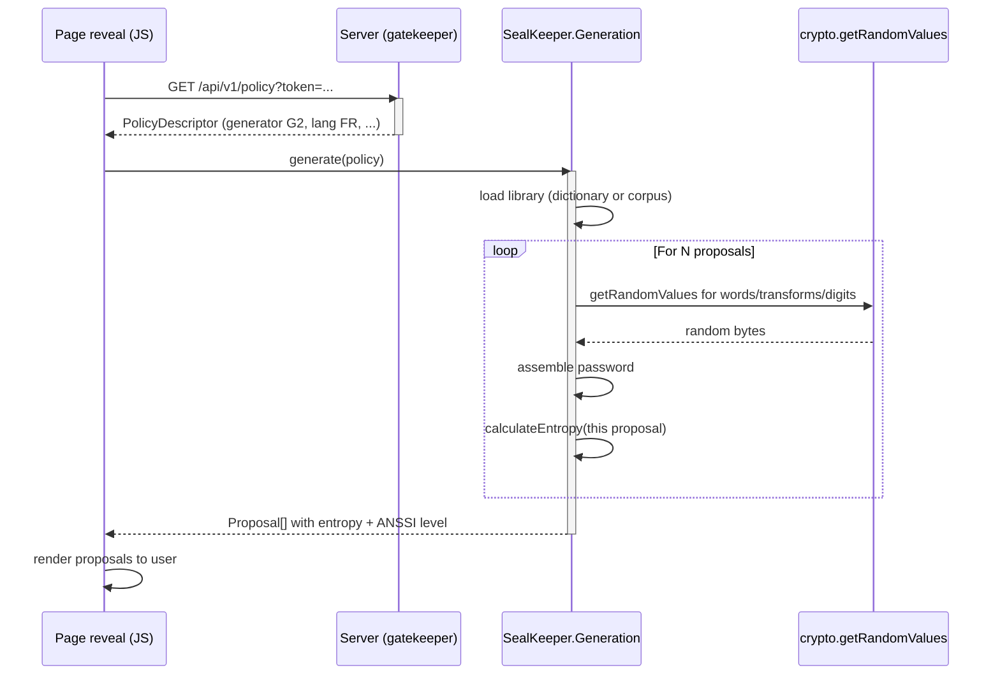

# Module A — Génération

**Statut** : validé
**Version** : 1.0
**Dernière mise à jour** : 2026-05-16
**Auteur** : Pascal-Louis Tessier (assisté par Daneel / Claude)
**Dépendances** : aucune (module fondateur)

---

## 1. Purpose

Ce module spécifie le **moteur de génération de mots de passe** de SealKeeper. Le moteur s'exécute **entièrement dans le navigateur de l'utilisateur** via la WebCrypto API. Le serveur ne génère jamais de mot de passe et n'en voit aucun.

Le moteur expose trois générateurs distincts (G1, G2, G3) calibrés respectivement sur les trois niveaux ANSSI (B1, B2, B3) du référentiel *« Recommandations relatives à l'authentification multifacteur et aux mots de passe »*. Le choix du générateur est dicté par la **policy** attachée au domaine de l'utilisateur et à son niveau d'élévation.

---

## 2. Actors and use cases

| Acteur | Interaction avec le module A |
|---|---|
| Utilisateur final (employé) | Reçoit N propositions générées localement, en choisit une |
| Administrateur SealKeeper | Configure les paramètres des générateurs via la console (module C) |
| JavaScript front-end (module B) | Appelle l'API JS de génération |
| Serveur SealKeeper (module D) | Emet la policy descriptor consommée par le JS |

**Cas d'usage principal.** Un employé saisit son email sur la page publique. Le serveur valide le domaine, détermine le niveau ANSSI applicable et émet un lien email. L'utilisateur clique, la page de révélation s'ouvre, le JS appelle `SealKeeper.generate(policy)`, obtient N propositions chiffrées localement, et les affiche.

---

## 3. Functional requirements

### 3.1 Générateur G1 — Citations transformées

| ID | Exigence | Niveau |
|---|---|---|
| FR-A.G1.1 | G1 sélectionne aléatoirement **une citation** dans un corpus d'au moins 5 000 entrées | MUST |
| FR-A.G1.2 | G1 applique **9 transformations** (T01 à T09) parmi celles du catalogue (§ 3.4), chacune activable indépendamment par la policy. T10 (synonymes) est reportée à v0.2.0 | MUST |
| FR-A.G1.3 | G1 ajoute **3 groupes de 3 chiffres aléatoires** placés à trois positions définies par la policy (préfixe, milieu, suffixe par défaut) | MUST |
| FR-A.G1.4 | G1 sélectionne **un séparateur** tiré aléatoirement dans une liste de 10 caractères définie par la policy | MUST |
| FR-A.G1.5 | G1 produit un mot de passe d'**entropie effective ≥ 50 bits** (cible B1) | MUST |
| FR-A.G1.6 | G1 expose son corpus actif via la policy descriptor (id de bibliothèque) | MUST |

**Exemple de sortie typique.**

```
123_EtreOuNeP@sEtre_456_789
4 17_Citation.Transformée_8 92_Suffix3 0
```

### 3.2 Générateur G2 — Assemblage de mots (Diceware-style)

| ID | Exigence | Niveau |
|---|---|---|
| FR-A.G2.1 | G2 tire **6 mots** indépendamment dans un dictionnaire de **5 000 mots minimum** | MUST |
| FR-A.G2.2 | G2 utilise **un séparateur** tiré aléatoirement parmi 10 caractères définis par la policy | MUST |
| FR-A.G2.3 | G2 ajoute **4 chiffres aléatoires** en suffixe (séparés ou collés au dernier mot, choix par policy) | MUST |
| FR-A.G2.4 | G2 produit un mot de passe d'**entropie effective ≥ 80 bits** (cible B2) | MUST |
| FR-A.G2.5 | G2 expose son dictionnaire actif via la policy descriptor (id de bibliothèque) | MUST |
| FR-A.G2.6 | G2 supporte 5 langues dans les dictionnaires par défaut : FR, EN, ES, DE, IT | SHOULD |

**Exemple de sortie typique.**

```
cheval-table-pluie-roman-fenetre-jardin-4729
ours_pierre_rive_train_ile_lune_8013
chat.fleur.nuit.livre.miel.route.2467
```

### 3.3 Générateur G3 — Aléatoire pur groupé

| ID | Exigence | Niveau |
|---|---|---|
| FR-A.G3.1 | G3 produit **20 caractères** tirés dans un alphabet de **62 caractères** (a-z, A-Z, 0-9) | MUST |
| FR-A.G3.2 | G3 groupe les 20 caractères en **4 blocs de 5 caractères** séparés par tirets (`Aj7pK-2vBnR-qLcZ4-tFwM3`) | MUST |
| FR-A.G3.3 | G3 produit un mot de passe d'**entropie effective ≥ 100 bits** (cible B3) | MUST |
| FR-A.G3.4 | G3 n'utilise pas de caractères ambigus (l/I/1, 0/O exclus optionnellement par policy) | MAY |
| FR-A.G3.5 | G3 n'utilise pas de bibliothèque (générateur stateless) | MUST |

**Exemple de sortie typique.**

```
Aj7pK-2vBnR-qLcZ4-tFwM3
Mw3kQ-5xRn7-Hp2Yj-V9bDA
8GfTp-Qk3Rv-NyL5m-X2cJh
```

### 3.4 Catalogue des 10 transformations (générateur G1, optionnel G2)

Chaque transformation peut être **déterministe** (toujours appliquée à l'identique) ou **aléatoire** (choisie au hasard à chaque génération). Les transformations aléatoires contribuent à l'entropie, les déterministes non.

| Code | Famille | Description | Aléatoire ? | Bits ajoutés |
|---|---|---|---|---|
| T01 | Casse | Choix entre lowercase / UPPERCASE / camelCase / PascalCase / SCREAMING_SNAKE | Oui (5 options) | log₂(5) ≈ 2,3 |
| T02 | Leet light | `a→@`, `e→3`, `i→!`, `o→0` — chaque occurrence indépendamment 50/50 | Oui (par caractère) | n bits où n = nombre de caractères concernés |
| T03 | Leet heavy | T02 + `s→$`, `t→+`, `l→1`, `g→9`, `b→8`, `z→2` | Oui (par caractère) | n bits étendus |
| T04 | Inversion | Reverse string ou reverse word order | Oui (2 options + bypass) | log₂(3) ≈ 1,6 |
| T05 | Tronçonnage | Premiers N caractères de chaque mot, initiales | Oui (3 options) | log₂(3) ≈ 1,6 |
| T06 | Diacritiques | Conserver (`é, à`) ou retirer (`e, a`) | Oui (2 options) | 1 |
| T07 | Reverse case alternée | Casse alternée par caractère | Oui (2 options : début maj ou min) | 1 |
| T08 | Insertion symbolique | Insérer un caractère spécial entre mots (1 sur 10 disponibles) | Oui (10 options) | log₂(10) ≈ 3,3 |
| T09 | Hash-tronqué visible | Ajout de 3-4 caractères d'un hash de l'horodatage | Oui (peudo-aléatoire) | ≈ 16 bits |
| T10 | Substitution mot | Un mot remplacé par son synonyme/antonyme tiré d'une table | Oui (par mot, optionnel) | log₂(N_synonyms) | **Reportée v0.2.0** |

**Note v0.1.0 — T10 non disponible.** La transformation T10 nécessite un dictionnaire de synonymes maintenu et validé éditorialement. Reportée à la version 0.2.0 pour ne pas alourdir le scope initial. Les neuf autres transformations (T01-T09) suffisent largement pour atteindre les seuils ANSSI B1/B2/B3.

**Note importante sur l'entropie.** Une transformation activée mais déterministe n'ajoute **aucun bit d'entropie**. Pour qu'une transformation contribue, son paramètre interne doit être tiré au sort par le générateur. La policy descriptor doit pouvoir distinguer *« transformation T01 activée, mode aléatoire »* de *« transformation T01 activée, mode déterministe avec lowercase »*.

### 3.5 Calcul d'entropie

| ID | Exigence | Niveau |
|---|---|---|
| FR-A.E.1 | Le moteur expose une fonction `calculateEntropy(policy)` qui retourne `{min, max, expected}` en bits | MUST |
| FR-A.E.2 | Le calcul respecte le **principe de Kerckhoffs** : l'attaquant connaît le générateur, ses paramètres, le corpus/dictionnaire — il ne connaît que le tirage particulier | MUST |
| FR-A.E.3 | Le calcul **ne compte pas** l'entropie des transformations déterministes | MUST |
| FR-A.E.4 | Le calcul est cohérent avec celui effectué en console admin (même fonction, même bundle) | MUST |
| FR-A.E.5 | Le résultat est affiché à l'utilisateur post-génération sous forme de jauge et de badge ANSSI (B1/B2/B3) | SHOULD |

### 3.6 Re-génération

| ID | Exigence | Niveau |
|---|---|---|
| FR-A.R.1 | L'utilisateur peut demander N nouvelles propositions sans nouvelle demande email, dans la limite du même token de session | SHOULD |
| FR-A.R.2 | Chaque appel à `regenerate()` produit un set indépendant de propositions | MUST |
| FR-A.R.3 | Le nombre de re-générations par session est limité par la policy (défaut : 3) | SHOULD |

---

## 4. Non-functional requirements

| Type | Exigence | Cible |
|---|---|---|
| Performance | Génération de N propositions | < 100 ms sur poste type i5/16Gb |
| Sécurité | Source d'entropie | `crypto.getRandomValues()` exclusivement, jamais `Math.random()` |
| Sécurité | Bundle JS | Open source, SRI obligatoire sur tous assets, CSP stricte interdisant le script tiers |
| Auditabilité | Code | Lisible, commenté, tests unitaires de chaque générateur |
| Compatibilité | API WebCrypto | Disponible nativement (Chrome 37+, Firefox 34+, Safari 11+, Edge 79+) |
| Mémoire | Empreinte runtime | < 5 MB de mémoire heap pour le bundle complet |

---

## 5. Data model

### 5.1 Policy descriptor (consommé par le générateur)

Format JSON, émis par le serveur (module D) à la demande du JS via `GET /api/v1/policy`.

```json
{
  "id": "policy-uuid",
  "domain": "wse-group.com",
  "anssiLevel": "B2",
  "generator": "G2",
  "proposalCount": 5,
  "regenerateLimit": 3,
  "parameters": {
    "libraryId": "fr-courant-v1",
    "language": "fr",
    "numberOfWords": 6,
    "separatorOptions": ["-", "_", ".", "/", "+", ":", "|", ";", ",", "~"],
    "numericGroups": [
      {"position": "suffix", "digitsCount": 4, "separator": "-"}
    ]
  },
  "expectedEntropy": {
    "minBits": 88,
    "maxBits": 92
  }
}
```

### 5.2 Format des fichiers de dictionnaires (générateur G2)

| Élément | Contrainte |
|---|---|
| Encoding | UTF-8 sans BOM |
| Séparateur de ligne | LF (`\n`) ou CRLF (`\r\n`) — tolérés à la lecture, LF en stockage |
| Structure | Un mot par ligne, en minuscules de préférence |
| En-tête de métadonnées | Lignes débutant par `#` en début de fichier |
| Doublons | Non autorisés (validation à l'upload) |
| Longueur min par mot | 4 caractères |
| Longueur max par mot | 12 caractères |
| Caractères autorisés | Lettres Unicode (incluant diacritiques) — pas de chiffre, pas de symbole |
| Taille minimale | 5 000 entrées |
| Taille recommandée | 7 776 (équivalent EFF Diceware) |
| Hash de contrôle | SHA-256 calculé et stocké par le serveur à l'upload |

**Exemple de fichier `fr-courant-v1.txt`.**

```
# SealKeeper dictionary
# language: fr
# source: EFF Diceware French adaptation + curation Pascal-Louis Tessier
# entries: 7776
# generated: 2026-05-15
# license: CC0 / public domain
# sha256: a7f9...
chevaux
table
pluie
roman
fenetre
jardin
...
```

### 5.3 Format des fichiers de corpus (générateur G1)

| Élément | Contrainte |
|---|---|
| Encoding | UTF-8 sans BOM |
| Structure | Une citation par ligne |
| Longueur typique | 5-15 mots par citation |
| Longueur min | 3 mots |
| Longueur max | 25 mots |
| Métadonnées | Lignes débutant par `#` en début de fichier |
| Taille minimale | 5 000 citations |
| Caractères autorisés | Tous, sauf retour ligne intra-citation |
| Hash de contrôle | SHA-256 |

**Exemple de fichier `fr-classiques-v1.txt`.**

```
# SealKeeper corpus
# language: fr
# theme: classiques français domaine public
# entries: 5240
# source: sélection éditoriale d'œuvres dans le domaine public au sens du droit français
#         (auteurs décédés avant 1956, soit 70 ans révolus en 2026)
# scope: Hugo, Proust, La Bruyère, Pascal, Voltaire, Molière, Rousseau, Diderot,
#        Montesquieu, Beaumarchais, Stendhal, Balzac, Flaubert, Maupassant, Zola,
#        Baudelaire, Rimbaud, Verlaine, Mallarmé, Apollinaire, et autres
# generated: 2026-05-15
# license: domaine public (œuvres source) + CC0 (sélection éditoriale SealKeeper)
# sha256: 9b3e...
Etre ou ne pas etre, telle est la question
Je pense donc je suis
La raison est trompeuse
La vie est un songe
...
```

**Note juridique sur le corpus livré par défaut.** En droit français, une œuvre tombe dans le domaine public **70 ans après le décès de son auteur**. SealKeeper livre par défaut un corpus **constitué exclusivement d'œuvres dont les auteurs sont décédés avant 1956**, ce qui exclut notamment Sartre, Camus, Beauvoir, Aragon, Sagan. Wikiquote n'est **pas** une source utilisable sans curation manuelle (zone grise sur de nombreuses citations contemporaines). L'admin peut uploader ses propres corpus (citations internes, slogans d'entreprise, etc.) sous sa propre responsabilité éditoriale et juridique.

### 5.4 Code d'une transformation

```json
{
  "code": "T01",
  "name": "case-randomization",
  "active": true,
  "mode": "random",
  "parameters": {
    "candidates": ["lowercase", "uppercase", "camelCase", "PascalCase", "SCREAMING_SNAKE"]
  }
}
```

---

## 6. Interfaces

### 6.1 API JavaScript exposée par le bundle

Le bundle JS expose un **namespace global** `window.SealKeeper.Generation`. Choix retenu sur la décision §8.1 : la page de révélation est servie en HTML statique par le serveur Go, sans bundler côté client. Le namespace global garantit la simplicité d'audit et l'absence de pipeline de build côté navigateur.

```typescript
namespace SealKeeper.Generation {
  /**
   * Generates N proposals according to the policy descriptor.
   * Uses crypto.getRandomValues() exclusively.
   * @throws GenerationError if the policy is invalid or library missing
   */
  function generate(policy: PolicyDescriptor): Promise<Proposal[]>;

  /**
   * Computes the entropy range of the policy without generating.
   * Used by the admin console for live feedback and by the user UI for display.
   */
  function calculateEntropy(policy: PolicyDescriptor): EntropyReport;

  /**
   * Re-generates a fresh set of proposals. Limited by policy.regenerateLimit.
   * @throws RegenerationLimitExceeded
   */
  function regenerate(policy: PolicyDescriptor): Promise<Proposal[]>;
}

interface Proposal {
  password: string;
  entropyBits: number;
  anssiLevel: 'B1' | 'B2' | 'B3';
  generator: 'G1' | 'G2' | 'G3';
}

interface EntropyReport {
  minBits: number;
  maxBits: number;
  expectedBits: number;
  anssiLevels: {
    B1: boolean;  // ≥ 50 bits
    B2: boolean;  // ≥ 80 bits
    B3: boolean;  // ≥ 100 bits
  };
  breakdown: Array<{ component: string; bits: number }>;
}
```

### 6.2 Flux interne du générateur



---

## 7. Edge cases and error handling

| Cas | Réponse |
|---|---|
| Dictionnaire/corpus introuvable côté CDN | Erreur `LibraryNotFound`, le JS affiche un message à l'utilisateur, propose une nouvelle demande |
| Dictionnaire trop petit pour atteindre l'entropie cible | Erreur `EntropyTargetUnreachable`, audit log enregistre la tentative |
| WebCrypto non disponible (navigateur trop ancien) | Erreur `WebCryptoUnavailable`, message explicite, pas de fallback `Math.random()` |
| Generation timeout > 5 secondes | Erreur `GenerationTimeout` |
| Policy descriptor invalide (champ obligatoire manquant) | Erreur `InvalidPolicyDescriptor` avec liste des champs manquants |
| Re-génération au-delà de la limite | Erreur `RegenerationLimitExceeded` |
| Aucun caractère imprimable dans le résultat (bug) | Erreur `EmptyGenerationResult`, audit log critique |

---

## 8. Closed decisions

Toutes les questions ouvertes ont été tranchées le 16 mai 2026 par Pascal-Louis Tessier après recommandation de Daneel. Les décisions sont liantes pour cette version du PRD.

| # | Question | Décision | Justification |
|---|---|---|---|
| D-A.1 | Format d'exposition de l'API JS | **Namespace global `window.SealKeeper.Generation`** | Page de révélation HTML statique, pas de bundler client, audit simplifié |
| D-A.2 | Générateur G4 phonétique (CVCVCV) | **Reporté à 0.2.0** | G2 (Diceware) couvre déjà *mémorable + dictable* ; éviter le scope creep en v0.1 |
| D-A.3 | Limite max de transformations actives simultanément en G1 | **Aucune limite hard** | L'entropy meter en console admin informe l'admin ; pas de mur arbitraire |
| D-A.4 | Corpus livrés par défaut | **EFF Diceware FR + EN** pour G2 ; **corpus éditorial SealKeeper** (sélection d'œuvres dans le domaine public au sens du droit français — auteurs décédés avant 1956) pour G1 | EFF Diceware = standard de facto ; Wikiquote pas utilisable sans curation pour raisons juridiques |
| D-A.5 | Transformation T10 (synonymes) | **Reportée à 0.2.0**, exclue de v0.1 | Maintenance d'un dictionnaire de synonymes hors scope initial |
| D-A.6 | L'utilisateur peut-il paramétrer (langue, format) ? | **Tout via policy** ; seule exception : détection automatique de la langue via `Accept-Language` | Cohérence, auditabilité, posture sécurité — l'utilisateur ne doit pas pouvoir affaiblir son propre niveau ANSSI |
| D-A.7 | Position des chiffres aléatoires (G1) : fixée ou tirée au sort ? | **Fixée par policy** (préfixe / milieu / suffixe par défaut) | Format visuel reconnaissable, lecture orale facilitée ; entropie de la position elle-même mineure (~3 bits) |
| D-A.8 | Affichage de la force à l'utilisateur | **Jauge colorée + badge ANSSI** (les deux), à finaliser en module B | Position posée, raffinement UI en module B |

---

## 9. References

- **ANSSI** — *Recommandations relatives à l'authentification multifacteur et aux mots de passe* (référentiel B1/B2/B3) — [lien](https://cyber.gouv.fr/publications/recommandations-relatives-lauthentification-multifacteur-et-aux-mots-de-passe)
- **NIST SP 800-63B** — *Digital Identity Guidelines, Authentication and Lifecycle Management* — [lien](https://csrc.nist.gov/publications/detail/sp/800-63b/final)
- **W3C WebCrypto API** — *Web Cryptography API specification* — [lien](https://www.w3.org/TR/WebCryptoAPI/)
- **EFF Diceware lists** — *Long word list for passphrases* — [lien](https://www.eff.org/dice)
- **RFC 4949** — *Internet Security Glossary, Version 2* — [lien](https://datatracker.ietf.org/doc/html/rfc4949)
- **Kerckhoffs' principle** — *La cryptographie militaire* (1883)
- Modules SealKeeper liés : **B** (consomme l'API JS), **C** (configure la policy), **D** (émet la policy descriptor)

---

## 10. Évolution de ce document

| Version | Date | Auteur | Changements |
|---|---|---|---|
| 1.0 | 2026-05-16 | P.-L. Tessier (Daneel) | **Version validée** — 8 décisions tranchées (D-A.1 à D-A.8) : API namespace global, G4 reporté 0.2.0, pas de limite transformations, EFF Diceware + corpus éditorial DP français, T10 reportée 0.2.0, paramètres via policy, position chiffres fixée, force = jauge + badge |
| 0.1 | 2026-05-16 | P.-L. Tessier (Daneel) | Création initiale, structure complète des 3 générateurs et catalogue 10 transformations |

---

*Document maintenu dans le repo `sched75/sealkeeper` sous `docs/prd/A-generation.md`. Toute proposition de modification passe par PR sur `main`.*
