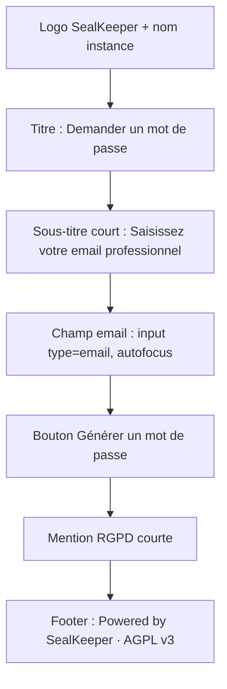
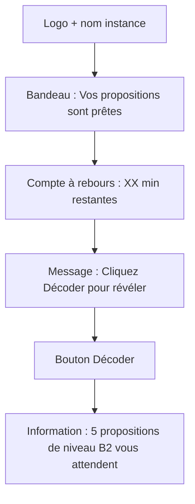
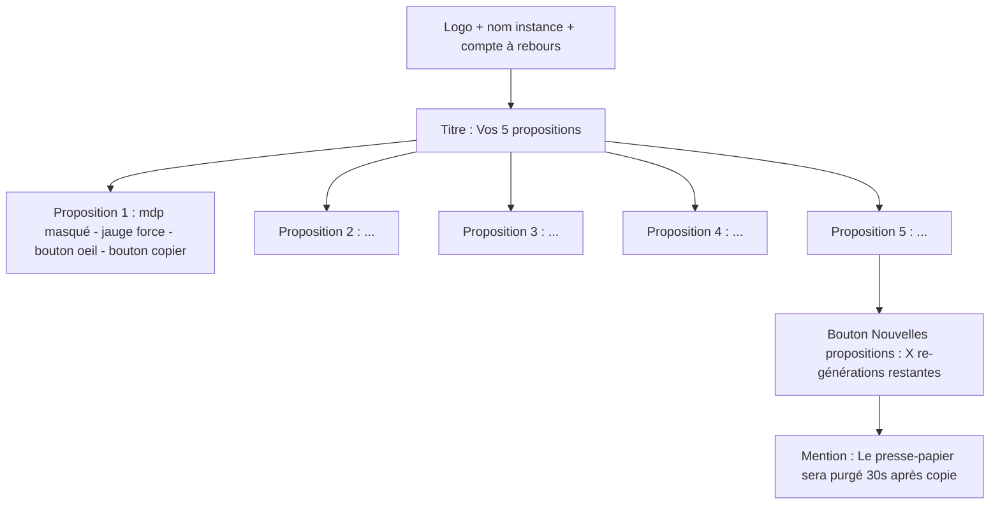
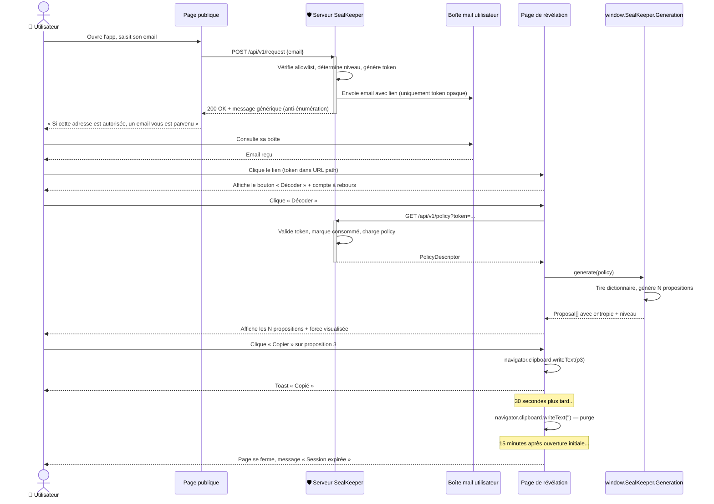

# Module B — Workflow utilisateur

**Statut** : validé
**Version** : 1.0
**Dernière mise à jour** : 2026-05-16
**Auteur** : Pascal-Louis Tessier (assisté par Daneel / Claude)
**Dépendances** : module A (générateur), module C (policy descriptor), module D (backend), module G (API)

---

## 1. Purpose

Ce module spécifie le **parcours utilisateur de bout en bout** : depuis la saisie de l'email sur la page publique jusqu'à la sélection d'un mot de passe sur la page de révélation. Il couvre également la **structure et le contenu de l'email** envoyé entre les deux étapes.

L'objectif est de poser une expérience **minimaliste et défensive** : un seul champ visible côté public (l'email), aucune divulgation d'information sur l'allowlist ou les niveaux ANSSI, une révélation qui se ferme d'elle-même, et un mot de passe qui ne traverse jamais le serveur.

---

## 2. Actors and use cases

| Acteur | Interaction avec le module B |
|---|---|
| Utilisateur final (employé) | Saisit son email sur la page publique, reçoit l'email, clique le lien, consulte ses propositions, en choisit une |
| Page publique (HTML/JS) | Affiche le formulaire de demande, envoie au serveur, gère le retour |
| Serveur SealKeeper (module D) | Valide la demande, émet le lien, gère le rate-limit |
| Relais SMTP (module D, configuré en module C) | Transporte l'email vers la boîte de l'utilisateur |
| Boîte mail utilisateur | Reçoit et affiche l'email |
| Page de révélation (HTML/JS) | Récupère la policy via API, appelle le générateur (module A), affiche N propositions, gère la sélection et la fermeture |

**Cas d'usage canonique.** Un employé doit créer un mot de passe pour son compte AD. Il ouvre l'intranet, accède à `sealkeeper.entreprise.com`, saisit `pascal-louis@entreprise.com`, clique *Générer*. Une minute plus tard, il reçoit un email dans sa boîte. Il clique le lien, la page de révélation s'ouvre, il voit 5 propositions de mots de passe niveau B1 (parce qu'il n'est pas dans la liste d'élévation B2/B3). Il choisit *« cheval-table-pluie-roman-fenetre-jardin-4729 »*, clique *Copier*, le presse-papier est rempli, l'utilisateur le colle dans son outil de gestion de compte AD. 30 secondes plus tard, le presse-papier est purgé. La page de révélation se ferme automatiquement à T+15 minutes.

---

## 3. Functional requirements

### 3.1 Page publique de demande

| ID | Exigence | Niveau |
|---|---|---|
| FR-B.1 | La page publique présente **un seul champ visible** : l'adresse email professionnelle, accompagné d'un bouton *« Générer un mot de passe »* | MUST |
| FR-B.2 | La page n'affiche **aucune information** sur les domaines autorisés, les niveaux ANSSI, ou les utilisateurs élevés | MUST |
| FR-B.3 | La page propose un sélecteur de langue (FR/EN, plus selon i18n module J) avec détection automatique via `Accept-Language` | SHOULD |
| FR-B.4 | La page affiche en pied une mention courte *« Powered by SealKeeper · Open source · AGPL v3 »* avec lien vers le site projet (configurable par admin) | SHOULD |
| FR-B.5 | La page est responsive (PC, tablette, mobile) selon § 4.1 | MUST |
| FR-B.6 | La page est accessible RGAA niveau AA (clavier, lecteur d'écran) selon module J | MUST |

### 3.2 Soumission et réponse anti-énumération

| ID | Exigence | Niveau |
|---|---|---|
| FR-B.7 | Après soumission, la page affiche **toujours le même message** quel que soit le résultat : *« Si cette adresse est autorisée, un email vous est parvenu. Vérifiez votre boîte de réception »* | MUST |
| FR-B.8 | Le temps de réponse côté serveur est **constant** (~500ms ± 50ms) qu'il y ait envoi ou non, pour prévenir les attaques par timing | MUST |
| FR-B.9 | Aucun retour HTTP ne révèle si l'email est valide, dans l'allowlist, dans une liste d'élévation, ou dans un état de rate-limit | MUST |
| FR-B.10 | Le serveur consigne dans son audit log toute soumission, en clair pour les analyses sécurité ultérieures | MUST |

### 3.3 Rate-limiting utilisateur

| ID | Exigence | Niveau |
|---|---|---|
| FR-B.11 | Une adresse email peut générer **au maximum 3 demandes par heure**, configurable par policy de domaine | MUST |
| FR-B.12 | Une adresse IP peut soumettre **au maximum 10 demandes par heure**, configurable globalement | MUST |
| FR-B.13 | Au-delà du rate-limit, le serveur ne renvoie **aucune erreur visible** à l'utilisateur ; il consigne l'événement en audit log mais affiche le message générique standard | MUST |

### 3.4 Email envoyé

| ID | Exigence | Niveau |
|---|---|---|
| FR-B.14 | L'email est envoyé en **MIME multipart/alternative** (texte brut + HTML), pour compatibilité maximale | MUST |
| FR-B.15 | Le sujet par défaut est *« Vos propositions de mot de passe SealKeeper »* (FR) ou équivalent dans la langue détectée. Personnalisable par admin (module C) | MUST |
| FR-B.16 | L'expéditeur est `noreply@<domaine-de-l-instance>` ; le `Reply-To` peut pointer vers une boîte support définie par l'admin | MUST |
| FR-B.17 | Le corps contient un seul lien cliquable, des informations contextuelles (durée de validité, usage unique) et la signature SealKeeper | MUST |
| FR-B.18 | Le lien contient **uniquement un token opaque** d'un seul usage. Aucun email, aucun fingerprint, aucune information sur le niveau ANSSI | MUST |
| FR-B.19 | L'email est signé DKIM et passe SPF/DMARC du domaine d'envoi (configuré côté serveur module D) | MUST |
| FR-B.20 | Le template HTML respecte le branding défini par l'admin (logo, couleurs, signature) | SHOULD |

**Structure du lien.**

```
https://sealkeeper.entreprise.com/reveal/9f2a1b8e3c4d5f67
                                  └──────────────────┘
                                  token opaque, 128 bits min
```

### 3.5 Page de révélation

| ID | Exigence | Niveau |
|---|---|---|
| FR-B.21 | À l'ouverture, la page affiche un message d'accueil et un **bouton *« Décoder »*** explicite, en indiquant que **5 propositions** (configurable par policy) attendent l'utilisateur | MUST |
| FR-B.22 | Tant que l'utilisateur n'a pas cliqué *Décoder*, aucune génération n'a lieu (protection contre prévisualisation, capture d'écran inopinée par antivirus) | MUST |
| FR-B.23 | Au clic *Décoder*, le JS appelle `GET /api/v1/policy?token=<token>` pour récupérer la policy descriptor | MUST |
| FR-B.24 | Le JS invoque ensuite `window.SealKeeper.Generation.generate(policy)` pour produire les N propositions localement | MUST |
| FR-B.25 | Les propositions sont affichées dans des cartes, chacune avec : le mot de passe, sa force visualisée (jauge + badge ANSSI), un bouton *« Copier »* | MUST |
| FR-B.26 | L'utilisateur peut afficher/masquer chaque proposition (icône œil) sans rafraîchir | SHOULD |
| FR-B.27 | Un bouton *« Nouvelles propositions »* permet la re-génération sans nouvelle demande email, dans la limite de `policy.regenerateLimit` (**défaut 3**, configurable par policy). Aucune confirmation n'est demandée au clic | SHOULD |
| FR-B.28 | Un compte à rebours **affiche le temps restant en minutes uniquement** (pas de secondes). Sous la dernière minute, le label devient *« moins d'une minute »* | MUST |
| FR-B.29 | À T+15 min (ou TTL policy), la page **se ferme automatiquement** et présente un message *« Session expirée »*. Le bouton *Copier* devient inactif | MUST |

### 3.6 Copy-to-clipboard et hygiène mémoire

| ID | Exigence | Niveau |
|---|---|---|
| FR-B.30 | Le clic *« Copier »* utilise l'API `navigator.clipboard.writeText()` du navigateur | MUST |
| FR-B.31 | Une notification visuelle confirme la copie (toast *« Copié »* pendant 2 secondes) | MUST |
| FR-B.32 | Le presse-papier est **automatiquement purgé après 30 secondes** : le JS réécrit le presse-papier avec une chaîne vide ou un message *« SealKeeper · presse-papier purgé »* | MUST |
| FR-B.33 | Le mot de passe n'est **jamais loggé** dans la console du navigateur (DevTools) | MUST |
| FR-B.34 | Le mot de passe n'est **jamais stocké** dans le `localStorage`, `sessionStorage`, ou cookies | MUST |
| FR-B.35 | Le mot de passe n'apparaît **jamais dans l'URL** (ni query, ni fragment) — toute génération vit en mémoire JS et dans le DOM uniquement | MUST |

### 3.7 Lien à usage unique

| ID | Exigence | Niveau |
|---|---|---|
| FR-B.36 | Le token de session est **consommé à la première interaction utilisateur** avec `GET /api/v1/policy` | MUST |
| FR-B.37 | Une seconde tentative d'ouverture du même lien retourne un message *« Lien déjà consommé. Demandez-en un nouveau si nécessaire »* | MUST |
| FR-B.38 | Le serveur audit-log chaque tentative d'ouverture, incluant les ré-utilisations | MUST |

### 3.8 Notification post-consultation (optionnelle par policy)

| ID | Exigence | Niveau |
|---|---|---|
| FR-B.39 | Si activée dans la policy, un email de notification *« votre mot de passe SealKeeper a été consulté à HH:MM depuis IP X »* est envoyé à l'utilisateur après chaque consultation | SHOULD |
| FR-B.40 | Cette notification contient l'IP, le user-agent, l'horodatage UTC, et un lien vers la page contact en cas de consultation suspecte | SHOULD |
| FR-B.41 | La notification est activable globalement par l'admin et surchargeable par policy de domaine. **Politique par défaut** : activée pour les niveaux B2 et B3, désactivée pour B1 | SHOULD |

---

## 4. Non-functional requirements

| Type | Exigence | Cible |
|---|---|---|
| Performance — page publique | Temps de chargement initial | < 1 seconde sur 3G |
| Performance — page révélation | Temps entre clic *Décoder* et affichage des N propositions | < 500 ms incluant fetch policy + génération |
| Accessibilité | Conformité RGAA 4.1 | Niveau AA |
| Compatibilité navigateurs | Chrome 90+, Firefox 88+, Safari 14+, Edge 90+ | MUST |
| Mobile | Responsive depuis 320px de large | MUST |
| i18n | Langues bundlées | FR, EN (v0.1) ; ES, DE, IT (v0.2) |
| Sécurité | CSP stricte, SRI sur tous assets, HSTS | MUST |
| Sécurité | Pas de tracking, pas d'analytics tiers, pas de CDN externe | MUST |
| Empreinte | Taille du bundle JS de révélation | < 200 KB minifié, incluant dictionnaire actif |
| Disponibilité | Page publique servie statiquement par Go | 99.9 % |

---

## 5. Data model

### 5.1 État côté navigateur (page de révélation)

```javascript
const sessionState = {
  token: "9f2a1b8e3c4d5f67",           // opaque, depuis URL path
  status: "pending" | "policy-loaded" | "generated" | "expired" | "consumed",
  policy: PolicyDescriptor | null,      // depuis GET /api/v1/policy
  proposals: Proposal[] | null,
  expiresAt: ISO8601DateTime,            // depuis policy
  regenerationsLeft: number              // depuis policy.regenerateLimit
};
```

### 5.2 Structure de l'email envoyé

| Champ | Valeur |
|---|---|
| `From` | `SealKeeper <noreply@<instance-domain>>` |
| `To` | `<utilisateur>` |
| `Reply-To` | `<support-mail configuré>` ou `noreply` |
| `Subject` | *« Vos propositions de mot de passe SealKeeper »* (i18n) |
| `Date` | RFC 2822 |
| `Message-ID` | `<token>@<instance-domain>` |
| `MIME-Version` | `1.0` |
| `Content-Type` | `multipart/alternative; boundary=...` |

**Corps texte brut.** Lisible en clients sans HTML.

```
Bonjour,

Vous avez demandé un mot de passe via SealKeeper.

Cliquez sur le lien ci-dessous pour voir vos propositions :
https://sealkeeper.entreprise.com/reveal/9f2a1b8e3c4d5f67

Validité : 15 minutes à compter de l'envoi de cet email.
Usage unique : ce lien ne fonctionne qu'une seule fois.

Si vous n'avez pas demandé ce mot de passe, ignorez cet email.

Cordialement,
SealKeeper
```

**Corps HTML.** Mise en forme selon branding admin (logo, couleurs, signature). Doit dégrader proprement sur Outlook 2016+.

### 5.3 Structure d'une proposition affichée

```javascript
const proposalCard = {
  password: "cheval-table-pluie-roman-fenetre-jardin-4729",
  entropyBits: 90.3,
  anssiLevel: "B2",
  generator: "G2",
  visibleInUI: true,
  copyCount: 0   // incrémenté à chaque clic Copier
};
```

---

## 6. Interfaces

### 6.1 Wireframe de la page publique



### 6.2 Wireframe de la page de révélation (état initial)



### 6.3 Wireframe de la page de révélation (après décodage)



### 6.4 Diagramme de séquence du workflow complet



---

## 7. Edge cases and error handling

| Cas | Réponse |
|---|---|
| Email saisi avec syntaxe invalide | Validation côté client (regex RFC 5322 simplifié) avant soumission. Message inline *« adresse invalide »*. |
| Email valide mais hors allowlist domaine | Serveur renvoie le message générique standard (anti-énumération). Aucune fuite. |
| Email valide, dans allowlist, mais rate-limit dépassé | Idem : message générique standard. Audit log enregistre. Pas d'email envoyé. |
| Lien cliqué après T+15min | Page de révélation affiche *« Ce lien a expiré. Demandez-en un nouveau »*. Bouton retour vers la page publique. |
| Lien déjà consommé (deuxième visite) | Page affiche *« Ce lien a déjà été utilisé. Demandez-en un nouveau si nécessaire »*. Bouton retour. |
| Connexion réseau perdue pendant la révélation | Le JS détecte (event `offline`), affiche un message non-bloquant. Le générateur peut tout de même fonctionner si la policy est déjà chargée (cache mémoire). |
| WebCrypto non disponible (navigateur trop ancien) | La page affiche *« Votre navigateur n'est pas compatible. Mettez-le à jour ou utilisez Chrome / Firefox / Safari récents »*. |
| Cookie tiers bloqué, JS partiel | La page de révélation utilise uniquement de la même origine. Aucun cookie tiers requis. |
| Utilisateur ferme l'onglet avant d'avoir copié | Aucun retour serveur, le token est déjà consommé, le mdp est perdu. L'utilisateur peut redemander un lien. |
| Clic *Copier* mais clipboard API indisponible (HTTP non-TLS) | Fallback `document.execCommand('copy')` legacy. Si absent, message *« Copie manuelle requise »* avec sélection forcée du texte. |
| Re-génération demandée au-delà de la limite | Bouton *Nouvelles propositions* devient inactif (grisé). Message *« Limite atteinte »*. |
| Audit log : utilisateur cliqué le lien depuis une IP différente de celle de la demande initiale | Événement enregistré, pas de blocage automatique (un utilisateur peut légitimement consulter ses emails depuis un autre device). Notification optionnelle si policy l'active. |

---

## 8. Closed decisions

Les décisions suivantes sont prises et liantes pour cette version :

| # | Décision | Justification |
|---|---|---|
| D-B.1 | **Pas de sélecteur de niveau ANSSI** côté utilisateur | Le niveau est entièrement déterminé par le serveur via les listes d'élévation B2/B3 |
| D-B.2 | **Message identique** en succès et échec sur la page publique | Anti-énumération RFC 7644 |
| D-B.3 | **Temps de réponse constant** (~500ms ± 50ms) | Prévient l'attaque par timing |
| D-B.4 | **Page de révélation requiert un clic explicite *Décoder*** | Empêche pré-rendu, capture screenshot accidentelle |
| D-B.5 | **TTL de la session = 15 minutes** par défaut (configurable par policy) | Compromis acceptable entre confort utilisateur et fenêtre d'attaque |
| D-B.6 | **Clipboard purgé après 30 secondes** | Standard mature, OS-friendly, ne pénalise pas le collage immédiat |
| D-B.7 | **Mot de passe jamais dans l'URL** | Évite tout logging par proxies intermédiaires |
| D-B.8 | **Email envoyé en multipart/alternative** | Compatibilité maximale (clients texte uniquement, Outlook 2010+) |
| D-B.9 | **Lien email contient uniquement un token opaque** de 128 bits minimum | Aucune info révélée même si l'email est intercepté |
| D-B.10 | **Token consommé à la première fetch de policy** (pas à l'ouverture de page) | Permet à un client mail qui pré-fetch les liens (anti-phishing) de ne pas consommer le token |
| D-B.11 | **5 propositions par défaut** (configurable par policy) | Sweet spot ergonomique (Miller 7±2) : 3 frustrant, 7 saturant ; 5 donne du choix sans surcharger |
| D-B.12 | **3 re-générations maximum par session** (configurable par policy) | Donne au total 4×5 = 20 propositions ; au-delà = recherche stérile de *« la perle »*, contraire à l'esprit |
| D-B.13 | **Niveau ANSSI affiché explicitement** (badge B1/B2/B3 + info-bulle pédagogique) | Transparence, sensibilisation, sans fuite (le niveau d'autrui reste inconnu) |
| D-B.14 | **Notification activée par défaut pour B2 et B3, désactivée pour B1** (chaque admin peut surcharger par policy) | B1 = volume élevé, surcharge des inboxes ; B2/B3 = sensibles, traçabilité utile |
| D-B.15 | **Compte à rebours en minutes uniquement** (*« moins d'une minute »* sous la dernière) | Précision suffisante, évite l'effet anxiogène d'un chronomètre |
| D-B.16 | **Pas de mode démo en production** ; le mode eval Docker existant couvre déjà ce besoin pour les évaluateurs | Un mode démo en prod permettrait à un attaquant de cartographier le produit |
| D-B.17 | **Pas de confirmation au clic *« Nouvelles propositions »*** | Le compteur visible *« X re-générations restantes »* suffit ; friction inutile |

---

## 9. Open questions

**Toutes les questions ouvertes ont été tranchées le 16 mai 2026** par Pascal-Louis Tessier après recommandation de Daneel. Les 7 décisions correspondantes sont consignées en §8 sous les références D-B.11 à D-B.17. Le PRD B est intégralement validé en v1.0.

Une question (l'ancienne 9.6, *mode démo en production*) a été renvoyée au module H (déploiement) plutôt que tranchée ici.

---

## 10. References

- **Module A** — appelé via `window.SealKeeper.Generation.generate(policy)`
- **Module C** — fournit la policy descriptor consommée
- **Module D** — émet le token, gère le rate-limit et l'envoi email
- **Module G** — définit `POST /api/v1/request` et `GET /api/v1/policy`
- **Module J** — i18n et accessibilité de toutes les pages utilisateur
- **Module K** — comportement mobile spécifique (responsive, QR transfert)
- **RFC 5322** — Internet Message Format (email)
- **RFC 7644** — Anti-énumération (référencée pour le principe)
- **RGAA 4.1** — Référentiel général d'amélioration de l'accessibilité
- **W3C Clipboard API** — [lien](https://www.w3.org/TR/clipboard-apis/)

---

## 11. Évolution de ce document

| Version | Date | Auteur | Changements |
|---|---|---|---|
| 1.0 | 2026-05-16 | P.-L. Tessier (Daneel) | **Version validée** — 7 décisions tranchées (D-B.11 à D-B.17) : 5 propositions par défaut, 3 re-générations, niveau ANSSI explicite, notification B2/B3 par défaut, compte à rebours en minutes, pas de mode démo en prod, pas de confirmation re-gen. Question 9.6 renvoyée au module H |
| 0.1 | 2026-05-16 | P.-L. Tessier (Daneel) | Création initiale, workflow complet, 41 FR, 10 décisions tranchées, 7 questions ouvertes |

---

*Document maintenu dans le repo `sched75/sealkeeper` sous `docs/prd/B-user-workflow.md`. Toute proposition de modification passe par PR sur `main`.*
