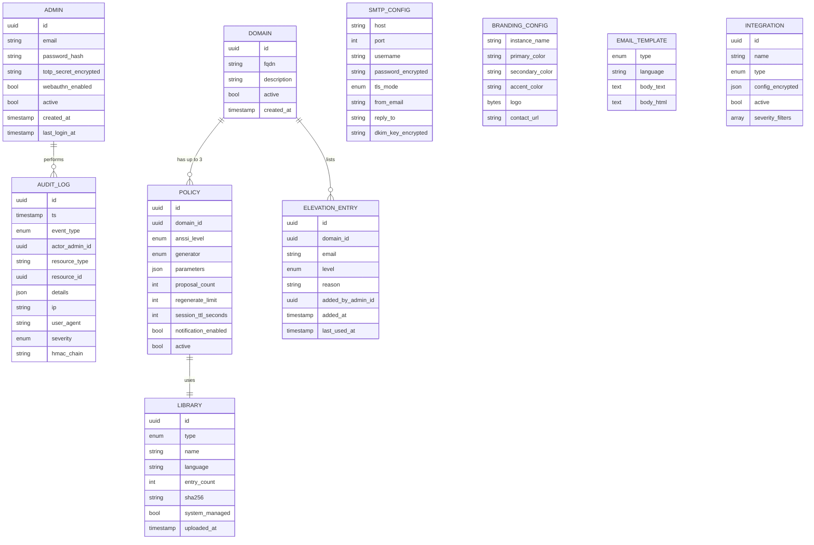
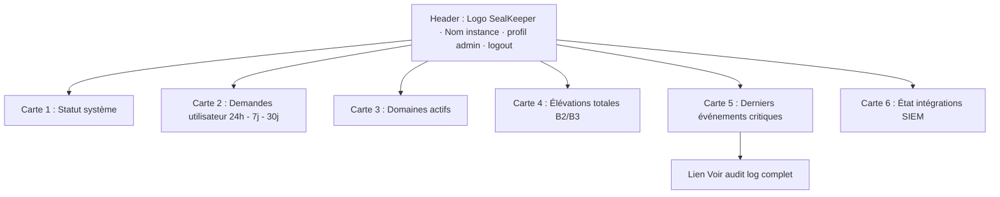
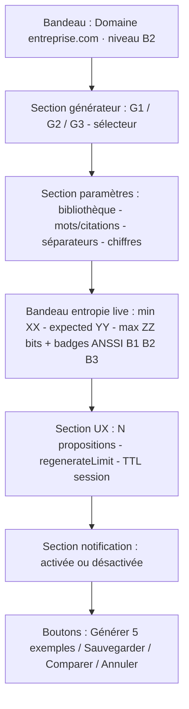
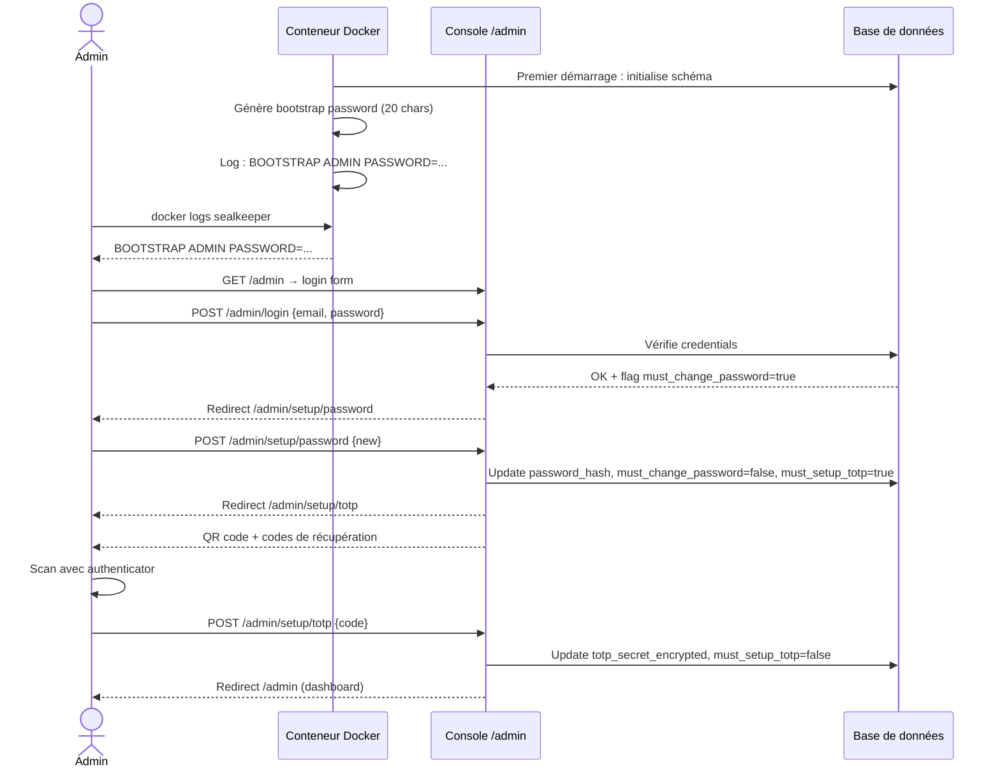

# Module C — Console admin

**Statut** : validé
**Version** : 1.0
**Dernière mise à jour** : 2026-05-16
**Auteur** : Pascal-Louis Tessier (assisté par Daneel / Claude)
**Dépendances** : aucune (module central) ; alimente A, B, D, E, F, G, H, I

---

## 1. Purpose

Ce module spécifie la **console d'administration** de SealKeeper. C'est la **surface unique** par laquelle se configure l'instance : authentification, domaines autorisés, policies de génération, listes d'élévation B2/B3, bibliothèques (dictionnaires et corpus), relais SMTP, branding, templates emails, audit log, intégrations sortantes.

La console est accessible sous `/admin` de l'instance. Elle est destinée à un public **technique averti** (DSI, RSSI, DPO, équipe IT), pas au grand public. L'ergonomie privilégie **l'exhaustivité et la traçabilité** sur l'attrait visuel.

**Principe directeur.** *« SealKeeper conseille, l'admin décide. »* La console n'impose jamais une configuration, mais elle informe l'admin en temps réel des conséquences de ses choix (notamment l'entropie résultante d'une policy).

---

## 2. Actors and use cases

| Acteur | Interaction principale |
|---|---|
| Admin principal (DSI / RSSI / DPO) | Configure tous les aspects de l'instance, surveille les audits |
| Admin technique (équipe IT) | Maintenance courante, ajout de domaines, gestion des élévations |
| Auditeur tiers | Lecture seule du registre d'audit et de la configuration |
| Bootstrap (premier démarrage) | Mot de passe initial généré, login forcé pour changement + activation TOTP |

**Cas d'usage canoniques.**

| Scénario | Étapes |
|---|---|
| Mise en service initiale | Bootstrap → login → activation TOTP → ajout domaine `entreprise.com` → création policy B1 par défaut → configuration SMTP → test d'envoi → publication |
| Élévation d'un dirigeant en B3 | Recherche admin → liste d'élévation B3 → ajout `dg@entreprise.com` → audit log enregistre |
| Création nouvelle policy B2 pour managers | Admin → policies du domaine → créer policy → choisir G2 → choisir dictionnaire FR → ajuster nb mots → entropie live affichée → validation |
| Upload d'un dictionnaire personnalisé | Bibliothèques → upload → validation format → hash SHA-256 stocké → activation par policy |
| Audit mensuel par RSSI | Connexion lecture seule → filtrage audit log par période → export CSV/JSON → revue offline |
| Configuration SIEM | Intégrations → activer Sentinel → workspace ID + token → test → audit log montre l'envoi |

---

## 3. Functional requirements

### 3.1 Authentification & bootstrap

| ID | Exigence | Niveau |
|---|---|---|
| FR-C.1 | Au premier démarrage, le serveur génère un **mot de passe bootstrap aléatoire** (20 caractères) et l'écrit dans les logs Docker au niveau INFO avec un marqueur clair *« BOOTSTRAP ADMIN PASSWORD »* | MUST |
| FR-C.2 | Le compte admin par défaut est `admin@localhost` avec le mot de passe bootstrap | MUST |
| FR-C.3 | À la première connexion, l'admin est **forcé de changer le mot de passe** avant tout accès à la console | MUST |
| FR-C.4 | À la première connexion, l'admin est **forcé d'activer TOTP** (RFC 6238) avant tout accès complet | MUST |
| FR-C.5 | L'activation TOTP affiche un QR code (otpauth URL standard) et 8 codes de récupération à imprimer ou enregistrer | MUST |
| FR-C.6 | La session admin a une durée de validité de **8 heures** par défaut, configurable | SHOULD |
| FR-C.7 | Après inactivité de 30 minutes, la session demande une re-authentification | SHOULD |
| FR-C.8 | Le logout est explicite ; le rafraîchissement de page ne déconnecte pas | MUST |
| FR-C.9 | Le formulaire de login a un délai constant de réponse (~300ms) pour prévenir l'énumération | MUST |
| FR-C.10 | Au-delà de 5 tentatives échouées, le compte est verrouillé pendant 15 minutes ; le déverrouillage est consigné en audit log | MUST |
| FR-C.11 | Support WebAuthn / FIDO2 en option (clé physique YubiKey, Titan, etc.) dès v0.1.0 | SHOULD |

### 3.2 Gestion des comptes admin

| ID | Exigence | Niveau |
|---|---|---|
| FR-C.12 | En v0.1.0, **un seul niveau d'admin** : super-admin. Pas de RBAC granulaire | MUST |
| FR-C.13 | Plusieurs comptes admin peuvent coexister, chacun avec ses propres credentials et TOTP | MUST |
| FR-C.14 | Un admin peut créer un autre admin (depuis la section *Comptes admin*) en saisissant l'email + un mot de passe à usage unique de premier login | MUST |
| FR-C.15 | Un admin peut être **désactivé** (pas supprimé) ; ses actions passées restent dans l'audit log | MUST |
| FR-C.16 | Un admin peut être **réactivé** ; il devra passer une étape de réinitialisation TOTP | MUST |
| FR-C.17 | Un admin connecté ne peut pas se désactiver lui-même | MUST |
| FR-C.18 | La suppression d'un compte admin (purge totale) n'est possible que par CLI serveur, jamais par l'UI | MUST |
| FR-C.19 | Une section *Mode lecture seule auditeur* permet de créer un compte audit-only qui ne peut consulter que le journal d'audit et l'export de configuration | 📋 v0.2 |

### 3.3 Gestion des domaines (allowlist)

| ID | Exigence | Niveau |
|---|---|---|
| FR-C.20 | Section *Domaines autorisés* affiche la liste des domaines acceptés, avec leur statut (actif / inactif), date d'ajout, et nombre de policies attachées | MUST |
| FR-C.21 | Ajout d'un domaine via formulaire simple : nom du domaine, description optionnelle, statut initial | MUST |
| FR-C.22 | Validation : le nom de domaine doit être un FQDN valide (RFC 1035), sans wildcard global mais wildcard sous-domaine accepté (`*.entreprise.com` couvre `paris.entreprise.com`, `dakar.entreprise.com`, etc.) | MUST |
| FR-C.23 | Désactivation d'un domaine : interdit toute nouvelle demande venant de ce domaine. Les liens email déjà émis restent valides jusqu'à leur TTL | MUST |
| FR-C.24 | Suppression complète d'un domaine entraîne la suppression en cascade des policies attachées et des entrées d'élévation. **Confirmation à double saisie** requise | MUST |
| FR-C.25 | Recherche par texte libre sur les domaines | SHOULD |
| FR-C.26 | Import CSV en lot pour création initiale (colonnes : domain, description, status) | SHOULD |

### 3.4 Gestion des policies

| ID | Exigence | Niveau |
|---|---|---|
| FR-C.27 | Chaque domaine peut avoir **jusqu'à 3 policies** : une par niveau ANSSI (B1, B2, B3) | MUST |
| FR-C.28 | La policy B1 est implicite (couvre tous les utilisateurs du domaine non listés en B2/B3). La policy B2 ne s'applique qu'aux emails listés en élévation B2. La policy B3, qu'aux emails listés en élévation B3 | MUST |
| FR-C.29 | Création/édition d'une policy via formulaire dédié : choix du générateur (G1, G2, G3), paramètres spécifiques au générateur, bibliothèque cible, nombre de propositions, regenerateLimit, TTL session, notification post-consultation | MUST |
| FR-C.30 | **Calcul d'entropie en temps réel** dans le formulaire d'édition : à chaque changement de paramètre, le bandeau affiche `min: XX bits — expected: YY bits — max: ZZ bits` et le niveau ANSSI atteint (badges verts ✓ B1, ✓ B2, ✓ B3 ou rouge ✗) | MUST |
| FR-C.31 | Le calcul d'entropie utilise la **même fonction JS** que celle exposée par le bundle générateur (`window.SealKeeper.Generation.calculateEntropy`). Pas de duplication de logique | MUST |
| FR-C.32 | L'admin peut sauvegarder une policy même si elle n'atteint pas le niveau ANSSI ciblé : un bandeau de mise en garde s'affiche, mais l'admin reste décisionnaire (*« SealKeeper conseille, l'admin décide »*) | MUST |
| FR-C.33 | Comparaison de deux policies côte-à-côte : sélection de 2 policies → vue *diff* avec mise en évidence des paramètres différents | 📋 v0.2 |
| FR-C.34 | Aperçu de la sortie : bouton *« Générer 5 exemples »* qui exécute le générateur localement et affiche 5 propositions pour validation visuelle | SHOULD |
| FR-C.35 | Désactivation d'une policy : interdit toute nouvelle demande à ce niveau pour ce domaine | MUST |
| FR-C.36 | Suppression d'une policy : confirmation à double saisie | MUST |
| FR-C.37 | Historique des modifications d'une policy : timestamp, admin, diff des paramètres. **En v0.1** : disponible via audit log filtré sur `resource_id = <policy.id>`. **UI dédiée** : 📋 v0.2 | MUST (audit log) / 📋 v0.2 (UI) |

### 3.5 Listes d'élévation B2 / B3

| ID | Exigence | Niveau |
|---|---|---|
| FR-C.38 | Chaque domaine possède **deux listes d'élévation** : B2 (managers) et B3 (admins systèmes) | MUST |
| FR-C.39 | Une adresse email peut être dans **au plus une** des deux listes | MUST |
| FR-C.40 | Ajout d'une adresse à une liste via formulaire : email + raison (texte libre, optionnel mais recommandé) + admin auteur (auto-rempli) | MUST |
| FR-C.41 | Retrait d'une adresse : confirmation simple | MUST |
| FR-C.42 | Import CSV en lot : colonnes `email, list (B2 ou B3), reason`. Validation par ligne, ignore les doublons, retourne un rapport d'import | MUST |
| FR-C.43 | Export CSV de la liste courante d'élévations | MUST |
| FR-C.44 | Recherche par email partiel ou nom de domaine | SHOULD |
| FR-C.45 | Pour chaque entrée : afficher date d'ajout, admin auteur, raison, dernière utilisation (date de la dernière demande effective) | SHOULD |
| FR-C.46 | Audit log distinct : *Ajout/Retrait d'élévation* avec admin, email, liste, raison | MUST |

### 3.6 Bibliothèques (dictionnaires & corpus)

| ID | Exigence | Niveau |
|---|---|---|
| FR-C.47 | Section *Bibliothèques* distingue deux types : **dictionnaires** (mots seuls, format §A.5.2) et **corpus** (citations, format §A.5.3) | MUST |
| FR-C.48 | Liste des bibliothèques affiche : nom, type, langue, nombre d'entrées, hash SHA-256, date d'upload, admin auteur, statut (active / inactive), policies qui l'utilisent | MUST |
| FR-C.49 | Upload d'un fichier : drag-and-drop ou sélecteur de fichier. Validation : format, encoding UTF-8, taille min/max, doublons | MUST |
| FR-C.50 | À l'upload, calcul automatique du SHA-256 et affichage. Le fichier est stocké côté serveur dans un répertoire dédié (`data/libraries/`) | MUST |
| FR-C.51 | En cas d'échec validation, message d'erreur précis (ligne incriminée, raison) | MUST |
| FR-C.52 | Bibliothèques système (EFF Diceware FR + EN, corpus éditorial DP français) sont **livrées par défaut**, marquées comme *« système »*, non supprimables | MUST |
| FR-C.53 | Une bibliothèque utilisée par au moins une policy ne peut être supprimée — la policy doit d'abord être migrée vers une autre bibliothèque ou désactivée | MUST |
| FR-C.54 | Téléchargement d'une bibliothèque (pour inspection, audit, sauvegarde) | SHOULD |
| FR-C.55 | Recherche par texte libre | SHOULD |
| FR-C.56 | Affichage d'un échantillon (10 premières entrées) au survol/clic | SHOULD |

### 3.7 Configuration SMTP

| ID | Exigence | Niveau |
|---|---|---|
| FR-C.57 | Section *SMTP* permet la configuration unique du relais d'envoi : host, port, username, password, TLS mode (STARTTLS / TLS / aucun), timeout | MUST |
| FR-C.58 | Le password SMTP est stocké chiffré côté serveur (clé d'instance dérivée du master secret) | MUST |
| FR-C.59 | Le password n'est jamais réaffiché en clair dans l'UI après saisie ; un champ *« Modifier »* permet de le ré-écrire entièrement | MUST |
| FR-C.60 | Configuration de l'expéditeur : email *From*, *Reply-To*, nom affiché | MUST |
| FR-C.61 | Bouton *« Tester l'envoi »* : envoie un email de test à une adresse saisie ad-hoc, log le résultat | MUST |
| FR-C.62 | Configuration DKIM : possibilité d'uploader une clé privée DKIM pour signature des emails sortants. **En v0.1** : le DKIM est attendu en amont (postfix, relai SMTP, MTA). Configuration native : 📋 v0.2 | 📋 v0.2 |
| FR-C.63 | Section *Captured mail* (visible uniquement en mode eval) affiche les emails capturés au lieu d'être envoyés. Chaque entrée : timestamp, destinataire, sujet, corps brut + HTML | MUST si eval |

### 3.8 Branding

| ID | Exigence | Niveau |
|---|---|---|
| FR-C.64 | Configuration des couleurs primaires (3 maximum) au format hex via color picker | MUST |
| FR-C.65 | Upload d'un logo (PNG ou SVG, max 256 KB, hauteur recommandée 64 px) | MUST |
| FR-C.66 | Nom de l'instance (apparaît en titre de page, headers, signatures) | MUST |
| FR-C.67 | URL contact / support optionnelle (apparaît en pied d'email) | SHOULD |
| FR-C.68 | Aperçu en temps réel des changements de branding sur une maquette des 3 pages utilisateur (publique, email, révélation) | 📋 v0.2 |

### 3.9 Templates emails

| ID | Exigence | Niveau |
|---|---|---|
| FR-C.69 | Section *Templates emails* permet l'édition des deux templates principaux : (1) email contenant le lien de révélation, (2) email de notification post-consultation | MUST |
| FR-C.70 | Chaque template a une version texte brut et une version HTML | MUST |
| FR-C.71 | Templates utilisent un **moteur de templating sécurisé** (Go `text/template` côté texte brut, Go `html/template` côté HTML, pour échappement automatique) | MUST |
| FR-C.72 | Variables disponibles documentées : `{{.RevealURL}}`, `{{.UserEmail}}`, `{{.ExpiresAt}}`, `{{.InstanceName}}`, `{{.ContactURL}}`, etc. | MUST |
| FR-C.73 | Templates traduits par langue (FR, EN par défaut) ; la langue à utiliser est déterminée par `Accept-Language` du request initial | MUST |
| FR-C.74 | Bouton *Prévisualiser* qui rend le template avec des variables d'exemple | SHOULD |
| FR-C.75 | Réinitialisation aux templates système (perte des modifications) après confirmation | SHOULD |

### 3.10 Audit log

| ID | Exigence | Niveau |
|---|---|---|
| FR-C.76 | Section *Audit log* affiche les événements en ordre chronologique inverse (récents en haut) | MUST |
| FR-C.77 | Chaque entrée : timestamp UTC + offset Europe/Paris, type d'événement, acteur, ressource, détails (JSON déplié au clic), IP, user-agent | MUST |
| FR-C.78 | Filtres : par période (date début/fin), type d'événement (énumération), acteur (texte), niveau (info/warn/error/critical), recherche full-text dans les détails | MUST |
| FR-C.79 | Pagination : 50 entrées par page, navigation par page | MUST |
| FR-C.80 | Export CSV ou JSON de la sélection courante (respect des filtres) | MUST |
| FR-C.81 | Intégrité du journal : chaque entrée est **signée HMAC chaînée** (hash de l'entrée précédente intégré au hash courant) — module E pour le détail | MUST |
| FR-C.82 | Affichage d'un indicateur d'intégrité dans le bandeau supérieur (✓ chaîne intacte / ✗ rupture détectée à l'entrée #X) | SHOULD |
| FR-C.83 | Rétention configurable (défaut 365 jours) ; purge programmée des entrées plus anciennes | SHOULD |

### 3.11 Intégrations sortantes (SIEM, Grafana)

| ID | Exigence | Niveau |
|---|---|---|
| FR-C.84 | Section *Intégrations* liste les cibles d'export d'audit log et de métriques | MUST |
| FR-C.85 | Cibles supportées en v0.1 : Syslog RFC 5424, JSON webhook HTTP, Splunk HEC, Microsoft Sentinel (Log Analytics), Elastic (ECS) | MUST |
| FR-C.86 | Chaque intégration a : nom, type, paramètres spécifiques (URL, token, header, sourcetype, etc.), statut (actif/inactif), filtres (niveaux à exporter) | MUST |
| FR-C.87 | Bouton *Tester* qui envoie un événement de test factice et affiche la réponse | MUST |
| FR-C.88 | Métriques Prometheus exposées sur `/metrics` (endpoint accessible avec token bearer optionnel) | MUST |
| FR-C.89 | Dashboards Grafana téléchargeables : section *Intégrations → Grafana* propose le téléchargement de 2 dashboards JSON (Ops + Sécurité) prêts à l'import | SHOULD |
| FR-C.90 | LDAP / AD optionnel (alimentation auto des listes d'élévation par appartenance à un groupe) — reporté à **v0.3** (nécessite SSO/OIDC livré en parallèle) | 📋 v0.3 |

### 3.12 Configuration générale système

| ID | Exigence | Niveau |
|---|---|---|
| FR-C.91 | Section *Système* : information sur la version, le commit Git, le mode (eval / production), l'URL publique, la taille de la base, le nombre d'objets par type | MUST |
| FR-C.92 | Configuration du TTL des sessions utilisateur (défaut 15 min, modifiable globalement avec override possible par policy) | MUST |
| FR-C.93 | Configuration du rate-limit global (par IP, par email) | MUST |
| FR-C.94 | Configuration de la rétention des données (audit log, sessions consommées, captures emails en mode eval) | MUST |
| FR-C.95 | Mode maintenance : suspend toutes les nouvelles demandes utilisateurs, conserve la console admin accessible. Message personnalisé affichable sur la page publique | SHOULD |

### 3.13 Export / Import de configuration

| ID | Exigence | Niveau |
|---|---|---|
| FR-C.96 | Export complet de la configuration sous forme de fichier JSON signé (domaines, policies, élévations, intégrations, branding, templates — pas les bibliothèques uploadées, pas les credentials SMTP) | MUST |
| FR-C.97 | Import d'une configuration : merge ou remplacement complet, après prévisualisation diff et confirmation | MUST |
| FR-C.98 | Versioning de la configuration : chaque export est numéroté et horodaté. Possibilité de revenir à une version antérieure (rollback). **En v0.1** : diff manuel entre deux exports JSON. **Rollback automatique** : 📋 v0.2 | 📋 v0.2 |
| FR-C.99 | Les imports/exports sont systématiquement journalisés en audit log | MUST |

---

## 4. Non-functional requirements

| Type | Exigence | Cible |
|---|---|---|
| Sécurité | TOTP obligatoire | MUST dès v0.1 |
| Sécurité | Session timeout | 8h max, 30 min idle |
| Sécurité | Brute-force protection | Verrouillage compte après 5 tentatives, 15 min |
| Sécurité | CSRF | Tokens sur tous les formulaires |
| Performance | Chargement initial | < 2s |
| Performance | Calcul d'entropie live | < 50 ms à chaque keystroke |
| Accessibilité | RGAA AA (module J) | MUST |
| Compatibilité | Navigateurs admin | Chrome 100+, Firefox 100+, Safari 15+, Edge 100+ |
| i18n | Console admin | FR, EN (v0.1) ; ES, DE, IT (v0.2) |
| Auditabilité | Toute action admin loggée | MUST |
| Empreinte | Bundle JS console admin | < 800 KB minifié |

---

## 5. Data model

### 5.1 Vue d'ensemble du schéma



### 5.2 Événements à logger en audit log

| Catégorie | Événements |
|---|---|
| Authentification | `ADMIN_LOGIN_SUCCESS`, `ADMIN_LOGIN_FAILED`, `ADMIN_LOGOUT`, `ADMIN_LOCKED`, `ADMIN_UNLOCKED`, `TOTP_ACTIVATED`, `TOTP_RESET` |
| Comptes admin | `ADMIN_CREATED`, `ADMIN_DEACTIVATED`, `ADMIN_REACTIVATED`, `ADMIN_PASSWORD_CHANGED` |
| Domaines | `DOMAIN_ADDED`, `DOMAIN_UPDATED`, `DOMAIN_DEACTIVATED`, `DOMAIN_DELETED` |
| Policies | `POLICY_CREATED`, `POLICY_UPDATED`, `POLICY_DEACTIVATED`, `POLICY_DELETED` |
| Élévations | `ELEVATION_ADDED`, `ELEVATION_REMOVED`, `ELEVATION_BULK_IMPORT` |
| Bibliothèques | `LIBRARY_UPLOADED`, `LIBRARY_DELETED`, `LIBRARY_ACTIVATED`, `LIBRARY_DEACTIVATED` |
| SMTP | `SMTP_CONFIG_UPDATED`, `SMTP_TEST_SENT`, `SMTP_TEST_FAILED` |
| Branding & templates | `BRANDING_UPDATED`, `TEMPLATE_UPDATED` |
| Intégrations | `INTEGRATION_ADDED`, `INTEGRATION_UPDATED`, `INTEGRATION_TESTED`, `INTEGRATION_REMOVED` |
| Système | `MAINTENANCE_MODE_ON`, `MAINTENANCE_MODE_OFF`, `CONFIG_EXPORTED`, `CONFIG_IMPORTED`, `CONFIG_ROLLED_BACK` |
| Workflow utilisateur (rappel) | `USER_REQUEST_RECEIVED`, `USER_REQUEST_ALLOWED`, `USER_REQUEST_BLOCKED_RATELIMIT`, `EMAIL_SENT`, `EMAIL_FAILED`, `TOKEN_CONSUMED`, `TOKEN_EXPIRED`, `TOKEN_REUSED_ATTEMPT` |

---

## 6. Interfaces

### 6.1 Navigation principale de la console

```mermaid
flowchart LR
    A[/admin] --> B[Login + TOTP]
    B --> C[Tableau de bord]
    C --> D[Domaines & Policies]
    C --> E[Élévations B2/B3]
    C --> F[Bibliothèques]
    C --> G[SMTP & Email]
    C --> H[Branding]
    C --> I[Templates emails]
    C --> J[Intégrations SIEM]
    C --> K[Audit log]
    C --> L[Système]
    C --> M[Comptes admin]
    C --> N[Captured mail · mode eval seulement]
```

### 6.2 Wireframe — Tableau de bord



### 6.3 Wireframe — Édition de policy (vue clé)



### 6.4 Diagramme de séquence — Bootstrap initial



---

## 7. Edge cases and error handling

| Cas | Réponse |
|---|---|
| Mot de passe bootstrap perdu (les logs Docker ne sont plus disponibles) | CLI serveur : `sealkeeper admin reset-bootstrap` génère un nouveau mot de passe et force le re-bootstrap. Action loggée |
| TOTP perdu | Codes de récupération fournis à l'activation (8 codes one-shot). Si tous épuisés, CLI : `sealkeeper admin reset-totp <email>` |
| Tous les comptes admin verrouillés ou désactivés | CLI : `sealkeeper admin emergency-unlock <email>`. Action loggée critique |
| Concurrency (deux admins éditent la même policy) | Last-write-wins avec affichage non-bloquant *« Cette policy a été modifiée par X à HH:MM, voir audit log »* |
| Tentative d'upload d'une bibliothèque non valide | Rejet avec message d'erreur précis (ligne, raison). Aucune action côté serveur |
| Tentative d'envoi SMTP en échec | L'audit log capture l'erreur (sans le password). L'utilisateur final voit le message générique anti-énumération |
| Politique de niveau ANSSI non atteint sauvegardée | Bandeau orange persistant *« Cette policy n'atteint pas le niveau ANSSI B2 visé »*. L'admin a sauvegardé en connaissance de cause (audit log l'a noté) |
| Bibliothèque référencée par une policy active, tentative de suppression | Rejet, message *« Cette bibliothèque est utilisée par la policy X. Migrez ou désactivez la policy d'abord »* |
| Domaine wildcard chevauche un domaine existant (`*.entreprise.com` ajouté alors que `paris.entreprise.com` existe déjà) | Avertissement à la création, choix de l'admin de procéder ou non. Logs en cas de procession |
| Intégration SIEM en panne (timeout, refus) | Audit log capture l'événement. Pas de retry agressif (1 retry à 30s, puis abandon avec alerte) |
| Import de configuration JSON corrompue ou non signée | Rejet avec liste des erreurs. Aucune modification appliquée |
| Tentative de rollback vers une version supprimée (purgée) | Rejet, message *« Cette version a été purgée. La version la plus ancienne disponible est X »* |

---

## 8. Closed decisions

Les décisions suivantes sont prises et liantes pour cette version :

| # | Décision | Justification |
|---|---|---|
| D-C.1 | **Un seul niveau d'admin (super-admin)** en v0.1 — pas de RBAC granulaire | Simplicité ; RBAC complet renvoyé à v0.4.0 |
| D-C.2 | **TOTP obligatoire** dès la première connexion, pas optionnel | Posture sécurité d'un produit de gestion de credentials |
| D-C.3 | **WebAuthn / FIDO2 supporté en option** dès v0.1.0 | Demandé par les DSI sensibles, faible coût d'implémentation |
| D-C.4 | **Bootstrap par mot de passe dans les logs Docker** | Pattern Unix standard ; alternative (token URL) plus risquée |
| D-C.5 | **CLI serveur** pour récupération bootstrap, reset TOTP, emergency-unlock | Pas d'UI pour ces actions critiques (couplage avec accès machine) |
| D-C.6 | **Wildcard sous-domaine accepté** (`*.entreprise.com`), wildcard global rejeté | Couvre les besoins entreprise sans risque de mésconfiguration catastrophique |
| D-C.7 | **B1 implicite** : tout email d'un domaine non listé en B2/B3 reçoit la policy B1 | Modèle déjà acquis en sessions précédentes |
| D-C.8 | **Calcul d'entropie live = même fonction JS** que celle du générateur | Source unique de vérité, évite divergence |
| D-C.9 | **Une bibliothèque utilisée ne peut être supprimée** | Protection intégrité produit |
| D-C.10 | **Bibliothèques système non supprimables** (EFF Diceware, corpus éditorial DP) | Protection contre les erreurs irréversibles |
| D-C.11 | **Last-write-wins** sur concurrency policy/domaine | Simplicité ; affichage non-bloquant compense |
| D-C.12 | **Export complet = JSON signé**, hors credentials et bibliothèques uploadées | Sécurité (les bibliothèques sont séparées pour des raisons de poids et de versioning) |
| D-C.13 | **Une seule config SMTP par instance** (pas de SMTP par domaine) | Suffisant en v0.1 ; multi-SMTP en v0.4 si demande |
| D-C.14 | **Audit log = signé HMAC chaîné** | Module E détaille le mécanisme |
| D-C.15 | **Mode eval expose la section *Captured mail*** ; mode production la masque | Sécurité : un mode prod ne doit jamais permettre de lire des emails capturés |
| D-C.16 | **Récupération de compte admin via CLI uniquement** (pas de lien email signé) | Lien email = vecteur phishing évident, posture cohérente avec reset TOTP / emergency-unlock |
| D-C.17 | **Mode lecture seule auditeur** reporté à v0.2 | Audit log + export CSV/JSON couvrent l'auditeur ponctuel en v0.1 ; pas de mini-RBAC nécessaire en v0.1 |
| D-C.18 | **Versioning + rollback config** reporté à v0.2 ; **export JSON conservé en v0.1** | Diff manuel entre 2 exports suffit en v0.1 ; rollback automatique demande versioning interne lourd |
| D-C.19 | **DKIM upload natif** reporté à v0.2 | Géré traditionnellement par l'infra mail externe (postfix, relai) — 99 % des déploiements |
| D-C.20 | **Interface dédiée pour les emails capturés en mode eval** (pas fichiers .eml bruts) | Mode eval = première impression produit, ergonomie déterminante pour l'adoption |
| D-C.21 | **Comparaison de policies (diff visuel)** reporté à v0.2 | Nice-to-have, diff entre 2 exports JSON suffit |
| D-C.22 | **Historique modifs policy : audit log filtré en v0.1, UI dédiée v0.2** | L'audit log capture déjà tout via `resource_id` ; UI dédiée = polishing |
| D-C.23 | **Aperçu branding temps réel** reporté à v0.2 | Complexe à implémenter ; test via *Tester l'envoi* en v0.1 suffit |
| D-C.24 | **Mode maintenance disponible dès v0.1** | Standard pour produit hébergé, flag global + 503, coût implémentation minime |
| D-C.25 | **Dashboards Grafana JSON livrés en v0.1** (Ops + Sécurité, 2 fichiers prêts à importer) | Différenciant fort, peu de produits le font, démontre la posture observability-first |
| D-C.26 | **LDAP / AD auto-élévation** reporté à **v0.3** (nécessite SSO/OIDC livré en parallèle) | Complexe, CSV bulk import (FR-C.42) couvre le besoin en v0.1/v0.2 |
| D-C.27 | **Création de compte admin via UI dès v0.1** | Multi-admins impossible sans cela ; CLI = bootstrap initial uniquement |

---

## 9. Open questions

**Toutes les questions ouvertes ont été tranchées le 16 mai 2026** par Pascal-Louis Tessier après recommandation de Daneel. Les 12 décisions correspondantes sont consignées en §8 sous les références D-C.16 à D-C.27. Le PRD C est intégralement validé en v1.0.

**Pattern de scope.** Sept fonctionnalités initialement classées *SHOULD* ont été reportées à v0.2 (mode auditeur, versioning rollback, DKIM natif, comparaison policies, UI historique policy, aperçu branding live, et reconfirmation LDAP/AD à v0.3). Cinq fonctionnalités ont été confirmées en v0.1 (UI capture mail, mode maintenance, dashboards Grafana, UI création admin, CLI-only récupération). Cette réduction de scope simplifie l'implémentation v0.1 d'environ 30 % sans perte de valeur fondamentale.

---

## 10. References

- **Module A** — fournit la fonction `calculateEntropy()` utilisée en console (FR-C.30, FR-C.31)
- **Module B** — consomme les policies, branding, templates
- **Module D** — implémente le backend qui sert la console
- **Module E** — détaille le mécanisme HMAC chaîné de l'audit log
- **Module F** — détaille les protocoles des intégrations SIEM
- **Module G** — formalise l'API admin REST
- **Module H** — détaille le mode eval et la capture mail
- **Module I** — RGPD : la console admin est aussi le point d'export DPO
- **Module J** — i18n et accessibilité RGAA AA de la console
- **RFC 6238** — TOTP
- **W3C WebAuthn Level 2** — FIDO2 hardware keys
- **RFC 5424** — Syslog
- **NIST SP 800-92** — Guide to computer security log management

---

## 11. Évolution de ce document

| Version | Date | Auteur | Changements |
|---|---|---|---|
| 1.0 | 2026-05-16 | P.-L. Tessier (Daneel) | **Version validée** — 12 décisions tranchées (D-C.16 à D-C.27) : récupération CLI-only, 7 fonctionnalités reportées v0.2 (mode auditeur, versioning rollback, DKIM natif, comparaison policies, UI historique policy, aperçu branding, LDAP-v0.3), 5 fonctionnalités confirmées v0.1 (UI capture mail, mode maintenance, dashboards Grafana, UI création admin, CLI récupération). Scope v0.1 réduit ~30 % |
| 0.1 | 2026-05-16 | P.-L. Tessier (Daneel) | Création initiale, 99 FR répartis en 13 sous-sections, 15 décisions tranchées, 12 questions ouvertes, schéma ER complet, 4 diagrammes Mermaid |

---

*Document maintenu dans le repo `sched75/sealkeeper` sous `docs/prd/C-admin-console.md`. Toute proposition de modification passe par PR sur `main`.*
