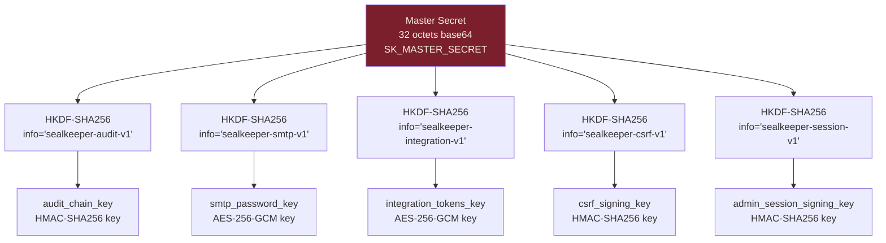

# Module E — Sécurité & audit

**Statut** : validé
**Version** : 1.0
**Dernière mise à jour** : 2026-05-16
**Auteur** : Pascal-Louis Darmon (assisté par Daneel / Claude)
**Dépendances** : modules C (audit log table, listes admin), D (master secret, sessions), G (endpoints à protéger) ; alimente I (RGPD)

---

## 1. Purpose

Ce module spécifie la **sécurité transverse** de SealKeeper : tous les contrôles qui ne tiennent pas dans un module fonctionnel mais qui s'appliquent à l'ensemble du système. Couvre la chaîne d'audit signée, les en-têtes HTTP de sécurité, l'anti-énumération formalisée, le rate-limiting défensif, la gestion cryptographique des secrets, le threat model STRIDE et la posture de réponse à incident.

C'est le **module de référence** que consulteront un RSSI, un pentester, un auditeur ANSSI ou un client posant des questions sur la posture sécurité. Tout autre module pointe vers E pour les décisions de sécurité concrètes.

---

## 2. Actors and use cases

| Acteur | Interaction |
|---|---|
| Auditeur sécurité externe | Vérifie la chaîne d'audit, lit le threat model, audite la config |
| Attaquant (modélisé STRIDE) | Représente les classes de menaces contre lesquelles le système se défend |
| Admin SealKeeper | Gère la posture (vérifie l'intégrité de la chaîne, surveille les alertes) |
| Serveur Go | Applique les contrôles à chaque requête |
| Reverse proxy / WAF / LB | Première ligne de défense (TLS, anti-DDoS) |

---

## 3. Functional requirements

### 3.1 Audit log signé HMAC chaîné

| ID | Exigence | Niveau |
|---|---|---|
| FR-E.1 | Chaque entrée d'audit log contient une signature `hmac_chain` calculée comme : `HMAC-SHA256(key=audit_chain_key, data=hash_previous_entry || canonical_json(this_entry))` | MUST |
| FR-E.2 | La première entrée (entrée *genesis*) utilise `hash_previous_entry = SHA-256(instance_id || initial_timestamp)` | MUST |
| FR-E.3 | `audit_chain_key` est une clé de 32 octets dérivée du master secret par HKDF-SHA256 avec `info="sealkeeper-audit-v1"` | MUST |
| FR-E.4 | `canonical_json` produit une représentation JSON déterministe : clés triées alphabétiquement, pas d'espaces superflus, types stricts | MUST |
| FR-E.5 | Une procédure `sealkeeper audit verify` vérifie la chaîne complète et retourne soit *« intacte »*, soit *« rupture détectée à l'entrée #N »* | MUST |
| FR-E.6 | La console admin affiche en permanence un indicateur d'intégrité dans son bandeau supérieur (FR-C.82) | MUST |
| FR-E.7 | En cas de rupture détectée, l'événement `AUDIT_CHAIN_BROKEN` est émis (impossible à signer correctement puisque la clé serait compromise — l'événement est stocké en clair avec marqueur spécial) et toutes les intégrations SIEM sont notifiées | MUST |
| FR-E.8 | La métrique Prometheus `sealkeeper_audit_log_chain_intact` (FR-D.61) reflète l'état (0 ou 1) | MUST |
| FR-E.9 | **v0.2 : signature Ed25519 asymétrique optionnelle** — une clé privée Ed25519 signe chaque entrée, la clé publique est exposée publiquement pour vérification tierce sans accès à la clé privée. La chaîne HMAC reste pour le runtime ; Ed25519 ajoute la non-répudiation | 📋 v0.2 |

### 3.2 Catalogue des événements d'audit

Référence canonique : module C §5.2. La liste est figée par catégorie (Authentification, Comptes admin, Domaines, Policies, Élévations, Bibliothèques, SMTP, Branding & templates, Intégrations, Système, Workflow utilisateur).

| ID | Exigence | Niveau |
|---|---|---|
| FR-E.10 | Chaque événement comporte les champs **obligatoires** : `id` (UUIDv7), `ts` (timestamp UTC + offset), `event_type` (énumération), `severity` (info / warn / error / critical) | MUST |
| FR-E.11 | Champs **conditionnels** selon le contexte : `actor_admin_id`, `resource_type`, `resource_id`, `details` (JSON), `ip`, `user_agent`, `request_id` | MUST si applicable |
| FR-E.12 | Aucun événement ne contient de mot de passe en clair, de TOTP secret, de session token utilisateur, ou de master secret. Les champs sensibles sont masqués (`***`) ou absents | MUST |
| FR-E.13 | Le hachage du token de session est consigné (`SHA-256(token)[0:16]`) pour pouvoir corréler sans révéler le token | MUST |
| FR-E.14 | Pour `EMAIL_SENT` et `EMAIL_FAILED`, le destinataire est consigné. Pour `EMAIL_FAILED`, la raison technique sans secrets | MUST |
| FR-E.15 | Pour `TOKEN_CONSUMED`, sont consignés : token hash, email, ip, user-agent, niveau ANSSI, policy id | MUST |
| FR-E.16 | Severity `critical` déclenche envoi prioritaire vers toutes les intégrations actives | MUST |

### 3.3 En-têtes HTTP de sécurité

| ID | En-tête | Valeur | Pages concernées |
|---|---|---|---|
| FR-E.17 | `Strict-Transport-Security` | `max-age=31536000; includeSubDomains` | Toutes |
| FR-E.18 | `Content-Security-Policy` | `default-src 'self'; script-src 'self'; style-src 'self'; img-src 'self' data:; font-src 'self'; connect-src 'self'; frame-ancestors 'none'; form-action 'self'; base-uri 'self'; object-src 'none'` | Toutes |
| FR-E.19 | `X-Content-Type-Options` | `nosniff` | Toutes |
| FR-E.20 | `X-Frame-Options` | `DENY` (redondant avec CSP `frame-ancestors 'none'`, conservé pour compatibilité) | Toutes |
| FR-E.21 | `Referrer-Policy` | `strict-origin-when-cross-origin` | Toutes |
| FR-E.22 | `Permissions-Policy` | `accelerometer=(), camera=(), geolocation=(), gyroscope=(), magnetometer=(), microphone=(), payment=(), usb=()` | Toutes |
| FR-E.23 | `Cross-Origin-Opener-Policy` | `same-origin` | Toutes |
| FR-E.24 | `Cross-Origin-Resource-Policy` | `same-origin` | Toutes (sauf endpoints public si déploiement multi-domaines, ajusté par config) |
| FR-E.25 | `Cache-Control` | `no-store, no-cache, must-revalidate` pour endpoints API et console admin ; `public, max-age=31536000, immutable` pour assets versionnés | Toutes |
| FR-E.26 | `Server` | Absent ou valeur générique (`sealkeeper`). Pas de version révélée | Toutes |
| FR-E.27 | `X-Powered-By` | Absent | Toutes |

### 3.4 SRI (Subresource Integrity)

| ID | Exigence | Niveau |
|---|---|---|
| FR-E.28 | Tous les assets statiques (CSS, JS, fontes) référencés dans les pages HTML utilisent un attribut `integrity` avec hash SHA-384 | MUST |
| FR-E.29 | Les hashes sont **générés au build** par la chaîne de build (Makefile + script) et injectés dans les templates HTML | MUST |
| FR-E.30 | Les assets ont un nom incluant un hash court (cache busting + immutability) : `app.4f3a91.js`, `style.8b2e1c.css` | MUST |
| FR-E.31 | Aucun CDN externe. Tous les assets sont servis par le binaire Go depuis `/static/` | MUST |
| FR-E.32 | Aucun script inline (CSP `'unsafe-inline'` interdit). Tous les comportements JS sont externalisés dans des fichiers | MUST |
| FR-E.33 | Aucune URL externe dans les CSS (pas de `@import`, pas de fonts hostées chez Google Fonts ou autre) | MUST |

### 3.5 Anti-énumération formalisée

| ID | Exigence | Niveau |
|---|---|---|
| FR-E.34 | `POST /api/v1/request` répond en temps constant **500 ms ± 50 ms**, indépendamment du résultat (domaine inconnu / autorisé / rate-limité / succès) | MUST |
| FR-E.35 | Le corps de réponse est strictement identique en succès et en échec : `{"status":"ok","message":"Si cette adresse est autorisée, un email vous est parvenu. Vérifiez votre boîte de réception."}` (i18n selon `Accept-Language`) | MUST |
| FR-E.36 | Le code HTTP est toujours **200 OK** pour cette route (jamais 4xx ou 5xx en cas d'échec de business logic) | MUST |
| FR-E.37 | La taille de la réponse est constante (padding ajouté si nécessaire) | SHOULD |
| FR-E.38 | Aucun header n'est conditionnel au résultat (pas de `X-Rate-Limit-Remaining`, pas de `Retry-After`) | MUST |
| FR-E.39 | `POST /admin/login` répond également en temps constant **300 ms ± 30 ms** pour prévenir l'énumération d'admins existants | MUST |
| FR-E.40 | Les messages d'erreur de login admin sont identiques pour *« utilisateur inconnu »*, *« mot de passe incorrect »*, *« TOTP incorrect »*, *« compte verrouillé »* (message générique *« Authentification refusée »*) | MUST |

### 3.6 Rate-limiting défensif

| ID | Exigence | Niveau |
|---|---|---|
| FR-E.41 | **Endpoint public `/api/v1/request`** : 3 demandes/heure par email + 10 demandes/heure par IP (FR-B.11, FR-B.12) | MUST |
| FR-E.42 | **Endpoint `/admin/login`** : 5 tentatives par compte avant verrouillage 15 minutes (FR-C.10) | MUST |
| FR-E.43 | **Endpoint `/reveal/{token}`** : 5 fetches par token avant invalidation forcée. Protection contre brute force sur tokens partiellement devinés | MUST |
| FR-E.44 | **Endpoint `/api/v1/policy`** : 1 fetch par token (consommation unique) | MUST |
| FR-E.45 | **Endpoints admin API XHR** : 100 requêtes/minute par session admin. Protège contre runaway JS dans la console | SHOULD |
| FR-E.46 | **Endpoint `/metrics`** : pas de rate-limit (Prometheus scrape) | MUST |
| FR-E.47 | Algorithme : **token bucket en mémoire** par clé (email, IP, admin_id, token). Pas de Redis nécessaire en v0.1 | MUST |
| FR-E.48 | Persistance des compteurs : SQLite/PostgreSQL pour les compteurs longue durée (par email, par admin) ; mémoire seule pour les compteurs courts (par IP, par minute) | MUST |
| FR-E.49 | Au dépassement, **pas de réponse 429 visible** : la réponse reste 200 + message générique pour l'endpoint public (FR-B.13). Pour les endpoints admin, 429 + message *« Trop de requêtes »* | MUST |

### 3.7 DKIM / SPF / DMARC outbound

| ID | Exigence | Niveau |
|---|---|---|
| FR-E.50 | En v0.1, SealKeeper **n'effectue pas** de signature DKIM native. La signature est attendue en amont par le relais SMTP configuré (D-D.9, D-C.19) | MUST |
| FR-E.51 | La documentation de déploiement (module H) explique la configuration recommandée : SPF (`v=spf1 ...`), DKIM (clé publique en DNS), DMARC (`v=DMARC1; p=quarantine; rua=...`) | MUST |
| FR-E.52 | Le serveur ajoute un en-tête `Message-ID` unique par envoi pour faciliter le tracing inverse | MUST |
| FR-E.53 | Le serveur ajoute un en-tête `List-Unsubscribe` même si SealKeeper n'envoie pas de marketing (compatibilité Gmail/Outlook anti-spam) — pointant vers une page expliquant que l'envoi n'est jamais automatique | MUST |
| FR-E.54 | **v0.2 : signature DKIM native** — upload de clé privée DKIM dans la console et signature côté serveur (FR-C.62, marqué v0.2) | 📋 v0.2 |

### 3.8 Threat model STRIDE

#### 3.8.1 Spoofing (usurpation d'identité)

| Menace | Mitigations |
|---|---|
| Usurpation d'identité utilisateur sur la page publique | Anti-énumération (3.5) ; aucun mot de passe ne transite ; vol de token email = vol d'inbox (escalation périmètre attaquant) |
| Usurpation d'identité admin | TOTP obligatoire, WebAuthn optionnel, sessions cookie HttpOnly+SameSite+Secure, verrouillage 5 tentatives, audit log de tout login |
| Usurpation d'identité SealKeeper (faux serveur, MitM) | TLS obligatoire, HSTS, CSP stricte, SRI sur tous les assets, certificats pinnable côté admin (option clients) |
| Email forgé (SealKeeper falsifié) | SPF + DKIM + DMARC documentés (3.7), Message-ID traçable |

#### 3.8.2 Tampering (altération)

| Menace | Mitigations |
|---|---|
| Modification d'une entrée d'audit log a posteriori | HMAC chaîné (3.1) : toute modification rompt la chaîne et est détectée |
| Modification du contenu d'une bibliothèque sur disque | Hash SHA-256 stocké en base. Vérification au chargement. Mismatch → bibliothèque marquée *« compromise »*, audit log critical |
| Modification de la configuration par accès direct à la DB | Pas de mitigation native (l'admin DB peut toujours). Documenter que l'accès direct DB est hors périmètre de confiance |
| Modification du master secret entre deux démarrages | Le serveur refuse de démarrer (les secrets en base sont indéchiffrables). Comportement documenté |
| Modification du code Go déployé | Reproductible builds + signing GPG des releases (module L), checksums publiés |

#### 3.8.3 Repudiation (déni)

| Menace | Mitigations |
|---|---|
| Un admin nie avoir effectué une action | Audit log HMAC chaîné, IP + user-agent, signature horodatée. v0.2 : Ed25519 asymétrique = preuve mathématique |
| Un utilisateur nie avoir consulté son mot de passe | Audit log `TOKEN_CONSUMED` avec IP + user-agent. v0.2 : notification post-consultation (FR-B.39-41 — activée par défaut sur B2/B3) sert d'avis cryptographique |

#### 3.8.4 Information disclosure (fuite d'information)

| Menace | Mitigations |
|---|---|
| Fuite du mot de passe par le serveur | **Impossible architecturalement** : le serveur ne génère ni ne reçoit jamais le mot de passe (génération navigateur uniquement, modules A et B) |
| Fuite d'un mot de passe par log applicatif | Sécurité par construction : le mdp ne transite jamais. Les logs ne peuvent pas le capturer |
| Fuite d'un mot de passe par presse-papier | Auto-purge 30s (FR-B.32). Hygiène utilisateur recommandée (verrouillage écran) |
| Fuite d'un mot de passe par historique navigateur | Mdp jamais dans l'URL (FR-B.35), pas dans le localStorage (FR-B.34), session token consommé une fois |
| Énumération d'emails autorisés | Anti-énumération (3.5) |
| Énumération d'admins | Login response constante (FR-E.40) |
| Fuite de la configuration via export | Export JSON exclut credentials SMTP, integration tokens, master secret (D-C.12) |
| Fuite par error verbose | Pas de stack trace exposée en prod ; erreurs génériques côté utilisateur, détails en audit log et logs serveur uniquement |

#### 3.8.5 Denial of service

| Menace | Mitigations |
|---|---|
| Flood `/api/v1/request` | Rate-limit par IP + par email (3.6) |
| Flood `/admin/login` | Verrouillage compte 5 tentatives (3.6) |
| Flood `/reveal/{token}` | Rate-limit par token (3.6) |
| Saturation DB par création de sessions | Limite sessions actives `SK_MAX_ACTIVE_SESSIONS` (FR-D edge case) |
| Saturation disque par audit log | Rétention configurable 365 jours par défaut (FR-C.83), purge programmée |
| Saturation mémoire par cache policies | Cache bounded ; nombre de policies max par instance documenté |
| Attaque par fichier upload monstrueux | Limite 10 MB (D-D.22), refus en amont |
| Slow loris / connections trainantes | Timeouts HTTP en amont (reverse proxy) ; idle timeout côté Go 30s |
| Attaque amplification par requêtes coûteuses | Pas de requête SQL non bornée. Tous les LIST endpoints paginés |

#### 3.8.6 Elevation of privilege

| Menace | Mitigations |
|---|---|
| Accès console admin sans credentials | TOTP obligatoire, double facteur, sessions courtes |
| Élévation B1 → B2/B3 par un utilisateur | Listes B2/B3 maintenues côté serveur uniquement, jamais influencées par le client |
| Évasion de container | Image `distroless/static` ou `scratch`, utilisateur non-root, pas de privilèges Docker |
| Injection SQL | `sqlc` (parametrized queries par construction), pas de string concatenation |
| Injection XSS | `html/template` Go (échappement auto), CSP stricte, pas d'inline JS |
| Injection LDAP / Command | Pas de LDAP en v0.1 ; pas d'exec de commandes côté serveur |
| CSRF sur console admin | Double-submit cookie token (FR-D.30) |
| Path traversal sur upload bibliothèque | Nom de fichier généré côté serveur (UUID), jamais le nom fourni par l'utilisateur |

### 3.9 Posture cryptographique

| ID | Exigence | Niveau |
|---|---|---|
| FR-E.55 | **Aucune cryptographie côté serveur ne concerne les mots de passe** — le serveur ne génère ni ne reçoit ni ne chiffre/déchiffre aucun mot de passe utilisateur | MUST |
| FR-E.56 | Les secrets stockés en base (SMTP password, integration tokens, DKIM key v0.2) sont chiffrés par **AES-256-GCM** | MUST |
| FR-E.57 | Les clés de chiffrement spécifiques sont dérivées du master secret par **HKDF-SHA256** avec un `info` distinct par usage (`"sealkeeper-smtp-v1"`, `"sealkeeper-integration-v1"`, etc.) | MUST |
| FR-E.58 | Le nonce GCM est unique par chiffrement (12 octets aléatoires, jamais réutilisé pour la même clé) | MUST |
| FR-E.59 | TLS **1.2 minimum**, **1.3 préféré**. Suites de chiffrement configurées strictement (refus 3DES, RC4, NULL, EXPORT) | MUST |
| FR-E.60 | Les certificats serveur sont gérés par le reverse proxy (Caddy, Traefik). Le binaire Go peut accepter du HTTPS direct si activé via config (mode standalone) | MUST |
| FR-E.61 | Cryptographie côté navigateur (génération mots de passe) : **WebCrypto API exclusivement**, `crypto.getRandomValues()`. Math.random formellement interdit | MUST |
| FR-E.62 | Tous les hachages utilisés : **SHA-256 minimum**, jamais MD5, SHA-1 | MUST |
| FR-E.63 | Mots de passe admin stockés avec **argon2id** (memoryCost=64MB, iterations=3, parallelism=4, saltLength=16) | MUST |

### 3.10 Gestion des secrets

| ID | Exigence | Niveau |
|---|---|---|
| FR-E.64 | Le master secret n'est jamais persisté en base. Il est fourni en environnement (D-D.19) | MUST |
| FR-E.65 | Le master secret n'apparaît jamais dans les logs, l'audit log, les exports, les dumps de config | MUST |
| FR-E.66 | **Rotation du master secret** : procédure CLI `sealkeeper secrets rotate-master` qui déchiffre tous les secrets avec l'ancienne clé, les rechiffre avec la nouvelle. **Reporté à v0.2** | 📋 v0.2 |
| FR-E.67 | Les secrets fournis dans la console (SMTP password, integration tokens) ne sont jamais réaffichés en clair après saisie (FR-C.59) | MUST |
| FR-E.68 | Les codes de récupération TOTP (FR-C.5, 8 codes) sont stockés en base en `argon2id`, comparés au login | MUST |
| FR-E.69 | Logs Docker bootstrap (FR-C.1) : le password apparaît une seule fois dans la sortie standard. Si l'admin a déjà changé son mdp, aucun nouveau message bootstrap n'est émis | MUST |

### 3.11 Procédures de réponse à incident

| ID | Exigence | Niveau |
|---|---|---|
| FR-E.70 | Documentation d'une **runbook d'incident** dans le dépôt (`docs/incident-response.md`) couvrant : détection, isolation, communication, forensics, post-mortem | MUST |
| FR-E.71 | Mécanisme de **mise en quarantaine immédiate** via CLI : `sealkeeper emergency stop` arrête le serveur et signale en audit log | MUST |
| FR-E.72 | Mécanisme de **purge d'urgence des sessions actives** : `sealkeeper emergency revoke-all-sessions` consomme toutes les sessions ouvertes (oblige tous les utilisateurs en cours à redemander un lien) | MUST |
| FR-E.73 | Mécanisme de **changement de master secret en urgence** (rotation forcée, v0.2 — cf. FR-E.66) | 📋 v0.2 |
| FR-E.74 | Mécanisme de **blacklist temporaire d'IP** via CLI : `sealkeeper firewall block <ip>` (utile pendant une attaque ciblée) | SHOULD |
| FR-E.75 | Procédure de **notification CNIL** (article 33 RGPD) documentée si un incident touche des données personnelles : timeline 72h, contenu de la notification | MUST |

---

## 4. Non-functional requirements

| Type | Cible |
|---|---|
| **Conformité OWASP** | ASVS 4.0 niveau 2 (cible visée par le module L pour la couverture de tests) |
| **Conformité ANSSI** | Recommandations mot de passe (déjà couvertes par les générateurs G1/G2/G3) |
| **Conformité NIST** | SP 800-63B (Digital Identity Guidelines), SP 800-53 (mapping partiel) |
| **RGPD article 32** | Sécurité du traitement : pseudonymisation (mdp), chiffrement (secrets), résilience (PRA/PCA documentés en module H), test régulier (module L) |
| **CSP** | `'unsafe-inline'` et `'unsafe-eval'` interdits |
| **TLS** | 1.2 minimum, 1.3 préféré ; pas de 1.0 / 1.1 |
| **Cryptographic agility** | Permettre l'évolution HMAC → Ed25519 sans migration douloureuse |
| **Auditabilité** | Toute action loggée ; chaîne d'audit vérifiable hors-ligne |

---

## 5. Data model

### 5.1 Structure de la chaîne d'audit HMAC

```mermaid
graph LR
    G[Entrée Genesis<br/>hash_prev = SHA-256 instance_id + ts] --> E1[Entrée #1<br/>hmac = HMAC key, hash_prev || json_1]
    E1 --> E2[Entrée #2<br/>hmac = HMAC key, hash E1 || json_2]
    E2 --> E3[Entrée #3<br/>hmac = HMAC key, hash E2 || json_3]
    E3 --> E4[Entrée #N<br/>hmac = HMAC key, hash E_N-1 || json_N]

    style G fill:#7A1F2B,color:#F4EFE6
    style E4 fill:#7A1F2B,color:#F4EFE6
```

### 5.2 Format JSON canonique d'une entrée d'audit

```json
{
  "actor_admin_id": "01HXY7M3K8WBQ8FPGZ2NCYV9HJ",
  "details": {
    "domain_id": "01HXY7M3K8WBQ8FPGZ2NCYV9HK",
    "policy_id": "01HXY7M3K8WBQ8FPGZ2NCYV9HL",
    "previous_anssi_level": "B1",
    "new_anssi_level": "B2"
  },
  "event_type": "POLICY_UPDATED",
  "hmac_chain": "9f2a1b8e3c4d5f67...",
  "id": "01HXY7M3K8WBQ8FPGZ2NCYV9HM",
  "ip": "10.0.1.42",
  "request_id": "01HXY7M3K8WBQ8FPGZ2NCYV9HN",
  "resource_id": "01HXY7M3K8WBQ8FPGZ2NCYV9HL",
  "resource_type": "policy",
  "severity": "info",
  "ts": "2026-05-16T15:42:31.123456Z",
  "user_agent": "Mozilla/5.0 ..."
}
```

Clés triées alphabétiquement, pas d'espaces superflus, types strictement typés.

### 5.3 Dérivation des clés depuis le master secret



---

## 6. Interfaces

### 6.1 Indicateur d'intégrité dans la console admin

Affiché en permanence dans le bandeau supérieur de toutes les pages admin. Trois états visuels :

- **✓ Chaîne d'audit intacte** (vert) — état normal
- **⚠ Vérification en cours** (orange) — au boot, pendant que la chaîne est revérifiée
- **✗ Rupture détectée à l'entrée #N** (rouge) — incident critique, lien vers la procédure de réponse

### 6.2 CLI de vérification

```
sealkeeper audit verify

→ Chain integrity check
  Total entries: 12347
  Verified: 12347
  Status: INTACT
  First entry: 2026-04-01T08:23:14Z
  Last entry: 2026-05-16T15:42:31Z
```

En cas de rupture :

```
sealkeeper audit verify

→ Chain integrity check
  Total entries: 12347
  Verified: 8421
  Status: BROKEN at entry #8422
  Expected HMAC: 4a8f...
  Computed HMAC: 9b2c...
  Failed entry timestamp: 2026-05-14T03:12:08Z
  Action required: Trigger incident response procedure
```

---

## 7. Edge cases and error handling

| Cas | Réponse |
|---|---|
| Master secret perdu (admin a perdu la valeur en env) | Tous les secrets en base sont indéchiffrables. SealKeeper refuse de démarrer. Procédure documentée : redéploiement complet avec nouvelle config (perte des policies, etc.) |
| Master secret compromis (fuité) | Procédure d'urgence : `sealkeeper emergency revoke-all-sessions` + `sealkeeper secrets rotate-master` (v0.2). En v0.1 : redéploiement complet + audit forensique |
| Audit chain key compromise | Rupture détectée par l'auditeur tiers possible si Ed25519 actif (v0.2). En v0.1 : audit interne uniquement |
| Rupture de chaîne d'audit | Événement `AUDIT_CHAIN_BROKEN` émis. Toutes les intégrations SIEM alertées. Admin contacté. Indicateur rouge en permanence dans la console |
| Tentative de modification directe en base | Pas de mitigation native. Documenter que la DB est dans le périmètre de confiance — un attaquant DB peut briser la chaîne mais c'est détectable |
| Réveil après outage long (sessions toutes expirées) | Comportement normal : les utilisateurs en cours redemandent un lien. Aucun impact sécurité |
| Horloge serveur reculée (NTP attack) | Les nouveaux audits portent un timestamp incohérent. Le timestamp dans le HMAC reste signé. Détectable a posteriori. Pas de mitigation native — recommandation : utiliser un NTP authentifié |
| Migration vers Ed25519 (v0.2) | Procédure : générer keypair, ajouter signature Ed25519 aux nouvelles entrées. Conserver HMAC pour les anciennes. Vérifications hybrides |

---

## 8. Closed decisions

| # | Décision | Justification |
|---|---|---|
| D-E.1 | **HMAC-SHA256 chaîné en v0.1** ; **Ed25519 asymétrique en v0.2** | Simple en v0.1 (clé symétrique partagée), non-répudiation en v0.2 (clé publique pour audit tiers) |
| D-E.2 | **Canonical JSON déterministe** (clés triées alphabétiquement) pour la signature | Permet la vérification hors-ligne sans dépendance à l'implémentation Go |
| D-E.3 | **Aucun CDN externe** | Tous les assets servis par le binaire ; CSP stricte possible |
| D-E.4 | **SRI obligatoire** sur tous les assets statiques | Protection contre supply-chain attack même en mono-origine |
| D-E.5 | **CSP sans `unsafe-inline` ni `unsafe-eval`** | Posture défensive maximale ; aucun script inline |
| D-E.6 | **Anti-énumération via padding temporel constant** (500 ms ± 50 ms) | Empêche les attaques par timing même en charge variable |
| D-E.7 | **Rate-limit token bucket en mémoire** (pas Redis en v0.1) | Suffit pour mono-instance ; persistance compteurs longue durée en DB |
| D-E.8 | **DKIM externe en v0.1**, natif en v0.2 (cf. D-C.19, D-D.9) | Délégation à l'infra mail mature |
| D-E.9 | **AES-256-GCM pour les secrets en base** ; jamais sur les mots de passe utilisateurs (qui ne sont pas en base) | Standard NIST, authenticated encryption |
| D-E.10 | **argon2id pour les mots de passe admin** (paramètres recommandés OWASP 2024) | Memory-hard, résistant GPU/ASIC |
| D-E.11 | **TLS 1.2+** , 1.3 préféré | Posture conforme NIST SP 800-52r2 |
| D-E.12 | **HKDF-SHA256 pour la dérivation de clés** depuis master secret | Standard RFC 5869 |
| D-E.13 | **Pas de rotation master secret en v0.1** (`sealkeeper secrets rotate-master` reporté v0.2) | Complexe à implémenter (déchiffrement + rechiffrement de tous les secrets) |
| D-E.14 | **Mécanismes d'urgence CLI** (`emergency stop`, `revoke-all-sessions`, `firewall block`) en v0.1 | Indispensable à la posture incident-ready |
| D-E.15 | **Runbook d'incident dans le dépôt** (`docs/incident-response.md`) en v0.1 | Documentation = part of the product |
| D-E.16 | **Notification CNIL article 33 documentée** dans le runbook | Conformité RGPD obligatoire pour un produit traitant des données personnelles |
| D-E.17 | **Politique de divulgation responsable activée dès v0.1** ; **pas de récompenses financières** tant que le produit est en pré-alpha (Hall of thanks suffit) | Posture sérieuse sans budget ; bug bounty financier prématuré |
| D-E.18 | **Pentest tiers obligatoire avant v1.0** ; recommandé avant v0.1 si budget | v1.0 = commitment API stability + production-ready, ne peut être livré sans validation externe |
| D-E.19 | **Pas de certification SOC 2 / ISO 27001 visée en v0.1** ; mapping OWASP ASVS 4.0 niveau 2 documenté | Certifications coûteuses (~30-100 k€) et prématurées ; mapping libre suffit pour la posture |
| D-E.20 | **Audit chain key dérivée du master secret** par HKDF-SHA256 (pas de clé séparée) | Une clé séparée ajoute une surface de gestion sans bénéfice net |
| D-E.21 | **Header `List-Unsubscribe` activé dès v0.1** | Coût minime, gain de délivrabilité significatif sur Gmail / Outlook |
| D-E.22 | **WAF natif pas livré en v0.1** ; reverse proxy (Caddy / Traefik) suffit ; intégration Cloudflare / ModSecurity documentée en module H | Délégation aux outils mûrs ; SealKeeper reste minimaliste |
| D-E.23 | **Firewall IP persisté en DB** (pas en mémoire seule) | Une mesure d'urgence ne doit pas être perdue au restart |
| D-E.24 | **Codes de récupération TOTP : 8 codes de 10 caractères alphanumériques** ; stockés en argon2id | Compromis lisibilité / sécurité ; 8 codes laissent une marge pour réinitialisations échelonnées |

---

## 9. Open questions

**Toutes les questions ouvertes ont été tranchées le 16 mai 2026** par Pascal-Louis Darmon après recommandation de Daneel. Les 8 décisions correspondantes sont consignées en §8 sous les références D-E.17 à D-E.24. Le PRD E est intégralement validé en v1.0.

Une décision (l'ancienne 9.6, WAF) renvoie le **détail** au module H (déploiement), tout en posant la ligne directrice en §8.

---

## 10. References

- **Module C** — table audit_log, événements catalogue, indicateur intégrité UI
- **Module D** — master secret, sessions, métriques Prometheus
- **Module F** — intégrations SIEM (consomment les événements audit)
- **Module G** — endpoints à protéger par les headers et rate-limit
- **Module H** — déploiement (reverse proxy, TLS, WAF)
- **Module I** — RGPD (chiffrement, notification CNIL, droit à l'oubli)
- **Module L** — tests de sécurité, couverture ASVS

- **OWASP ASVS 4.0** — Application Security Verification Standard
- **OWASP Top 10 (2021)** — Most critical web application security risks
- **NIST SP 800-63B** — Digital Identity Guidelines
- **NIST SP 800-53** — Security and Privacy Controls
- **NIST SP 800-52r2** — Guidelines for TLS Implementations
- **RFC 5869** — HKDF (HMAC-based Key Derivation Function)
- **RFC 7519** — JSON Web Token (référence ; SealKeeper utilise des tokens opaques mais le RFC est pertinent pour les comparer)
- **RFC 8032** — Ed25519 (et autres EdDSA)
- **RFC 7807** — Problem Details for HTTP APIs (référence pour module G)
- **RGPD article 32** — Sécurité du traitement
- **RGPD article 33** — Notification d'une violation de données à l'autorité (CNIL)
- **STRIDE threat modeling** — Microsoft, 1999

---

## 11. Évolution de ce document

| Version | Date | Auteur | Changements |
|---|---|---|---|
| 1.0 | 2026-05-16 | P.-L. Darmon (Daneel) | **Version validée** — 8 décisions tranchées (D-E.17 à D-E.24) : politique de disclosure sans récompense financière, pentest tiers obligatoire avant v1.0, pas de certif SOC 2 / ISO 27001 v0.1 mais mapping ASVS, audit chain key dérivée master secret, List-Unsubscribe en v0.1, WAF délégué au reverse proxy (détail H), firewall IP en DB, codes TOTP 8×10 alphanum |
| 0.1 | 2026-05-16 | P.-L. Darmon (Daneel) | Création initiale — 75 FR réparties en 11 sous-sections, threat model STRIDE complet (6 catégories), 16 décisions tranchées, 8 questions ouvertes, 2 diagrammes Mermaid (chaîne HMAC, dérivation HKDF) |

---

*Document maintenu dans le repo `sched75/sealkeeper` sous `docs/prd/E-security-audit.md`.*
