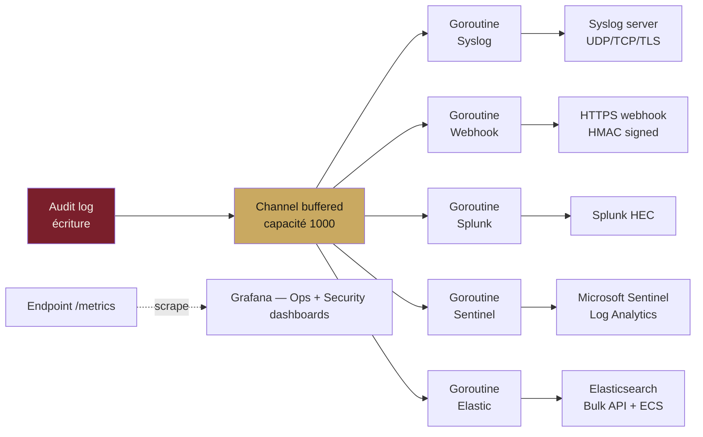
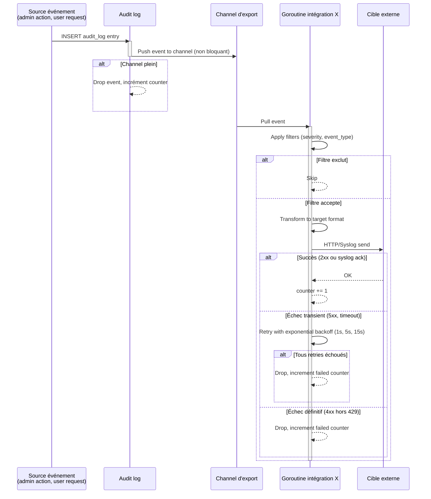

# Module F — Intégrations

**Statut** : validé
**Version** : 1.0
**Dernière mise à jour** : 2026-05-16
**Auteur** : Pascal-Louis Darmon (assisté par Daneel / Claude)
**Dépendances** : modules C (UI de config), D (backend exporteur), E (événements audit à exporter), G (endpoints admin de gestion)

---

## 1. Purpose

Ce module spécifie toutes les **intégrations** de SealKeeper avec des systèmes externes :

— **Sortantes** : export d'audit log et de métriques vers des SIEM (Syslog RFC 5424, JSON webhook, Splunk HEC, Microsoft Sentinel, Elastic) et des plateformes d'observabilité (Prometheus, Grafana via dashboards JSON livrés).
— **Entrantes** : alimentation automatique des listes d'élévation par LDAP / AD (📋 v0.3) et provisioning SCIM (📋 v0.3+).

Le principe directeur : **SealKeeper s'intègre, ne devient pas un SIEM**. La fonction reste de distribuer des mots de passe ANSSI-compliant ; les exports facilitent la surveillance et la conformité par l'écosystème déjà en place chez le client.

---

## 2. Actors and use cases

| Acteur | Interaction |
|---|---|
| Admin SealKeeper | Configure intégrations en console (module C §3.11), teste, supervise |
| Serveur SealKeeper | Émet les événements audit log et les métriques |
| SIEM externe (Splunk, Sentinel, Elastic, Syslog collector) | Reçoit, ingère, archive |
| Prometheus | Scrape `/metrics` régulièrement |
| Grafana | Importe les dashboards JSON livrés, affiche les métriques |
| Annuaire LDAP / AD (v0.3) | Source des élévations B2/B3 |
| Service IdP via SCIM (v0.3+) | Source de provisioning utilisateurs |

**Cas d'usage canoniques.**

| Scénario | Étapes |
|---|---|
| RSSI veut un audit log central dans Splunk | Admin → console → intégrations → Splunk HEC → URL + token → test → activation. Tous les événements `severity ≥ info` partent vers Splunk avec sourcetype `sealkeeper:audit` |
| DSI veut monitorer les volumes dans Grafana | Admin → console → intégrations → Grafana → télécharge `ops-dashboard.json` → importe dans Grafana → ajoute la source Prometheus pointant `/metrics` |
| Compliance veut tous les événements `critical` notifiés en temps réel | Admin → console → intégrations → JSON webhook → URL `https://alerting.company.com/sealkeeper` → filtre severity `critical` → test → activation |
| (v0.3) DSI veut auto-alimenter la liste B3 depuis le groupe AD `WSE-Admins` | Admin → console → intégrations LDAP → bind credentials → groupe `WSE-Admins` → niveau B3 → sync 1×/heure |

---

## 3. Functional requirements

### 3.1 Architecture commune des intégrations sortantes

| ID | Exigence | Niveau |
|---|---|---|
| FR-F.1 | Toutes les intégrations sortantes implémentent une **interface Go commune** `Exporter` exposant : `Name() string`, `Test(ctx) error`, `Export(ctx, event) error`, `Close() error` | MUST |
| FR-F.2 | Chaque intégration tourne dans une **goroutine dédiée** consommant un canal d'événements bufférisé en mémoire (taille configurable, défaut 1000) | MUST |
| FR-F.3 | Si le canal est plein (cible lente, déconnectée), les nouveaux événements sont **abandonnés** (drop-tail) avec un compteur Prometheus `sealkeeper_integration_dropped_total{integration}` incrémenté. Pas de blocage du serveur principal | MUST |
| FR-F.4 | Chaque envoi a un **timeout** configurable par intégration (défaut 10 secondes) | MUST |
| FR-F.5 | En cas d'échec transitoire (5xx, timeout réseau), le serveur **retry 3 fois** avec backoff exponentiel (1s, 5s, 15s). Échec définitif → abandon de l'événement, audit log interne ne consigne pas (sinon récursion) mais incrémente `sealkeeper_integration_failed_total{integration, reason}` | MUST |
| FR-F.6 | Chaque intégration supporte des **filtres** : niveaux de severity (info, warn, error, critical), types d'événements (whitelist ou blacklist). Configurés en console (FR-C.86) | MUST |
| FR-F.7 | Le contenu sensible des événements (tokens hash, IPs, user-agents) est **inclus** dans les exports. Les secrets restent exclus (cf. FR-E.12) | MUST |
| FR-F.8 | Aucune **queue persistante** en v0.1 : les événements en cours de traitement sont perdus si le serveur redémarre. Persistance en v0.2 si demande forte | MUST |
| FR-F.9 | Un bouton **Tester** en console envoie un événement factice `INTEGRATION_TEST_PING` à la cible | MUST |
| FR-F.10 | Toutes les intégrations sont **désactivées par défaut** ; l'admin doit explicitement les activer après avoir testé | MUST |

### 3.2 Syslog RFC 5424

| ID | Exigence | Niveau |
|---|---|---|
| FR-F.11 | Support des trois transports : **UDP** (port 514 par défaut), **TCP** (port 514), **TLS** RFC 5425 (port 6514 par défaut) | MUST |
| FR-F.12 | Format strict **RFC 5424** : `<PRI>VERSION TIMESTAMP HOSTNAME APP-NAME PROCID MSGID STRUCTURED-DATA MSG` | MUST |
| FR-F.13 | `PRI` calculé : `facility * 8 + severity`. Facility par défaut **`local4` (20)** ; configurable. Severity mappée depuis l'événement audit | MUST |
| FR-F.14 | Mapping sévérité audit → syslog | MUST |

Mapping :

| Audit | Syslog | Numérique |
|---|---|---|
| critical | crit | 2 |
| error | err | 3 |
| warn | warning | 4 |
| info | info | 6 |

| ID | Exigence | Niveau |
|---|---|---|
| FR-F.15 | `APP-NAME` = `sealkeeper`, `HOSTNAME` = nom configurable (défaut hostname système), `PROCID` = PID du process, `MSGID` = `event_type` (e.g. `POLICY_UPDATED`) | MUST |
| FR-F.16 | `STRUCTURED-DATA` contient les champs principaux dans le SD-ID `sealkeeper@<enterprise_number>` (PEN à demander à IANA, ou utiliser un placeholder `sealkeeper@99999` en v0.1) | MUST |
| FR-F.17 | `MSG` (texte libre) = court résumé humain : *« POLICY_UPDATED policy=01HXY... actor=01HXY... »* | MUST |
| FR-F.18 | Encodage : **UTF-8 avec BOM** comme prescrit par RFC 5424 §6 | MUST |
| FR-F.19 | Octet counting pour TCP/TLS (mode framing RFC 6587) | MUST |
| FR-F.20 | TLS : validation du certificat serveur ; CA bundle configurable, mTLS optionnel (📋 v0.2) | MUST (TLS) ; 📋 v0.2 (mTLS) |

### 3.3 JSON webhook

| ID | Exigence | Niveau |
|---|---|---|
| FR-F.21 | Envoi POST HTTPS vers une URL configurable. Méthode strictement POST | MUST |
| FR-F.22 | Body JSON contenant l'événement au format canonique de l'audit log (cf. module E §5.2) | MUST |
| FR-F.23 | Header **`X-SealKeeper-Signature: sha256=<hex_digest>`** = HMAC-SHA256 du body avec une clé partagée configurée par l'admin | MUST |
| FR-F.24 | Header **`X-SealKeeper-Event-Type: <event_type>`** | MUST |
| FR-F.25 | Header **`X-SealKeeper-Delivery: <UUIDv7>`** : identifiant unique de l'envoi (utile côté réception pour déduplication) | MUST |
| FR-F.26 | Header **`X-SealKeeper-Idempotency-Key: <event_id>`** : ID de l'événement source. Permet à la cible de déduplicater en cas de retry | MUST |
| FR-F.27 | User-Agent **`SealKeeper/<version> Webhook/1.0`** | MUST |
| FR-F.28 | Le serveur accepte des **codes 2xx** comme succès, **3xx** comme redirection (suivie une fois), **4xx ≠ 429** comme échec définitif, **429 et 5xx** comme transient (retry selon FR-F.5) | MUST |
| FR-F.29 | Pas de support des webhooks **batch** en v0.1 : un événement = un POST | MUST |
| FR-F.30 | TLS obligatoire pour les URL en production ; HTTP plain accepté seulement si la cible est `localhost` ou une IP RFC 1918 (réseau privé) | MUST |

### 3.4 Splunk HEC (HTTP Event Collector)

| ID | Exigence | Niveau |
|---|---|---|
| FR-F.31 | Envoi POST vers l'endpoint Splunk HEC : `https://<host>:8088/services/collector` | MUST |
| FR-F.32 | Authentification via header `Authorization: Splunk <hec_token>` | MUST |
| FR-F.33 | Payload Splunk : `{"event": {...payload audit log...}, "sourcetype": "sealkeeper:audit", "source": "sealkeeper", "host": "<instance_name>", "time": <unix_epoch_seconds>}` | MUST |
| FR-F.34 | `sourcetype`, `source`, `host`, `index` configurables par l'admin (défauts raisonnables) | MUST |
| FR-F.35 | Validation du certificat TLS (CA bundle configurable). Option `skip_tls_verify` désactivable, déconseillée et marquée en console | MUST |
| FR-F.36 | Batching : si plusieurs événements à envoyer (en cas de retry après backlog), grouper en une seule requête avec une ligne JSON par événement (newline-delimited) | SHOULD |

### 3.5 Microsoft Sentinel (Log Analytics workspace)

| ID | Exigence | Niveau |
|---|---|---|
| FR-F.37 | **Deux modes** d'authentification supportés : | MUST |
| FR-F.38 | **Mode classique** : Shared Key API (POST `https://<workspace>.ods.opinsights.azure.com/api/logs?api-version=2016-04-01`, header `Authorization: SharedKey <workspace>:<signature>`) | MUST |
| FR-F.39 | **Mode moderne** : Data Collection Rule (DCR) avec OAuth2 client credentials (Azure AD app + DCR endpoint URL). Recommandé par Microsoft depuis 2022 | MUST |
| FR-F.40 | Le nom du log custom est `SealKeeperAudit_CL` (suffixe `_CL` ajouté automatiquement par Sentinel pour les custom logs) | MUST |
| FR-F.41 | Champs envoyés au format JSON, mapping plat : `TimeGenerated`, `EventType`, `Severity`, `ActorAdminId`, `ResourceType`, `ResourceId`, `IP`, `UserAgent`, `Details` (JSON sérialisé en string) | MUST |
| FR-F.42 | Batching : Sentinel ingère JSON array ; le serveur envoie des batches d'événements (max 30 MB par batch, max 1000 événements) | MUST |

### 3.6 Elastic / Elasticsearch (Elastic Common Schema)

| ID | Exigence | Niveau |
|---|---|---|
| FR-F.43 | Endpoint configurable (URL + port, ex : `https://es.company.com:9200`) | MUST |
| FR-F.44 | Authentification : basic auth (username/password) OU API key (`Authorization: ApiKey <base64>`). Choix par l'admin | MUST |
| FR-F.45 | Index cible configurable : par défaut **`sealkeeper-audit-{yyyy-MM-dd}`** (rolling daily) | MUST |
| FR-F.46 | Utilise le **Bulk API** : `POST /<index>/_bulk` avec corps newline-delimited (chaque ligne : action puis document) | MUST |
| FR-F.47 | **Mapping ECS (Elastic Common Schema)** | MUST |

Mapping ECS principal :

| Champ SealKeeper | Champ ECS |
|---|---|
| `ts` | `@timestamp` |
| `event_type` | `event.action` |
| `severity` | `event.severity` (numérique) + `log.level` (string) |
| `actor_admin_id` | `user.id` |
| `resource_type` | `event.dataset` |
| `resource_id` | `event.kind` ou champ custom `sealkeeper.resource_id` |
| `ip` | `source.ip` |
| `user_agent` | `user_agent.original` |
| `details` | `sealkeeper.details` (custom namespace) |

| ID | Exigence | Niveau |
|---|---|---|
| FR-F.48 | Champ `@timestamp` au format ISO 8601 UTC | MUST |
| FR-F.49 | Champ `ecs.version` = `8.11` (version ciblée) | MUST |
| FR-F.50 | Validation TLS, mêmes règles que pour Splunk | MUST |

### 3.7 Prometheus / `/metrics`

| ID | Exigence | Niveau |
|---|---|---|
| FR-F.51 | L'endpoint `/metrics` est servi par le serveur (FR-D.53). La liste des métriques est définie en module D §3.8 (FR-D.55 à FR-D.62) | MUST |
| FR-F.52 | Pas de configuration *push* vers Pushgateway en v0.1 ; modèle pull standard Prometheus | MUST |
| FR-F.53 | Métriques additionnelles relatives aux intégrations : `sealkeeper_integration_sends_total{integration, status}`, `sealkeeper_integration_dropped_total{integration}`, `sealkeeper_integration_failed_total{integration, reason}`, `sealkeeper_integration_latency_seconds{integration}` (histogram) | MUST |

### 3.8 Dashboards Grafana livrés

| ID | Exigence | Niveau |
|---|---|---|
| FR-F.54 | **Deux dashboards Grafana JSON** sont livrés avec SealKeeper : `ops-dashboard.json` (vue exploitation) et `security-dashboard.json` (vue sécurité) | MUST |
| FR-F.55 | Format compatible **Grafana 9.x et 10.x+** | MUST |
| FR-F.56 | Téléchargeables depuis la console admin : section *Intégrations → Grafana* (FR-C.89) | MUST |
| FR-F.57 | Disponibles aussi sous `/static/grafana/ops-dashboard.json` et `/static/grafana/security-dashboard.json` pour automatisation (curl, GitOps) | MUST |
| FR-F.58 | Le dashboard Ops contient au minimum : taux de demandes par minute, latence p50/p95/p99, taux d'erreur, état SMTP, taille de la base, sessions actives | MUST |
| FR-F.59 | Le dashboard Sécurité contient au minimum : tentatives de login échouées, taux de blocage rate-limit, événements critical par heure, intégrité de la chaîne d'audit | MUST |
| FR-F.60 | Variables Grafana utilisables : `$instance`, `$datasource`, `$time_range` | SHOULD |

### 3.9 LDAP / Active Directory (📋 v0.3)

| ID | Exigence | Niveau |
|---|---|---|
| FR-F.61 | Configuration : URL LDAP (ldap:// ou ldaps://), bind DN, bind password, base DN, mapping groupe → niveau ANSSI | 📋 v0.3 |
| FR-F.62 | Sync planifié (fréquence configurable, défaut 1 fois par heure) | 📋 v0.3 |
| FR-F.63 | Diff entre l'état LDAP et la liste locale ; ajouts et retraits journalisés en audit log | 📋 v0.3 |
| FR-F.64 | Mode dry-run : prévisualise les changements sans les appliquer | 📋 v0.3 |
| FR-F.65 | Conflit (un email est dans le groupe LDAP ET ajouté manuellement) : la version la plus récente l'emporte, l'autre est journalisée | 📋 v0.3 |

### 3.10 SCIM 2.0 (📋 v0.3+)

| ID | Exigence | Niveau |
|---|---|---|
| FR-F.66 | Endpoints SCIM 2.0 standard exposés sous `/scim/v2/` : `/Users`, `/Groups`, `/ServiceProviderConfig`, `/ResourceTypes`, `/Schemas` | 📋 v0.3+ |
| FR-F.67 | Authentification via bearer token spécifique SCIM | 📋 v0.3+ |
| FR-F.68 | Support des opérations standard : Create, Read, Update, Delete, Patch | 📋 v0.3+ |
| FR-F.69 | Mapping User SCIM → entrée d'élévation SealKeeper | 📋 v0.3+ |

---

## 4. Non-functional requirements

| Type | Cible |
|---|---|
| Latence d'export (p95) | < 1 seconde par événement individuel |
| Throughput d'export | 100 événements/seconde par intégration |
| Garantie de délivrance | At-most-once (drop-tail si saturé) en v0.1 ; at-least-once avec queue persistante en v0.2 |
| Backoff retry | Exponentiel : 1s, 5s, 15s |
| Empreinte mémoire | < 10 MB par intégration active |
| Connexions sortantes | Réutilisation des connexions HTTP via keep-alive |
| TLS | 1.2 minimum, 1.3 préféré (alignement module E) |
| Auditabilité | Toutes les configurations d'intégrations consignées en audit log |

---

## 5. Data model

### 5.1 Vue d'ensemble du flux d'export



### 5.2 Format unifié d'événement (référence audit log)

Voir module E §5.2 pour le format JSON canonique. Chaque intégration transforme ce format vers son format cible (mapping documenté en §3.x correspondant).

### 5.3 Configuration d'une intégration en base

```json
{
  "id": "01HXY7M3K8WBQ8FPGZ2NCYV9HZ",
  "name": "Splunk Production",
  "type": "splunk_hec",
  "active": false,
  "config_encrypted": "<AES-256-GCM ciphertext>",
  "severity_filters": ["info", "warn", "error", "critical"],
  "event_type_filters": null,
  "created_at": "2026-05-16T08:00:00Z",
  "updated_at": "2026-05-16T15:30:00Z",
  "last_test_at": "2026-05-16T15:30:00Z",
  "last_test_status": "success"
}
```

Le contenu de `config_encrypted` dépend du type d'intégration : tokens, URLs, credentials. Toujours chiffré AES-256-GCM avec clé dérivée du master secret (cf. module E §3.9-§3.10).

---

## 6. Interfaces

### 6.1 Cycle de vie d'un événement exporté



### 6.2 Liste exhaustive des types d'intégrations v0.1

| Type | Identifiant interne | Protocole | Section |
|---|---|---|---|
| Syslog RFC 5424 | `syslog_5424` | UDP / TCP / TLS | 3.2 |
| JSON webhook | `webhook_json` | HTTPS POST | 3.3 |
| Splunk HEC | `splunk_hec` | HTTPS POST | 3.4 |
| Microsoft Sentinel | `sentinel_log_analytics` | HTTPS POST (Shared Key ou DCR) | 3.5 |
| Elasticsearch / Elastic | `elastic_bulk` | HTTPS POST (Bulk API + ECS) | 3.6 |
| Prometheus | (pas une intégration sortante, scrape pull) | HTTP GET | 3.7 |
| Grafana dashboards | (fichiers JSON, pas une intégration runtime) | n/a | 3.8 |

---

## 7. Edge cases and error handling

| Cas | Réponse |
|---|---|
| Cible injoignable (DNS, refused) | Retry 3 fois avec backoff. Échec → drop, counter `failed{reason=unreachable}`. Audit log interne : aucun (sinon récursion) |
| Cible répond 401 / 403 | Échec définitif. Counter `failed{reason=auth}`. La console admin reflète le statut `last_test_status = "auth_failed"` au prochain test manuel |
| Cible répond 429 | Retry avec backoff respectant `Retry-After` header si présent |
| Cible répond 5xx | Retry standard |
| Certificat TLS invalide | Échec définitif. Counter `failed{reason=tls}`. Pas de fallback HTTP plain |
| Body trop volumineux pour la cible | Splunk : split en plusieurs batches. Sentinel : split en plusieurs batches < 30 MB. Webhook : pas de batching, l'événement passe ou échoue |
| Cible répond très lentement (timeout) | Timeout configurable par intégration. Au-delà, considéré échec transient |
| Événement émis pendant l'arrêt du serveur | Drop. Pas de garantie de délivrance en v0.1 (pas de queue persistante) |
| Filtre vide (`severity_filters = []`) | Aucun événement n'est filtré → tous passent. Pour ne rien envoyer : désactiver l'intégration |
| Mauvaise config (URL invalide, token manquant) | Refusé en console à la création / édition. Validation côté serveur via `Test()` avant activation |
| Intégration désactivée en cours de session | La goroutine est stoppée gracieusement, le canal vidé, les événements en cours abandonnés |
| Suppression d'une intégration | Stop + cleanup, audit log INTEGRATION_REMOVED |
| Buffer plein (drop-tail) | Counter Prometheus, alerte Grafana possible. Pas d'impact sur les autres intégrations |
| Chaîne d'audit rompue (FR-E.7) | Événement `AUDIT_CHAIN_BROKEN` est émis et **forcé en priorité** sur toutes les intégrations actives, hors filtre |

---

## 8. Closed decisions

| # | Décision | Justification |
|---|---|---|
| D-F.1 | **Interface Go commune `Exporter`** pour toutes les intégrations | Pluggability, tests unitaires uniformes |
| D-F.2 | **Best-effort en v0.1** (drop-tail si saturé, pas de queue persistante) ; **at-least-once en v0.2** si demandé | Simplicité v0.1, montée en garantie progressive |
| D-F.3 | **Retry 3 fois avec backoff exponentiel** (1s, 5s, 15s) | Suffisant pour les pannes transitoires sans agrésser la cible |
| D-F.4 | **Timeout 10 secondes par envoi** par défaut, configurable | Compromis entre tolérance et non-blocage |
| D-F.5 | **Buffer en mémoire 1000 événements** par intégration, configurable | Absorbe les pics sans charger la DB |
| D-F.6 | **Syslog : support UDP, TCP, TLS RFC 5425** | Couverture des trois transports principaux |
| D-F.7 | **Webhook : HMAC-SHA256 signature** dans header `X-SealKeeper-Signature` | Standard de facto (GitHub, Stripe), permet validation côté cible |
| D-F.8 | **Webhook : pas de batch en v0.1** (un événement = un POST) | Simplicité, conformité avec idempotency-key par événement |
| D-F.9 | **Splunk HEC** privilégié sur le syslog Splunk | Plus moderne, JSON natif, plus simple à configurer |
| D-F.10 | **Sentinel : support des deux modes** (Shared Key legacy et DCR moderne) | Couverture des installations existantes et nouvelles |
| D-F.11 | **Elastic : Bulk API + Elastic Common Schema 8.11** | Standard ECS, batching natif, performant |
| D-F.12 | **Prometheus : modèle pull standard** (scrape `/metrics`), pas de Pushgateway en v0.1 | Simplicité, pattern Prometheus idiomatique |
| D-F.13 | **Deux dashboards Grafana JSON livrés** : Ops + Sécurité | Différenciant, faible coût (livrables one-shot) |
| D-F.14 | **LDAP / AD reporté v0.3** (cf. D-C.26), CSV bulk import en v0.1 / v0.2 | Complexe, nécessite SSO/OIDC d'abord |
| D-F.15 | **SCIM 2.0 reporté v0.3+** | Très peu d'IdP supportent l'écriture SCIM pour groupes custom, demande limitée |
| D-F.16 | **Toutes les intégrations désactivées par défaut** ; activation explicite après test | Évite les fuites par config par défaut |
| D-F.17 | **Validation TLS stricte** (vérification certificat, pas de skip par défaut) | Posture sécurité ; option skip déconseillée et marquée en UI |
| D-F.18 | **PEN IANA** : placeholder `99999` en v0.1 dans SD-ID syslog ; demande IANA officielle en parallèle (gratuit, ~4 semaines) ; migration dès attribution | Demande non bloquante, permet livraison immédiate |
| D-F.19 | **Pas de support webhook batch en v0.1** ; attente de la demande utilisateur pour v0.2 | Majorité des cibles préfèrent 1 événement = 1 POST |
| D-F.20 | **Connecteur Datadog reporté v0.3+** | Couvert par syslog ou JSON webhook ; pas de demande prioritaire |
| D-F.21 | **Connecteur AWS CloudWatch Logs reporté v0.3+** | Couvert par syslog forwarder ou kinesis intermédiaire |
| D-F.22 | **Buffer persistant (queue disque) reporté v0.2** si demande forte ; implémentation préliminaire prévue avec SQLite | Cohérent avec stack v0.1, montée en garantie progressive |
| D-F.23 | **Deux dashboards Grafana livrés en v0.1** (Ops + Sécurité) ; dashboard *Demographic* ajouté en v0.2 si demande | Couvre les besoins essentiels |
| D-F.24 | **Format Grafana JSON v10** (compatible v9 et v10) | Future-proof, support deux versions |
| D-F.25 | **Mode debug intégration par intégration**, logs applicatif uniquement (pas en audit log) | Évite la pollution audit ; activable ciblé pour diagnostic |

---

## 9. Open questions

**Toutes les questions ouvertes ont été tranchées le 16 mai 2026** par Pascal-Louis Darmon après recommandation de Daneel. Les 8 décisions correspondantes sont consignées en §8 sous les références D-F.18 à D-F.25. Le PRD F est intégralement validé en v1.0.

Quatre fonctionnalités sont reportées (Datadog v0.3+, CloudWatch v0.3+, webhook batch v0.2 sous condition, queue persistante v0.2 sous condition). Une demande administrative non-bloquante est en cours (PEN IANA pour Syslog).

---

## 10. References

- **Module C** — UI de configuration des intégrations (§3.11)
- **Module D** — backend qui implémente les goroutines et le canal
- **Module E** — événements audit à exporter, posture sécurité (TLS, secrets chiffrés)
- **Module G** — endpoints admin de gestion des intégrations
- **Module L** — tests d'intégration avec testcontainers (Splunk, Elasticsearch dockerisés)

- **RFC 5424** — The Syslog Protocol
- **RFC 5425** — Transport Layer Security (TLS) Transport Mapping for Syslog
- **RFC 6587** — Transmission of Syslog Messages over TCP (octet counting)
- **Splunk HEC documentation** — [docs.splunk.com](https://docs.splunk.com/Documentation/Splunk/latest/Data/HTTPEventCollector)
- **Microsoft Sentinel custom logs** — [learn.microsoft.com](https://learn.microsoft.com/en-us/azure/sentinel/connect-custom-logs)
- **Microsoft Sentinel DCR** — Data Collection Rules documentation
- **Elastic Common Schema (ECS) 8.11** — [elastic.co/guide/en/ecs](https://www.elastic.co/guide/en/ecs/current/index.html)
- **Elasticsearch Bulk API** — [elastic.co/guide/en/elasticsearch/reference](https://www.elastic.co/guide/en/elasticsearch/reference/current/docs-bulk.html)
- **Prometheus Exposition Format** — [prometheus.io/docs/instrumenting/exposition_formats](https://prometheus.io/docs/instrumenting/exposition_formats/)
- **Grafana JSON model v10** — [grafana.com/docs/grafana/latest/dashboards/json-model](https://grafana.com/docs/grafana/latest/dashboards/json-model/)
- **SCIM 2.0** — RFC 7643 (Schema), RFC 7644 (Protocol)
- **IANA Private Enterprise Numbers** — pour SD-ID Syslog

---

## 11. Évolution de ce document

| Version | Date | Auteur | Changements |
|---|---|---|---|
| 1.0 | 2026-05-16 | P.-L. Darmon (Daneel) | **Version validée** — 8 décisions tranchées (D-F.18 à D-F.25) : PEN placeholder 99999 + demande IANA, pas de webhook batch v0.1, Datadog/CloudWatch reportés v0.3+, queue persistante et dashboard Demographic v0.2 si demande, format Grafana JSON v10, mode debug par intégration |
| 0.1 | 2026-05-16 | P.-L. Darmon (Daneel) | Création initiale — 69 FR réparties en 10 sous-sections, 5 intégrations sortantes spécifiées (Syslog 5424, Webhook JSON, Splunk HEC, Sentinel, Elastic ECS), Prometheus + 2 dashboards Grafana, LDAP et SCIM reportés v0.3+, 17 décisions tranchées, 8 questions ouvertes, 2 diagrammes Mermaid (flux export, séquence) |

---

*Document maintenu dans le repo `sched75/sealkeeper` sous `docs/prd/F-integrations.md`.*
