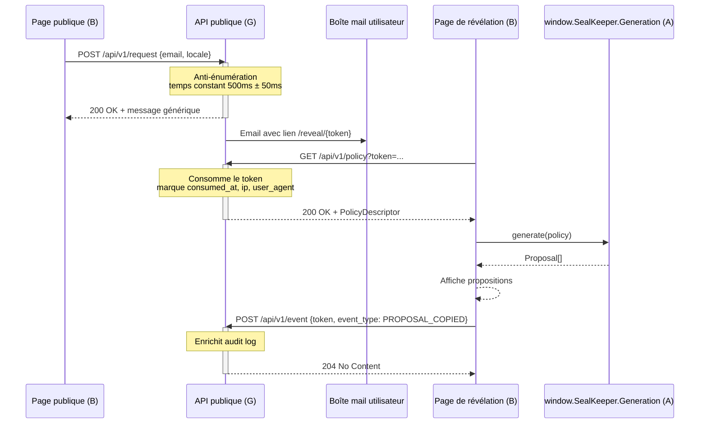
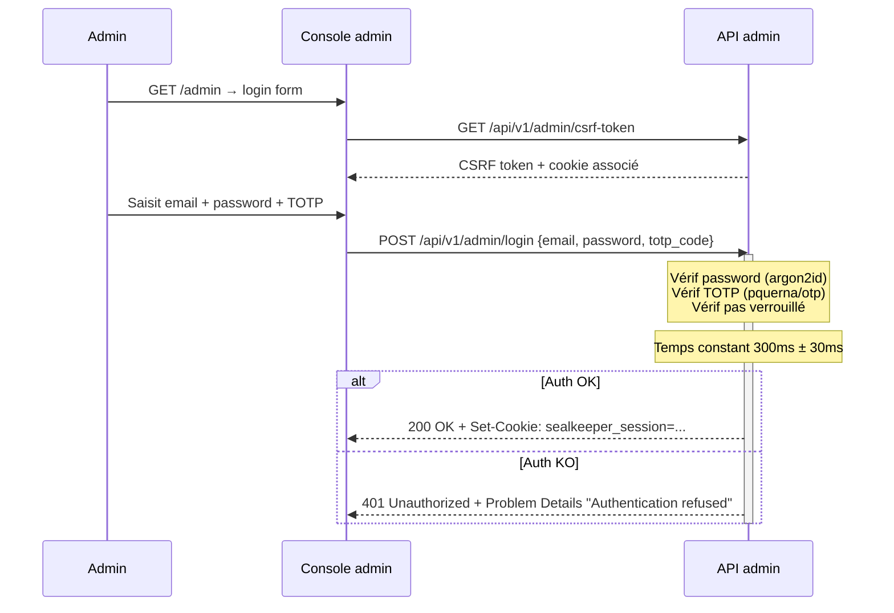

# Module G — API REST

**Statut** : validé
**Version** : 1.0
**Dernière mise à jour** : 2026-05-16
**Auteur** : Pascal-Louis Darmon (assisté par Daneel / Claude)
**Dépendances** : modules B (consommateur public), C (consommateur admin), D (backend qui implémente), E (sécurité applicable) ; alimente F (intégrations) et L (tests)

---

## 1. Purpose

Ce module spécifie **l'intégralité de l'API REST** exposée par SealKeeper : endpoints publics consommés par la page publique et la page de révélation, endpoints admin consommés par la console, endpoints d'observabilité (`/healthz`, `/readyz`, `/metrics`), conventions transverses (format JSON, codes d'erreur RFC 7807, pagination, versioning).

Le document sert de **contrat** entre frontend et backend, et de **référence canonique** à partir de laquelle est générée la spec OpenAPI 3.1 publiée sous `/api/v1/openapi.yaml`. Toute évolution de l'API passe d'abord par ce module.

---

## 2. Actors and use cases

| Acteur | Endpoints consommés |
|---|---|
| Page publique (module B) | `POST /api/v1/request` |
| Page de révélation (module B) | `GET /api/v1/policy`, `POST /api/v1/event` (optionnel) |
| Console admin (module C) | `POST /api/v1/admin/login`, tous les endpoints `/api/v1/admin/*` |
| Outils observabilité (Prometheus, K8s probes) | `GET /healthz`, `GET /readyz`, `GET /metrics` |
| Intégrateur externe (v0.2+) | Endpoints admin via bearer token API |
| Spec consumer (Swagger UI, Postman, code gen) | `GET /api/v1/openapi.yaml` |

---

## 3. Functional requirements

### 3.1 Conventions générales

| ID | Exigence | Niveau |
|---|---|---|
| FR-G.1 | Tous les endpoints API sont préfixés par **`/api/v1/`** | MUST |
| FR-G.2 | Le format d'échange est **JSON UTF-8** sauf endpoints spécifiques (`/metrics` en text format Prometheus, uploads en multipart/form-data) | MUST |
| FR-G.3 | Les requêtes envoient `Content-Type: application/json` ; les réponses en envoient autant que pertinent | MUST |
| FR-G.4 | Les noms de champs JSON utilisent **`snake_case`** uniformément (cohérent avec Go encoding/json struct tags) | MUST |
| FR-G.5 | Les timestamps sont au format **ISO 8601 / RFC 3339 UTC** avec millisecondes : `2026-05-16T15:43:21.123Z` | MUST |
| FR-G.6 | Les identifiants de ressources sont des **UUIDv7** (Crockford's base32 ou hex selon le contexte ; UUIDv7 conserve la propriété de tri chronologique) | MUST |
| FR-G.7 | Le versioning d'API est dans l'URL (`/api/v1/`). Une rupture incompatible donnera `/api/v2/` ; les deux versions cohabitent pendant au moins 6 mois | MUST |
| FR-G.8 | Header `X-Request-ID` (UUIDv7) propagé sur toute requête. Si non fourni par le client, le serveur en génère un et le retourne. Présent dans les logs et l'audit log | MUST |
| FR-G.9 | L'API renvoie systématiquement un body JSON, même pour les erreurs et les réponses sans données utiles (`{}`). Pas de réponse vide à l'exception de `204 No Content` | MUST |
| FR-G.10 | Les en-têtes de sécurité (CSP, HSTS, etc.) du module E s'appliquent à toutes les réponses | MUST |

### 3.2 Endpoints publics

| ID | Endpoint | Méthode | Description | Auth |
|---|---|---|---|---|
| FR-G.11 | `/api/v1/request` | POST | Demande d'un mot de passe par un utilisateur | aucune |
| FR-G.12 | `/api/v1/policy` | GET | Récupération de la policy descriptor par le JS à partir d'un token | token de session (URL query) |
| FR-G.13 | `/api/v1/event` | POST | Feedback côté JS : proposition copiée, page fermée, etc. (analytique anonyme) | token de session (URL query) |
| FR-G.14 | `/healthz` | GET | Liveness probe — retourne 200 OK dès que le binaire répond | aucune |
| FR-G.15 | `/readyz` | GET | Readiness probe — vérifie DB et migrations | aucune |
| FR-G.16 | `/metrics` | GET | Métriques Prometheus | optionnel : bearer `SK_METRICS_TOKEN` |
| FR-G.17 | `/api/v1/openapi.yaml` | GET | Spec OpenAPI 3.1 complète | aucune |

#### 3.2.1 POST /api/v1/request

**Request body**

```json
{
  "email": "pascal-louis@entreprise.com",
  "locale": "fr"
}
```

| Champ | Type | Obligatoire | Notes |
|---|---|---|---|
| `email` | string | oui | Doit passer une validation RFC 5322 simplifiée |
| `locale` | string | non | `fr` par défaut ; sinon dérivée de `Accept-Language` |

**Response (toujours 200 OK, anti-énumération — cf. FR-E.34, E.35, E.36)**

```json
{
  "status": "ok",
  "message": "Si cette adresse est autorisée, un email vous est parvenu. Vérifiez votre boîte de réception."
}
```

**Erreurs renvoyées**

- `400 Bad Request` + body Problem Details si le format d'email est invalide
- `405 Method Not Allowed` si méthode != POST
- `415 Unsupported Media Type` si Content-Type != application/json

Note : aucun retour ne révèle si l'email est dans l'allowlist, rate-limité, ou autre (cf. E.34-E.40).

#### 3.2.2 GET /api/v1/policy

**Query parameters**

| Paramètre | Type | Obligatoire | Notes |
|---|---|---|---|
| `token` | string | oui | Token de session opaque 128 bits (32 hex) reçu par email |

**Réponse 200 OK**

```json
{
  "policy": {
    "id": "01HXY7M3K8WBQ8FPGZ2NCYV9HL",
    "anssi_level": "B2",
    "generator": "G2",
    "proposal_count": 5,
    "regenerate_limit": 3,
    "session_ttl_seconds": 900,
    "notification_enabled": true,
    "parameters": {
      "library_id": "fr-courant-v1",
      "library_url": "/static/libraries/fr-courant-v1.txt",
      "library_sha256": "a7f9...",
      "language": "fr",
      "number_of_words": 6,
      "separator_options": ["-", "_", ".", "/", "+", ":", "|", ";", ",", "~"],
      "numeric_groups": [
        {"position": "suffix", "digits_count": 4, "separator": "-"}
      ]
    },
    "expected_entropy": {
      "min_bits": 88,
      "max_bits": 92
    }
  },
  "session": {
    "expires_at": "2026-05-16T16:00:00.000Z"
  }
}
```

**Erreurs**

- `400 Bad Request` si `token` manquant ou mal formé
- `404 Not Found` si token inconnu, déjà consommé ou expiré (réponse uniforme pour éviter la distinction)

**Effet de bord** : la première fetch consomme le token (FR-D.25, D-B.10).

#### 3.2.3 POST /api/v1/event

**Request body**

```json
{
  "token": "9f2a1b8e3c4d5f67...",
  "event_type": "PROPOSAL_COPIED" | "PAGE_CLOSED" | "REGENERATION_REQUESTED" | "GENERATION_FAILED",
  "details": {}
}
```

**Réponse**

- `204 No Content` sur succès
- `400 Bad Request` si format invalide
- `404 Not Found` si token inconnu (silencieux pour la sécurité)

**Note.** Cet endpoint sert principalement à enrichir l'audit log côté serveur. Pas de payload personnel, pas de tracking analytique tiers.

#### 3.2.4 GET /healthz et /readyz

`/healthz` : toujours `200 OK` + `{"status":"ok"}` dès que le serveur répond.

`/readyz` : `200 OK` + `{"status":"ready","subsystems":{"database":"ok","migrations":"ok"}}` si tout est opérationnel, sinon `503 Service Unavailable` + JSON détaillant les sous-systèmes en échec.

### 3.3 Endpoints admin — Authentification

| ID | Endpoint | Méthode | Description |
|---|---|---|---|
| FR-G.18 | `/api/v1/admin/login` | POST | Authentification password + TOTP |
| FR-G.19 | `/api/v1/admin/logout` | POST | Déconnexion (révoque la session admin) |
| FR-G.20 | `/api/v1/admin/totp/setup` | POST | Active TOTP (génère secret + codes de récup) |
| FR-G.21 | `/api/v1/admin/totp/reset` | POST | Réinitialise TOTP (impose nouvelle activation) |
| FR-G.22 | `/api/v1/admin/password` | PUT | Changement mot de passe |
| FR-G.23 | `/api/v1/admin/webauthn/register` | POST | Enregistre une clé FIDO2 |
| FR-G.24 | `/api/v1/admin/webauthn/authenticate` | POST | Login alternatif via FIDO2 |
| FR-G.25 | `/api/v1/admin/me` | GET | Profil de l'admin connecté |

Toutes ces routes utilisent **session cookie** (HttpOnly, SameSite=Strict, Secure). Réponse en temps constant (FR-E.39, E.40).

### 3.4 Endpoints admin — Domaines et policies

| ID | Endpoint | Méthode | Description |
|---|---|---|---|
| FR-G.26 | `/api/v1/admin/domains` | GET | Liste paginée des domaines |
| FR-G.27 | `/api/v1/admin/domains` | POST | Crée un domaine |
| FR-G.28 | `/api/v1/admin/domains/{id}` | GET | Détail d'un domaine |
| FR-G.29 | `/api/v1/admin/domains/{id}` | PUT | Met à jour un domaine |
| FR-G.30 | `/api/v1/admin/domains/{id}` | DELETE | Supprime un domaine (cascade vers policies et élévations) |
| FR-G.31 | `/api/v1/admin/domains/{id}/policies` | GET | Liste les policies d'un domaine (max 3 : B1, B2, B3) |
| FR-G.32 | `/api/v1/admin/domains/{id}/policies` | POST | Crée une policy pour un domaine + niveau ANSSI |
| FR-G.33 | `/api/v1/admin/policies/{id}` | GET | Détail d'une policy |
| FR-G.34 | `/api/v1/admin/policies/{id}` | PUT | Met à jour une policy |
| FR-G.35 | `/api/v1/admin/policies/{id}` | DELETE | Supprime une policy |
| FR-G.36 | `/api/v1/admin/policies/{id}/preview` | POST | Génère 5 exemples avec cette policy (sans persistance) |

### 3.5 Endpoints admin — Élévations B2/B3

| ID | Endpoint | Méthode | Description |
|---|---|---|---|
| FR-G.37 | `/api/v1/admin/domains/{id}/elevations` | GET | Liste paginée des élévations du domaine |
| FR-G.38 | `/api/v1/admin/domains/{id}/elevations` | POST | Ajoute une élévation (email, niveau B2 ou B3, raison) |
| FR-G.39 | `/api/v1/admin/elevations/{id}` | DELETE | Retire une élévation |
| FR-G.40 | `/api/v1/admin/domains/{id}/elevations/bulk` | POST | Import CSV en lot (multipart/form-data) |
| FR-G.41 | `/api/v1/admin/domains/{id}/elevations/export` | GET | Export CSV |

### 3.6 Endpoints admin — Bibliothèques

| ID | Endpoint | Méthode | Description |
|---|---|---|---|
| FR-G.42 | `/api/v1/admin/libraries` | GET | Liste paginée |
| FR-G.43 | `/api/v1/admin/libraries` | POST | Upload (multipart/form-data, ≤ 10 MB par D-D.22) |
| FR-G.44 | `/api/v1/admin/libraries/{id}` | GET | Métadonnées |
| FR-G.45 | `/api/v1/admin/libraries/{id}` | DELETE | Suppression (refusée si utilisée par une policy) |
| FR-G.46 | `/api/v1/admin/libraries/{id}/download` | GET | Téléchargement du fichier original |
| FR-G.47 | `/api/v1/admin/libraries/{id}/sample` | GET | Premières N entrées (échantillon UI) |

### 3.7 Endpoints admin — SMTP, branding, templates, système

| ID | Endpoint | Méthode | Description |
|---|---|---|---|
| FR-G.48 | `/api/v1/admin/smtp` | GET | Config SMTP courante (password masqué) |
| FR-G.49 | `/api/v1/admin/smtp` | PUT | Met à jour la config SMTP |
| FR-G.50 | `/api/v1/admin/smtp/test` | POST | Envoie un email de test |
| FR-G.51 | `/api/v1/admin/branding` | GET | Config branding |
| FR-G.52 | `/api/v1/admin/branding` | PUT | Met à jour le branding |
| FR-G.53 | `/api/v1/admin/branding/logo` | POST | Upload du logo (multipart) |
| FR-G.54 | `/api/v1/admin/templates` | GET | Liste des templates (reveal + notification × langues) |
| FR-G.55 | `/api/v1/admin/templates/{type}/{lang}` | GET | Récupère un template |
| FR-G.56 | `/api/v1/admin/templates/{type}/{lang}` | PUT | Met à jour |
| FR-G.57 | `/api/v1/admin/templates/{type}/{lang}/preview` | POST | Aperçu avec variables d'exemple |
| FR-G.58 | `/api/v1/admin/system` | GET | Config système courante |
| FR-G.59 | `/api/v1/admin/system` | PUT | Met à jour la config système |
| FR-G.60 | `/api/v1/admin/system/maintenance` | POST | Active le mode maintenance |
| FR-G.61 | `/api/v1/admin/system/maintenance` | DELETE | Désactive le mode maintenance |

### 3.8 Endpoints admin — Audit log, intégrations, captured mail

| ID | Endpoint | Méthode | Description |
|---|---|---|---|
| FR-G.62 | `/api/v1/admin/audit-log` | GET | Liste paginée + filtres |
| FR-G.63 | `/api/v1/admin/audit-log/{id}` | GET | Détail d'une entrée |
| FR-G.64 | `/api/v1/admin/audit-log/export` | GET | Export CSV ou JSON (param `format`) |
| FR-G.65 | `/api/v1/admin/audit-log/verify` | POST | Vérifie l'intégrité de la chaîne HMAC |
| FR-G.66 | `/api/v1/admin/integrations` | GET | Liste des intégrations SIEM |
| FR-G.67 | `/api/v1/admin/integrations` | POST | Crée une intégration |
| FR-G.68 | `/api/v1/admin/integrations/{id}` | GET, PUT, DELETE | CRUD |
| FR-G.69 | `/api/v1/admin/integrations/{id}/test` | POST | Envoie un événement test |
| FR-G.70 | `/api/v1/admin/captured-mail` | GET | Liste des mails capturés (mode eval seulement) |
| FR-G.71 | `/api/v1/admin/captured-mail/{id}` | GET, DELETE | Détail / suppression |

### 3.9 Endpoints admin — Comptes admin

| ID | Endpoint | Méthode | Description |
|---|---|---|---|
| FR-G.72 | `/api/v1/admin/admins` | GET | Liste des comptes admin |
| FR-G.73 | `/api/v1/admin/admins` | POST | Crée un compte admin |
| FR-G.74 | `/api/v1/admin/admins/{id}` | GET | Détail |
| FR-G.75 | `/api/v1/admin/admins/{id}/deactivate` | POST | Désactive |
| FR-G.76 | `/api/v1/admin/admins/{id}/reactivate` | POST | Réactive |
| FR-G.77 | `/api/v1/admin/config/export` | GET | Export complet de la configuration JSON signée |
| FR-G.78 | `/api/v1/admin/config/import` | POST | Import (preview + apply) |

### 3.10 Authentification et CSRF

| ID | Exigence | Niveau |
|---|---|---|
| FR-G.79 | La console admin utilise un **cookie de session HttpOnly + SameSite=Strict + Secure** signé HMAC | MUST |
| FR-G.80 | Tous les endpoints `/api/v1/admin/*` qui modifient l'état (POST, PUT, DELETE) requièrent un **token CSRF** transmis en header `X-CSRF-Token` ou champ caché de form. Validation par double-submit cookie | MUST |
| FR-G.81 | Le token CSRF est obtenu via `GET /api/v1/admin/csrf-token` (renvoie le token + le cookie associé) | MUST |
| FR-G.82 | **Bearer token pour API headless** (intégrations programmatiques) : 📋 reporté à v0.2 | 📋 v0.2 |
| FR-G.83 | Endpoint `/metrics` accessible publiquement par défaut, ou protégé par bearer `SK_METRICS_TOKEN` si configuré | MUST |

### 3.11 Codes d'erreur normalisés (RFC 7807)

| ID | Exigence | Niveau |
|---|---|---|
| FR-G.84 | Toutes les erreurs API renvoient un body au format **Problem Details for HTTP APIs (RFC 7807)** | MUST |
| FR-G.85 | Le `Content-Type` des réponses d'erreur est **`application/problem+json`** | MUST |
| FR-G.86 | Champs obligatoires : `type` (URI vers la doc), `title` (court, humain), `status` (HTTP status code), `detail` (long, humain). Champs additionnels : `instance` (URI de la ressource), `errors` (tableau pour validation field-level) | MUST |
| FR-G.87 | Les URIs de `type` pointent vers `https://sealkeeper.eu/docs/errors/{code}` | MUST |

**Exemple de réponse d'erreur de validation**

```json
{
  "type": "https://sealkeeper.eu/docs/errors/validation-failed",
  "title": "Validation failed",
  "status": 422,
  "detail": "The request body contains invalid fields.",
  "instance": "/api/v1/admin/policies",
  "errors": [
    {
      "field": "anssi_level",
      "message": "must be one of B1, B2, B3"
    },
    {
      "field": "parameters.number_of_words",
      "message": "must be between 4 and 12"
    }
  ]
}
```

### 3.12 Codes HTTP normalisés

| Code | Usage |
|---|---|
| 200 OK | Succès avec body |
| 201 Created | Création de ressource avec body retournant la ressource créée |
| 204 No Content | Succès sans body (rare ; ex : DELETE) |
| 400 Bad Request | Syntaxe invalide (JSON mal formé, contenu non parsable) |
| 401 Unauthorized | Auth requise et absente / invalide |
| 403 Forbidden | Auth valide mais action interdite (ex : tentative de supprimer la dernière admin) |
| 404 Not Found | Ressource introuvable |
| 405 Method Not Allowed | Méthode HTTP non supportée |
| 409 Conflict | Conflit d'état (ex : domaine déjà existant, tentative de supprimer une bibliothèque en usage) |
| 415 Unsupported Media Type | Content-Type non supporté |
| 422 Unprocessable Entity | Validation métier échouée (format ok mais sémantique invalide) |
| 429 Too Many Requests | Rate-limit dépassé (admin uniquement ; les endpoints publics ne renvoient pas 429 — cf. FR-E.49) |
| 500 Internal Server Error | Erreur serveur non récupérable |
| 502 Bad Gateway | Relais SMTP injoignable (dans le contexte `POST /admin/smtp/test`) |
| 503 Service Unavailable | Mode maintenance, DB inaccessible, ou `/readyz` négatif |

### 3.13 Pagination

| ID | Exigence | Niveau |
|---|---|---|
| FR-G.88 | Les listings volumineux (audit log, élévations, demandes utilisateurs) utilisent une **pagination cursor-based** | MUST |
| FR-G.89 | Paramètres de query : `?limit=50&after=<cursor>` (pagination forward) ou `?before=<cursor>` (pagination backward) | MUST |
| FR-G.90 | Réponse : `{"items": [...], "page": {"limit": 50, "has_more": true, "next_cursor": "...", "prev_cursor": "..."}}` | MUST |
| FR-G.91 | Limite par défaut : 50 ; maximum autorisé : 200 | MUST |
| FR-G.92 | Listings courts (domaines, policies par domaine — max 3, bibliothèques actives) utilisent une **liste simple** sans pagination | MUST |

### 3.14 Spec OpenAPI 3.1

| ID | Exigence | Niveau |
|---|---|---|
| FR-G.93 | La spec OpenAPI 3.1 est servie statiquement sous `/api/v1/openapi.yaml` (et `/api/v1/openapi.json` pour les outils qui préfèrent JSON) | MUST |
| FR-G.94 | La spec est **co-versionnée avec le binaire** : modification = nouvelle release | MUST |
| FR-G.95 | La spec couvre **tous les endpoints**, incluant les codes d'erreur et leurs schémas Problem Details | MUST |
| FR-G.96 | La spec utilise **JSON Schema** pour la validation des body | MUST |
| FR-G.97 | Une UI Swagger optionnelle est servie sous `/api/docs` (configurable par `SK_SWAGGER_UI_ENABLED`) | SHOULD |

---

## 4. Non-functional requirements

| Type | Cible |
|---|---|
| Latence p50 endpoints admin | < 50 ms |
| Latence p50 endpoint `/api/v1/request` | constante 500 ms ± 50 ms (cf. anti-énumération) |
| Latence p50 `/api/v1/policy` | < 30 ms |
| Throughput sustained | 100 req/s par cœur CPU |
| Backwards compatibility | Aucune rupture sur `/api/v1/` ; rupture = `/api/v2/` |
| Cohérence schémas | 100 % des endpoints documentés dans OpenAPI |
| Audit | Tout endpoint admin modifiant l'état est consigné en audit log (module E) |

---

## 5. Data model

### 5.1 Format Problem Details (RFC 7807) — schéma de référence

```json
{
  "type": "URI vers /docs/errors/{code}",
  "title": "Court, humain",
  "status": 422,
  "detail": "Long, humain",
  "instance": "URI de la ressource concernée",
  "errors": [
    {"field": "...", "message": "..."}
  ]
}
```

### 5.2 Format de pagination cursor-based

```json
{
  "items": [/* objets */],
  "page": {
    "limit": 50,
    "has_more": true,
    "next_cursor": "01HXY7M3K8WBQ8FPGZ2NCYV9HM",
    "prev_cursor": "01HXY7M3K8WBQ8FPGZ2NCYV9AB"
  }
}
```

Le cursor est l'**ID UUIDv7 du dernier élément de la page courante** (FR-G.6 garantit le tri chronologique strict).

---

## 6. Interfaces

### 6.1 Vue d'ensemble des familles d'endpoints

```mermaid
graph TB
    Public[Endpoints publics]
    Admin[Endpoints admin]
    Obs[Endpoints observabilité]

    Public --> Pub1[POST /api/v1/request]
    Public --> Pub2[GET /api/v1/policy]
    Public --> Pub3[POST /api/v1/event]

    Admin --> Auth[Auth — login, logout, TOTP, WebAuthn]
    Admin --> Dom[Domaines + Policies]
    Admin --> Elev[Élévations B2/B3]
    Admin --> Lib[Bibliothèques]
    Admin --> Conf[SMTP, Branding, Templates, Système]
    Admin --> Aud[Audit log + Vérification]
    Admin --> Int[Intégrations SIEM]
    Admin --> Eval[Captured mail · mode eval]
    Admin --> Adm[Comptes admin]
    Admin --> Cfg[Config export/import]

    Obs --> Hz[GET /healthz]
    Obs --> Rz[GET /readyz]
    Obs --> Mt[GET /metrics]
    Obs --> Spec[GET /api/v1/openapi.yaml]
```



### 6.2 Diagramme de séquence — workflow public consolidé



### 6.3 Diagramme de séquence — auth admin avec TOTP



---

## 7. Edge cases and error handling

| Cas | Réponse |
|---|---|
| Body JSON malformé | `400 Bad Request` + Problem Details |
| Field manquant ou type incorrect | `422 Unprocessable Entity` + Problem Details avec champ `errors` détaillé |
| Auth admin manquante sur endpoint protégé | `401 Unauthorized` + Problem Details, jamais 403 (ne distingue pas auth absente d'auth invalide) |
| CSRF token manquant ou invalide | `403 Forbidden` + Problem Details |
| Ressource introuvable | `404 Not Found` + Problem Details |
| Conflit (ex : doublon, suppression d'une ressource en usage) | `409 Conflict` + Problem Details précisant le conflit |
| Méthode non supportée | `405 Method Not Allowed` + header `Allow` listant les méthodes acceptées |
| Body trop volumineux | `413 Payload Too Large` + Problem Details. Limite globale 1 MB pour JSON, 10 MB pour upload bibliothèque |
| Content-Type non supporté | `415 Unsupported Media Type` + header `Accept` listant les types acceptés |
| Rate-limit admin dépassé | `429 Too Many Requests` + header `Retry-After: 60` + Problem Details. Public : pas de 429 visible (FR-E.49) |
| Erreur interne | `500 Internal Server Error` + Problem Details générique (pas de stack trace). Détails complets en audit log et logs serveur |
| Maintenance mode actif | `503 Service Unavailable` + header `Retry-After` + body décrivant le mode |
| Token de session inconnu/expiré/consommé | `404 Not Found` uniforme (ne révèle pas l'état précis) |
| Tentative d'accéder à un endpoint v2 inexistant | `404 Not Found` |
| OPTIONS preflight CORS | Pas de CORS en v0.1 (same-origin strict). En v0.2 : configurable |

---

## 8. Closed decisions

| # | Décision | Justification |
|---|---|---|
| D-G.1 | **Préfixe `/api/v1/`** et versioning dans l'URL | Lisibilité, compatibilité descendante, alignement REST mainstream |
| D-G.2 | **JSON UTF-8** comme format principal | Standard de facto, support universel |
| D-G.3 | **`snake_case` pour les noms de champs** | Cohérence avec Go encoding/json struct tags, lisibilité |
| D-G.4 | **UUIDv7 pour les IDs** | Conserve l'ordre chronologique pour pagination cursor-based |
| D-G.5 | **RFC 7807 Problem Details** pour les erreurs | Standard mature, support natif Swagger / Postman / lib clients |
| D-G.6 | **Pagination cursor-based** pour listings volumineux | Scale sans souffrance ; offset-based pose problème au-delà de 10k items |
| D-G.7 | **Session cookie HttpOnly + SameSite=Strict + Secure** pour la console admin | Standard OWASP, simple, sûr |
| D-G.8 | **CSRF double-submit cookie** sur tous les endpoints admin modifiant l'état | Pattern OWASP standard, simple à implémenter |
| D-G.9 | **Pas de Bearer token API public en v0.1** ; reporté à v0.2 | Premier scope : console UI suffit |
| D-G.10 | **Pas de CORS en v0.1** (same-origin strict) ; configurable en v0.2 | Posture défensive, élargie quand cas d'usage clair |
| D-G.11 | **Spec OpenAPI 3.1 servie statiquement** sous `/api/v1/openapi.yaml` | Génération de clients tiers, validation, documentation |
| D-G.12 | **Swagger UI optionnel** sous `/api/docs`, désactivable par config | Utile en dev, peut être désactivé en prod si non désiré |
| D-G.13 | **X-Request-ID header propagé** sur toutes les requêtes | Tracing distribué, corrélation audit log |
| D-G.14 | **Endpoint dédié `/api/v1/admin/audit-log/verify`** pour la vérification d'intégrité | Disponibilité immédiate (pas de CLI nécessaire) |
| D-G.15 | **Limites de body** : 1 MB pour JSON, 10 MB pour upload bibliothèque | Prévient les attaques par grosse charge |
| D-G.16 | **`type` des Problem Details = URI vers docs.sealkeeper.eu/errors/{code}`** | Documentation accessible pour chaque erreur |
| D-G.17 | **Endpoint d'export DPO** (réf. question 9.8 du module D) : `/api/v1/admin/dpo-export` (chemin dédié pour traçabilité), détail en module I | Cohérence avec la pré-décision |
| D-G.18 | **Pas de GraphQL en v0.1+ ; REST + OpenAPI 3.1 suffisent** ; réévaluation possible en v1.0+ si demande forte | GraphQL ajoute complexité (DataLoader, N+1, schéma figé) sans bénéfice net pour l'API actuelle |
| D-G.19 | **Pas d'API webhook séparée** ; les webhooks sortants sont couverts par le module F (intégrations) | Évite la duplication ; F est le bon canal pour les événements |
| D-G.20 | **Format date dans URL = ISO 8601** (`?from=2026-05-01T00:00:00Z&to=2026-05-31T23:59:59Z`) | Lisible humainement, standard universel |
| D-G.21 | **Server-Sent Events (SSE) pour live audit log** reporté à v0.2 ; en v0.1, polling toutes les 10 secondes côté console | SSE nécessite gestion de connexions longues côté Go ; polling suffit en v0.1 |
| D-G.22 | **Preview policy** (`POST /api/v1/admin/policies/{id}/preview`) exécutée **dans le navigateur** par le bundle générateur, pas côté serveur | Cohérent avec D-A.7 : le serveur ne génère jamais de mot de passe |
| D-G.23 | **Compression gzip / brotli déléguée au reverse proxy** | Cohérent avec D-D.21 ; binaire Go reste minimaliste |
| D-G.24 | **API headless v0.2 = lecture seule** (audit log + métriques business) ; CRUD admin reporté v0.3 | Premier scope mesuré ; demande probable d'outils tiers de monitoring |
| D-G.25 | **Endpoint `/api/v1/admin/health-extended`** reporté v0.2 | `/healthz` + `/readyz` + `/metrics` couvrent les besoins v0.1 |

---

## 9. Open questions

**Toutes les questions ouvertes ont été tranchées le 16 mai 2026** par Pascal-Louis Darmon après recommandation de Daneel. Les 8 décisions correspondantes sont consignées en §8 sous les références D-G.18 à D-G.25. Le PRD G est intégralement validé en v1.0.

Trois fonctionnalités sont reportées à v0.2 (SSE live audit log, endpoint `/health-extended`, API headless lecture seule) et une à v0.3 (API headless CRUD admin). GraphQL et webhooks dédiés sont écartés sine die.

---

## 10. References

- **Module B** — consommateur frontend public
- **Module C** — consommateur console admin
- **Module D** — backend qui implémente
- **Module E** — sécurité applicable (CSRF, headers, anti-énumération, rate-limit)
- **Module F** — intégrations SIEM consomment des événements admin
- **Module I** — RGPD (endpoint DPO export)
- **Module L** — tests d'API automatisés

- **RFC 7807** — Problem Details for HTTP APIs
- **RFC 5322** — Internet Message Format (validation emails)
- **RFC 3339** — Date and Time on the Internet
- **OpenAPI Specification 3.1** — [https://spec.openapis.org/oas/v3.1.0](https://spec.openapis.org/oas/v3.1.0)
- **JSON Schema 2020-12** — base de validation des schémas
- **OWASP CSRF Prevention Cheat Sheet** — pattern double-submit cookie
- **OWASP API Security Top 10 (2023)** — guide des risques API
- **UUIDv7 spec** — [RFC 9562](https://datatracker.ietf.org/doc/rfc9562/)

---

## 11. Évolution de ce document

| Version | Date | Auteur | Changements |
|---|---|---|---|
| 1.0 | 2026-05-16 | P.-L. Darmon (Daneel) | **Version validée** — 8 décisions tranchées (D-G.18 à D-G.25) : pas de GraphQL, pas de webhook dédié (F prend le relais), ISO 8601 en URL, SSE et `/health-extended` reportés v0.2, preview policy côté navigateur, compression au reverse proxy, API headless lecture seule v0.2 et CRUD v0.3 |
| 0.1 | 2026-05-16 | P.-L. Darmon (Daneel) | Création initiale — 97 FR réparties en 14 sous-sections, 68 endpoints catalogués, 17 décisions tranchées, 8 questions ouvertes, 3 diagrammes Mermaid (familles endpoints, workflow public, auth admin) |

---

*Document maintenu dans le repo `sched75/sealkeeper` sous `docs/prd/G-api-rest.md`.*
