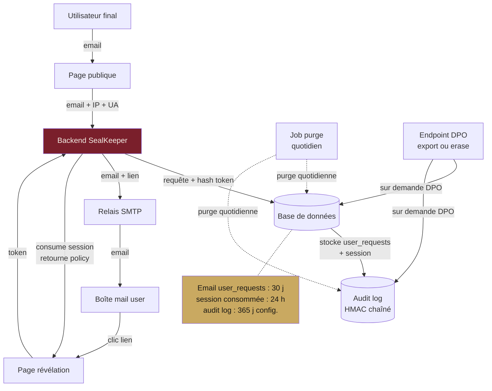
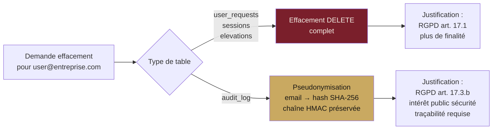
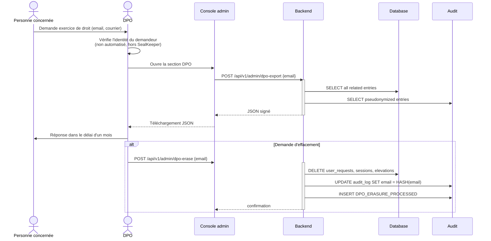

# Module I — RGPD & conformité

**Statut** : validé
**Version** : 1.0
**Dernière mise à jour** : 2026-05-16
**Auteur** : Pascal-Louis Darmon (assisté par Daneel / Claude)
**Dépendances** : modules C (UI gestion droits, export), D (effacement, audit retention), E (sécurité, notification CNIL), G (endpoint DPO), H (procédure désinstallation)

---

## 1. Purpose

Ce module spécifie la **conformité RGPD** du produit SealKeeper. Il documente la nature des données personnelles traitées, les bases légales, les durées de conservation, les droits des personnes concernées, les procédures d'exercice de ces droits, la notification de violation, et la posture vis-à-vis des sous-traitants et des transferts hors UE.

SealKeeper est un **logiciel** distribué sous AGPL v3, pas un service hébergé par l'éditeur. La **responsabilité du traitement** au sens du RGPD (article 4.7) revient donc à **l'entité qui déploie SealKeeper** (l'entreprise utilisatrice). Les mainteneurs (contributeurs) ne sont pas responsables du traitement.

**Posture directrice.** SealKeeper minimise par construction la quantité de données personnelles traitées : aucun mot de passe ne transite par le serveur, le seul élément personnel manipulé est **l'adresse email professionnelle** de la personne demandant un mot de passe, avec quelques métadonnées techniques (IP, user-agent) consignées au titre de l'auditabilité. Cette minimisation est un argument fort de conformité RGPD par construction.

---

## 2. Actors and use cases

| Acteur | Rôle RGPD | Interaction |
|---|---|---|
| Personne concernée | Personne dont les données sont traitées (RGPD art. 4.1) | Utilisateur employé qui demande un mot de passe |
| Responsable du traitement | Entité qui déploie SealKeeper (RGPD art. 4.7) | Détermine les finalités, configure l'instance |
| Sous-traitant SealKeeper | Mainteneurs SealKeeper | Aucun — pas d'hébergement ni d'accès aux données déployées |
| Sous-traitants tiers | Relais SMTP, SIEM externes | Reçoivent partiellement des données ; DPA à conclure par le responsable |
| DPO de l'entreprise utilisatrice | Délégué à la protection des données (RGPD art. 37) | Consulte les exports, gère les demandes de droits |
| Autorité de contrôle (CNIL en France) | Régulateur | Reçoit les notifications de violation, audite |

---

## 3. Functional requirements

### 3.1 Cartographie des données personnelles (RGPD article 30)

| ID | Exigence | Niveau |
|---|---|---|
| FR-I.1 | SealKeeper traite **trois catégories de données personnelles** : | MUST |
| FR-I.2 | **(A) Données d'identité de l'utilisateur final** : adresse email professionnelle (ex : `prenom.nom@entreprise.com`), seule donnée de contact strictement nécessaire à la finalité | MUST |
| FR-I.3 | **(B) Données d'identité de l'admin SealKeeper** : adresse email, nom optionnel, secret TOTP | MUST |
| FR-I.4 | **(C) Métadonnées techniques** : adresse IP, user-agent, horodatages d'accès, identifiants de session (hash), logs d'audit | MUST |
| FR-I.5 | **Aucune autre catégorie** n'est traitée : pas de nom complet ni prénom dans la base utilisateur (sauf dérivé de l'email par convention), pas de coordonnées physiques, pas de données sensibles (RGPD article 9), pas de données de mineurs (le produit cible des utilisateurs professionnels adultes) | MUST |
| FR-I.6 | **Aucun mot de passe** (ni utilisateur, ni admin, ni TOTP) ne transite côté serveur en clair. Les mots de passe sont générés navigateur (utilisateur) ou hashés argon2id (admin) | MUST |

**Tableau récapitulatif Article 30**

| Catégorie de traitement | Finalité | Base légale | Catégories de données | Catégories de personnes | Destinataires | Durée de conservation | Transferts hors UE |
|---|---|---|---|---|---|---|---|
| Émission d'un lien de génération mot de passe | Fournir un mot de passe ANSSI-compliant à l'employé | Intérêt légitime de l'employeur (RGPD art. 6.1.f) ou exécution du contrat de travail (art. 6.1.b) selon contexte client | Email, IP, user-agent, horodatages | Employés de l'entreprise utilisatrice | Relais SMTP du responsable de traitement | 30 jours (rate-limit) puis effacé ; hash conservé en audit log selon politique | Non en standard ; oui si SIEM hors UE activé par admin (responsable assume) |
| Administration de l'instance | Configurer, surveiller, auditer | Intérêt légitime de l'employeur | Email admin, nom, IP, user-agent, TOTP secret chiffré, codes récup argon2id | Administrateurs IT | Personnel autorisé | Durée de vie du compte + 90 jours après désactivation | Non |
| Audit & sécurité | Tracer les actions pour conformité ANSSI, détection d'incident | Obligation légale (sécurité du SI) + intérêt légitime | Pseudonymisé (hash IDs), IP, user-agent, événement | Toute interaction logguée | Console admin, SIEM externes configurés | 365 jours configurable (CNIL recommande min 6 mois pour traces de sécurité) | Selon SIEM configuré |

### 3.2 Privacy by design et by default (RGPD article 25)

| ID | Exigence | Niveau |
|---|---|---|
| FR-I.7 | **Minimisation** (art. 5.1.c) : seule l'adresse email est demandée à l'utilisateur. Aucune information complémentaire n'est sollicitée | MUST |
| FR-I.8 | **Pseudonymisation** (art. 4.5) : dans l'audit log, les identifiants admin sont des UUIDv7 ; les tokens utilisateurs sont stockés en hash SHA-256 ; aucun mot de passe n'apparaît | MUST |
| FR-I.9 | **Zero-knowledge architecture** : le mot de passe utilisateur final n'est ni généré, ni reçu, ni stocké côté serveur. Conséquence directe : **impossibilité technique de fuite via SealKeeper** | MUST |
| FR-I.10 | **Stockage limité** (art. 5.1.e) : durées de conservation fines par catégorie (cf. §3.5), purge automatique programmée | MUST |
| FR-I.11 | **Pas de profilage** ni de décision automatisée (art. 22) : aucun scoring, aucune classification de l'utilisateur | MUST |
| FR-I.12 | **Pas de cookies tiers** : ni analytics (Google Analytics, Matomo, Plausible), ni publicité, ni tracking. Seul un **cookie de session admin** strictement nécessaire est utilisé. Conformité ePrivacy directive | MUST |
| FR-I.13 | **Pas de fingerprinting** : aucune empreinte navigateur n'est calculée ni stockée | MUST |

### 3.3 Information des personnes (RGPD articles 13-14)

| ID | Exigence | Niveau |
|---|---|---|
| FR-I.14 | Une **page Privacy Policy** est servie sous `/privacy` (et lien permanent en pied de page sur toutes les vues publiques). Template fourni en `web/templates/privacy.html.tmpl`, adaptable par l'admin | MUST |
| FR-I.15 | La page Privacy Policy couvre **les 12 informations obligatoires** de l'article 13 RGPD : identité du responsable, coordonnées du DPO, finalités, base légale, intérêts légitimes le cas échéant, destinataires, transferts hors UE, durées de conservation, droits, droit de retirer le consentement (n/a ici), droit de plainte CNIL, source des données | MUST |
| FR-I.16 | Champs dynamiques à compléter par l'admin via la console : nom du responsable, adresse, contact DPO (email + téléphone), CNIL référence, mentions transferts | MUST |
| FR-I.17 | L'email envoyé contient une **mention de pied** : *« Cet email est envoyé à votre demande explicite via SealKeeper, un outil interne de gestion des mots de passe. Aucun mot de passe n'a été stocké. Politique de confidentialité : <URL> »* | MUST |
| FR-I.18 | La page publique de demande affiche, sous le bouton *Générer*, un texte court : *« Votre adresse email sera utilisée uniquement pour vous envoyer un lien de génération de mot de passe. Aucun mot de passe n'est stocké. <a>En savoir plus</a> »* | MUST |

### 3.4 Droits des personnes concernées (RGPD articles 15-22)

| ID | Droit | Article | Procédure SealKeeper |
|---|---|---|---|
| FR-I.19 | **Droit d'accès** | 15 | Endpoint `/api/v1/admin/dpo-export` (cf. §3.10) permet à l'admin/DPO d'exporter toutes les données relatives à une adresse email donnée |
| FR-I.20 | **Droit de rectification** | 16 | Pour l'email : impossible directement (l'email est la clé). Procédure : supprimer + reconfiguer côté annuaire interne. Pour l'admin : édition console |
| FR-I.21 | **Droit à l'effacement (oubli)** | 17 | Endpoint `/api/v1/admin/dpo-erase` ou CLI `sealkeeper dpo erase <email>` : supprime les entrées d'élévation, anonymise dans l'audit log (cf. §3.11), supprime les sessions en cours |
| FR-I.22 | **Droit à la limitation** | 18 | Désactivation d'une élévation ou d'un compte admin (FR-C.15, FR-C.38) — l'effet est de bloquer le traitement sans purger |
| FR-I.23 | **Droit à la portabilité** | 20 | Export DPO au format JSON structuré et machine-readable |
| FR-I.24 | **Droit d'opposition** | 21 | L'utilisateur peut demander à ne plus recevoir de mot de passe. Solution : retrait de la liste blanche du domaine par l'admin (ou exclusion individuelle, 📋 v0.2) |
| FR-I.25 | **Droit de ne pas faire l'objet d'une décision automatisée** | 22 | Non applicable (pas de décision automatisée) |

| ID | Exigence | Niveau |
|---|---|---|
| FR-I.26 | Les demandes de droit doivent être traitées dans le **délai d'un mois** (RGPD art. 12). La console admin permet de répondre dans ce délai | MUST |
| FR-I.27 | Une page documentaire `/docs/dpo-procedures.md` détaille les procédures pour chaque droit, à destination des DPO clients | MUST |
| FR-I.28 | **Exclusion individuelle** d'une adresse (ne plus recevoir de lien malgré sa présence dans le domaine autorisé) | 📋 v0.2 |

### 3.5 Durées de conservation

| ID | Catégorie | Durée par défaut | Justification | Configurable |
|---|---|---|---|---|
| FR-I.29 | Adresse email utilisateur en demande active (`user_requests`) | **30 jours** | Permet le rate-limit sur 1h × marge de tolérance | Oui |
| FR-I.30 | Token de session utilisateur (`sessions`) | **TTL session** + 24h post-consommation | Audit forensique post-incident | Oui (TTL session = 15 min par défaut) |
| FR-I.31 | Audit log (`audit_log`) | **365 jours** | Recommandation CNIL : 6 mois min, 1 an raisonnable pour traces de sécurité | Oui |
| FR-I.32 | Captured mail (mode eval) | **7 jours** | Évaluation, pas de production | Oui |
| FR-I.33 | Comptes admin actifs | **Durée de vie du compte** | Justifié tant qu'actif | n/a |
| FR-I.34 | Comptes admin désactivés | **90 jours** puis purge définitive | Permet réactivation en cas d'erreur, conserve la trace minimum | Oui |
| FR-I.35 | Élévations B2/B3 | **Durée de vie de l'attribution** | Justifié tant qu'attribuée | n/a |
| FR-I.36 | Backups | **30 jours rolling** | Off-site, encryption at-rest recommandée | Oui (par l'opérateur de backup) |

| ID | Exigence | Niveau |
|---|---|---|
| FR-I.37 | Une **purge programmée** (job de fond, cron interne) tourne quotidiennement et supprime toutes les entrées dépassant les durées configurées | MUST |
| FR-I.38 | Le job de purge écrit en audit log : `RETENTION_PURGE_RUN` avec le nombre d'entrées purgées par catégorie | MUST |
| FR-I.39 | L'admin peut consulter dans la console *Système* la prochaine date de purge et le résumé des purges précédentes | SHOULD |

### 3.6 Sécurité du traitement (RGPD article 32)

Référence canonique : **module E**. Synthèse pour l'auditeur RGPD :

| Exigence article 32 | Mise en œuvre SealKeeper |
|---|---|
| Pseudonymisation et chiffrement | argon2id pour mots de passe admin, AES-256-GCM pour secrets en base, hash SHA-256 pour tokens utilisateurs, HKDF-SHA256 pour dérivation de clés depuis master secret |
| Confidentialité, intégrité, disponibilité | TLS 1.2+ obligatoire, en-têtes HTTP de sécurité stricts, audit log signé HMAC chaîné, healthchecks, backups, mode maintenance |
| Restauration de la disponibilité | Procédure de restauration documentée (module H §3.8), tests recommandés mensuels |
| Procédure de tests réguliers | Pipeline CI avec SAST, tests E2E, scan d'image (module L), pentest tiers obligatoire avant v1.0 |

### 3.7 Notification de violation (RGPD articles 33-34)

| ID | Exigence | Niveau |
|---|---|---|
| FR-I.40 | Procédure de notification CNIL **dans les 72 heures** documentée dans `docs/incident-response.md` (module E §3.11) | MUST |
| FR-I.41 | Template de notification à la CNIL (format papier/électronique selon le portail CNIL en vigueur) inclus | MUST |
| FR-I.42 | Si la violation présente un **risque élevé** (art. 34), notification aux personnes concernées via les emails du registre d'élévations + page d'incident publique. Template fourni | MUST |
| FR-I.43 | **Registre des violations** maintenu par l'entité responsable du traitement (pas dans SealKeeper, c'est une obligation de l'entreprise). Mention explicite dans la doc | MUST |
| FR-I.44 | Notification automatique aux SIEM via filtre événement `severity=critical` (module F) | MUST |

### 3.8 Sous-traitants (RGPD article 28)

| ID | Exigence | Niveau |
|---|---|---|
| FR-I.45 | **SealKeeper en tant que logiciel** n'a pas de sous-traitants ; les mainteneurs ne traitent aucune donnée du déploiement | MUST |
| FR-I.46 | **L'entité déployante** doit conclure un DPA (Data Processing Agreement) avec ses propres sous-traitants : | MUST |
| FR-I.47 | Relais SMTP (Postfix interne, Microsoft 365, AWS SES, SendGrid, etc.) | recommandé |
| FR-I.48 | Hébergeur (AWS, Azure, GCP, OVH, Scaleway, etc.) | recommandé |
| FR-I.49 | SIEM externe (Splunk Cloud, Microsoft Sentinel, Elastic Cloud, etc.) | recommandé |
| FR-I.50 | Page documentaire `/docs/dpa-template.md` fournit un canevas de DPA réutilisable | SHOULD |

### 3.9 Transferts hors UE (RGPD chapitre V)

| ID | Exigence | Niveau |
|---|---|---|
| FR-I.51 | SealKeeper **ne transfère pas de données hors UE par défaut** : le binaire est self-hosted dans l'infrastructure du responsable | MUST |
| FR-I.52 | Si l'admin configure une **intégration SIEM hors UE** (Splunk Cloud US, Sentinel hors UE) ou un **SMTP relay hors UE**, c'est sa responsabilité d'organiser le transfert conforme : | MUST |
| FR-I.53 | Décision d'adéquation (UK, Suisse, Japon, etc. selon liste CE) | MUST |
| FR-I.54 | EU-US Data Privacy Framework (depuis juillet 2023) pour transferts US | MUST |
| FR-I.55 | Clauses contractuelles types (CCT) Commission Européenne 2021 | MUST |
| FR-I.56 | BCR (Binding Corporate Rules) si groupe multinational | MUST |
| FR-I.57 | La console admin affiche un **avertissement** lors de la configuration d'une intégration dont l'URL résout vers une IP hors UE : *« Cette intégration semble pointer vers une cible hors UE. Vérifiez la conformité Schrems II »* | SHOULD |
| FR-I.58 | La Privacy Policy générée doit lister les transferts effectifs (rempli par l'admin dans la console) | MUST |

### 3.10 Export DPO complet

| ID | Exigence | Niveau |
|---|---|---|
| FR-I.59 | Endpoint **`POST /api/v1/admin/dpo-export`** + commande CLI `sealkeeper dpo export <email> --output <path>` permettent au DPO d'exporter toutes les données relatives à une adresse email | MUST |
| FR-I.60 | Le contenu de l'export comprend : | MUST |
| FR-I.61 | Toutes les entrées de `user_requests` (demandes passées) | MUST |
| FR-I.62 | Toutes les entrées de `sessions` consommées avec hash token, IP, user-agent | MUST |
| FR-I.63 | Toutes les entrées de `elevations` (présence en B2/B3, raison, dates) | MUST |
| FR-I.64 | Toutes les entrées de `audit_log` filtrées sur l'email (pseudonymisé) | MUST |
| FR-I.65 | Format : **JSON structuré** avec métadonnées de génération (date, opérateur, version), signé HMAC pour intégrité | MUST |
| FR-I.66 | L'export est **portable** : machine-readable, conforme au droit de portabilité art. 20 | MUST |
| FR-I.67 | L'export est journalisé en audit log : `DPO_EXPORT_GENERATED` avec : email cible, admin auteur, hash de l'export | MUST |
| FR-I.68 | Les exports ne sont **pas persistés** côté serveur ; ils sont téléchargés par l'admin et la copie serveur est supprimée immédiatement | MUST |

### 3.11 Droit à l'oubli (effacement et pseudonymisation)

| ID | Exigence | Niveau |
|---|---|---|
| FR-I.69 | Endpoint **`POST /api/v1/admin/dpo-erase`** + CLI `sealkeeper dpo erase <email>` traitent une demande d'effacement | MUST |
| FR-I.70 | Effets de l'effacement : | MUST |
| FR-I.71 | Suppression définitive des entrées dans `user_requests`, `sessions`, `elevations` | MUST |
| FR-I.72 | **Pseudonymisation** (pas effacement total) dans `audit_log` : l'email est remplacé par un hash irréversible, les détails sont conservés pour préserver l'intégrité de la chaîne HMAC | MUST |
| FR-I.73 | Justification de la pseudonymisation au lieu de l'effacement dans l'audit log : RGPD article 17.3.b *« l'effacement est limité quand le traitement est nécessaire à un motif d'intérêt public, notamment de sécurité publique »* — la chaîne d'audit est ce motif. La pseudonymisation supprime l'identifiabilité tout en préservant l'intégrité | MUST |
| FR-I.74 | La pseudonymisation est **irréversible** : la même adresse email demandée à effacer en plusieurs occasions retournera le même hash (pour cohérence), mais ce hash n'est pas inversible à partir du seul audit log | MUST |
| FR-I.75 | L'action d'effacement est journalisée : `DPO_ERASURE_PROCESSED` avec hash de l'email, admin auteur, date | MUST |
| FR-I.76 | Documentation **explicite** dans la Privacy Policy : *« Conformément à l'article 17.3 RGPD, certaines traces d'audit liées à la sécurité sont conservées en forme pseudonymisée après votre demande d'effacement. »* | MUST |
| FR-I.77 | **Pas d'effacement automatique** : le droit à l'oubli s'exerce sur demande explicite, validé par l'admin DPO | MUST |

### 3.12 Mentions légales et licence

| ID | Exigence | Niveau |
|---|---|---|
| FR-I.78 | Page `/legal` servie statiquement, contenant : | MUST |
| FR-I.79 | Mention du logiciel : *« SealKeeper, logiciel libre sous licence AGPL v3, distribué par les contributeurs du projet »* | MUST |
| FR-I.80 | Mention de responsabilité : *« Cette instance est déployée et opérée par <responsable de traitement>. Les mainteneurs du projet SealKeeper ne traitent aucune donnée personnelle issue de ce déploiement. »* | MUST |
| FR-I.81 | Information AGPL v3 § 13 : *« Si vous modifiez SealKeeper et le déployez en réseau, vous devez fournir le code source à vos utilisateurs. »* Lien vers source | MUST |
| FR-I.82 | Champs dynamiques à compléter par l'admin : nom du responsable, RCS / SIRET, adresse, contact | MUST |

### 3.13 Audit de conformité RGPD

| ID | Exigence | Niveau |
|---|---|---|
| FR-I.83 | Documentation `docs/rgpd-self-assessment.md` fournit une **checklist d'auto-évaluation** alignée sur le référentiel CNIL et la PIA (Privacy Impact Assessment) | MUST |
| FR-I.84 | La PIA n'est **pas obligatoire** pour SealKeeper *en tant que logiciel*, mais peut l'être pour le déploiement spécifique selon le contexte (traitement à grande échelle, surveillance systématique). Documentation guide le responsable | SHOULD |
| FR-I.85 | Mapping avec **ISO 27701** (extension privacy de ISO 27001) : 📋 v0.2 | 📋 v0.2 |

---

## 4. Non-functional requirements

| Type | Cible |
|---|---|
| **Conformité RGPD UE 2016/679** | Couverture complète des obligations applicables au produit logiciel |
| **Conformité Loi Informatique et Libertés (France)** | Pas d'exigence supplémentaire au-delà du RGPD pour ce type de traitement |
| **Conformité ePrivacy** | Pas de cookies non essentiels, pas de tracking |
| **Compatibilité Schrems II** | Documentation + avertissement console pour transferts hors UE |
| **ISO 27701** | 📋 v0.2 (mapping documenté) |
| **Conservation logs** | Respect strict des durées configurées |
| **Délai traitement demande de droit** | < 1 mois (RGPD art. 12.3) |
| **Délai notification violation à CNIL** | < 72 heures (RGPD art. 33) |

---

## 5. Data model

### 5.1 Cartographie data flow et conservation



### 5.2 Matrice droits / actions techniques

| Droit (article RGPD) | Action SealKeeper | Endpoint / CLI |
|---|---|---|
| Accès (15) | Export DPO | `POST /api/v1/admin/dpo-export` + `sealkeeper dpo export` |
| Rectification (16) | Édition manuelle (admin) ou recréation entrée | console admin |
| Effacement (17) | Suppression + pseudonymisation | `POST /api/v1/admin/dpo-erase` + `sealkeeper dpo erase` |
| Limitation (18) | Désactivation (élévation, compte) | console admin |
| Portabilité (20) | Export JSON structuré | identique à 15, format machine-readable |
| Opposition (21) | Retrait de l'allowlist | console admin (par domaine ou par email 📋 v0.2) |

### 5.3 Schéma effacement vs pseudonymisation



---

## 6. Interfaces

### 6.1 Page Privacy Policy générée

Template HTML fourni en `web/templates/privacy.html.tmpl`, alimenté par les variables suivantes (configurables en console *Branding* + nouvelle section *Mentions légales*) :

```
{{.ControllerName}}          - Nom du responsable
{{.ControllerAddress}}       - Adresse postale
{{.ControllerEmail}}         - Contact général
{{.DPOName}}                 - Nom du DPO
{{.DPOEmail}}                - Contact DPO
{{.AuthorityCountry}}        - Pays autorité de contrôle (FR = CNIL)
{{.AuthorityName}}           - Nom autorité (Commission Nationale...)
{{.LegalBasisPrimary}}       - Base légale principale
{{.RetentionPolicies}}       - Politique de rétention spécifique
{{.SubProcessors}}           - Liste des sous-traitants
{{.TransfersOutsideEU}}      - Transferts hors UE configurés
```

### 6.2 Workflow de traitement d'une demande de droit



---

## 7. Edge cases and error handling

| Cas | Réponse |
|---|---|
| Personne demande effacement = compte admin actif | Avertissement console *« Cette adresse correspond à un compte admin actif. Désactiver d'abord. »* |
| Personne sur deux instances SealKeeper distinctes | Chaque instance traite indépendamment. Le DPO doit demander à chaque responsable de traitement |
| Données dans backups après effacement | Documenté : la **purge des backups** se fait via la politique de rétention de backups (30 jours rolling). Les anciens backups expirent naturellement avec la donnée effacée. Si une restauration restaure la donnée, l'admin doit re-traiter l'effacement |
| Rétention juridique en conflit avec demande effacement | RGPD art. 17.3.b : conservation autorisée si motif légal (sécurité, conformité ANSSI). Audit log pseudonymisé conservé |
| Personne ne s'identifie pas formellement | Le DPO doit vérifier l'identité avant action. Hors périmètre SealKeeper (procédure organisationnelle) |
| Demande de droit reçue après désactivation de l'instance | Si DB conservée : exporter via CLI. Si DB purgée : pas de donnée à exporter, réponse écrite confirmée |
| Export DPO retourne 0 entrée | Réponse formelle au demandeur : *« Aucune donnée vous concernant n'est traitée par cette instance. »* |
| Effacement demandé sur email présent dans 100+ audit log entries | Pseudonymisation atomique en transaction unique ; performance < 5 secondes attendu sur PG, < 30 secondes sur SQLite |
| Découverte d'une violation au cours d'un export DPO | Documenter immédiatement, déclencher procédure incident, notification CNIL si nécessaire |
| Transferts hors UE détectés a posteriori | Mise en conformité par le responsable (CCT signées, ou suppression du transfert), notification à la CNIL si manquement déclaré |

---

## 8. Closed decisions

| # | Décision | Justification |
|---|---|---|
| D-I.1 | **AGPL v3 = responsabilité utilisateur final** ; les mainteneurs ne sont pas responsables du traitement | Architecture self-hosted, pas de SaaS éditeur |
| D-I.2 | **Endpoint DPO dédié** (`/api/v1/admin/dpo-export`, `/api/v1/admin/dpo-erase`) plutôt que repris dans l'API admin standard | Traçabilité spécifique, séparation des préoccupations |
| D-I.3 | **Pseudonymisation de l'audit log** lors d'un effacement (pas effacement total) ; justification RGPD art. 17.3.b | Préserve l'intégrité de la chaîne HMAC, motif d'intérêt public sécurité |
| D-I.4 | **Pas de cookies non essentiels**, **pas de tracking**, **pas d'analytics tiers** | Conformité ePrivacy + posture défensive |
| D-I.5 | **Pas de transferts hors UE par défaut** ; activation par admin engage sa responsabilité avec avertissement console | Posture défensive, sensibilisation |
| D-I.6 | **Privacy Policy template** servie en `/privacy` avec variables remplies par l'admin | Conformité art. 13 par défaut |
| D-I.7 | **PIA non incluse par défaut** ; documentation guide le responsable selon contexte (grande échelle, surveillance systématique) | PIA est responsabilité du déployant, pas du produit |
| D-I.8 | **DPA template fourni** pour usage avec sous-traitants tiers de l'utilisateur | Aide pratique, pas une obligation produit |
| D-I.9 | **Durée audit log par défaut 365 jours**, configurable | Recommandation CNIL min 6 mois, 1 an équilibré |
| D-I.10 | **Purge programmée quotidienne** avec audit log de l'action | Conformité minimisation + traçabilité |
| D-I.11 | **Aucune décision automatisée** sur les personnes | Évite art. 22 RGPD entièrement |
| D-I.12 | **Hash SHA-256 pour pseudonymiser email dans audit log** | Standard, irréversible sans pré-image |
| D-I.13 | **Notification CNIL via doc + template** ; pas d'automatisation native en v0.1 | Décision humaine requise (qualification du risque) |
| D-I.14 | **Export DPO non persisté côté serveur** ; téléchargement immédiat puis suppression | Minimisation, évite ré-exfiltration |
| D-I.15 | **Avertissement console pour cibles SIEM/SMTP hors UE** | Sensibilisation au moment opportun |
| D-I.16 | **Mapping ISO 27701 reporté v0.2** | Niveau de maturité plus tardif |
| D-I.17 | **Exclusion individuelle d'une adresse reportée v0.2** ; en v0.1, retrait du domaine entier de l'allowlist | Couverture droit d'opposition (art. 21) acceptable en v0.1 via domaine |
| D-I.18 | **DPA template livré en licence CC0** | Réutilisation maximale par les responsables de traitement, pas de friction juridique |
| D-I.19 | **Format export DPO propre en v0.1** (documenté), JSON Schema publié en v0.2 | Sortie immédiate v0.1, formalisation publique ensuite |
| D-I.20 | **Notification CNIL manuelle uniquement** ; pas d'automatisation native | La CNIL n'expose pas d'API publique ; la qualification du risque exige expertise humaine |
| D-I.21 | **Page `/transparency` publique reportée v0.2** (nombre de demandes, droits exercés, incidents) | Utile mais non vital, demande maturité opérationnelle |
| D-I.22 | **Sous-traitants listés automatiquement** dans la Privacy Policy générée depuis la config des intégrations + SMTP | Évite l'oubli, garantit la cohérence |
| D-I.23 | **Hash de pseudonymisation aligné sur la durée de l'audit log** (365 jours configurable) | Cohérence : quand l'entrée d'audit expire, le hash disparaît avec elle |
| D-I.24 | **Pas de distinction DPO interne / externe** en console ; simple champ texte | Distinction juridique sans impact technique |
| D-I.25 | **Wizard auto-classification PIA reporté v0.3** | Demande expertise éditoriale RGPD non-triviale |

---

## 9. Open questions

**Toutes les questions ouvertes ont été tranchées le 16 mai 2026** par Pascal-Louis Darmon, DPO chez WSE Group, après recommandation de Daneel. Les 9 décisions correspondantes sont consignées en §8 sous les références D-I.17 à D-I.25. Le PRD I est intégralement validé en v1.0.

Cinq fonctionnalités sont reportées (exclusion individuelle v0.2, page transparence v0.2, JSON Schema export DPO v0.2, mapping ISO 27701 v0.2, wizard PIA v0.3). Une posture est confirmée : notification CNIL manuelle uniquement (pas d'automation possible ni souhaitable).

---

## 10. References

- **Module C** — UI gestion droits, export, configuration mentions légales
- **Module D** — effacement et pseudonymisation côté backend, purge programmée
- **Module E** — sécurité du traitement, notification CNIL
- **Module G** — endpoints DPO
- **Module H** — procédure de désinstallation propre (effacement total)

- **Règlement (UE) 2016/679 (RGPD)** — texte intégral
- **Loi n° 78-17 du 6 janvier 1978 modifiée (Loi Informatique et Libertés)** — France
- **CNIL** — [cnil.fr](https://www.cnil.fr) (référentiels, guidance, sanctions)
- **EDPB (Comité européen de la protection des données)** — guidelines
- **CEPD recommandations 01/2020** — mesures supplémentaires Schrems II
- **ePrivacy directive 2002/58/CE** — cookies et communications électroniques
- **ISO/IEC 27701:2019** — Extension PIMS de ISO 27001
- **EU-US Data Privacy Framework** — juillet 2023
- **Décision d'adéquation UK** — juin 2021
- **Clauses contractuelles types Commission Européenne** — 2021/914
- **AGPL v3** — texte de la licence, paragraphe 13 sur l'usage en réseau

---

## 11. Évolution de ce document

| Version | Date | Auteur | Changements |
|---|---|---|---|
| 1.0 | 2026-05-16 | P.-L. Darmon (Daneel) | **Version validée** — 9 décisions tranchées (D-I.17 à D-I.25) : exclusion individuelle v0.2, DPA en CC0, format export propre v0.1 + JSON Schema v0.2, notif CNIL manuelle, page transparence v0.2, sous-traitants auto-listés, hash pseudonymisation aligné audit log, pas de distinction DPO interne/externe, wizard PIA v0.3 |
| 0.1 | 2026-05-16 | P.-L. Darmon (Daneel) | Création initiale — 85 FR réparties en 13 sous-sections, couverture RGPD complète (cartographie art. 30, privacy by design, droits 15-22, durées de conservation, sécurité art. 32, notification 33-34, sous-traitants art. 28, transferts hors UE, export DPO, pseudonymisation art. 17.3, mentions légales, audit conformité), 16 décisions tranchées, 9 questions ouvertes, 3 diagrammes Mermaid |

---

*Document maintenu dans le repo `sched75/sealkeeper` sous `docs/prd/I-rgpd-compliance.md`.*
