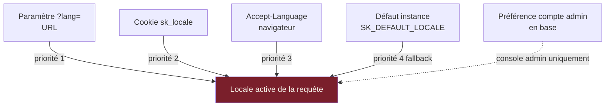
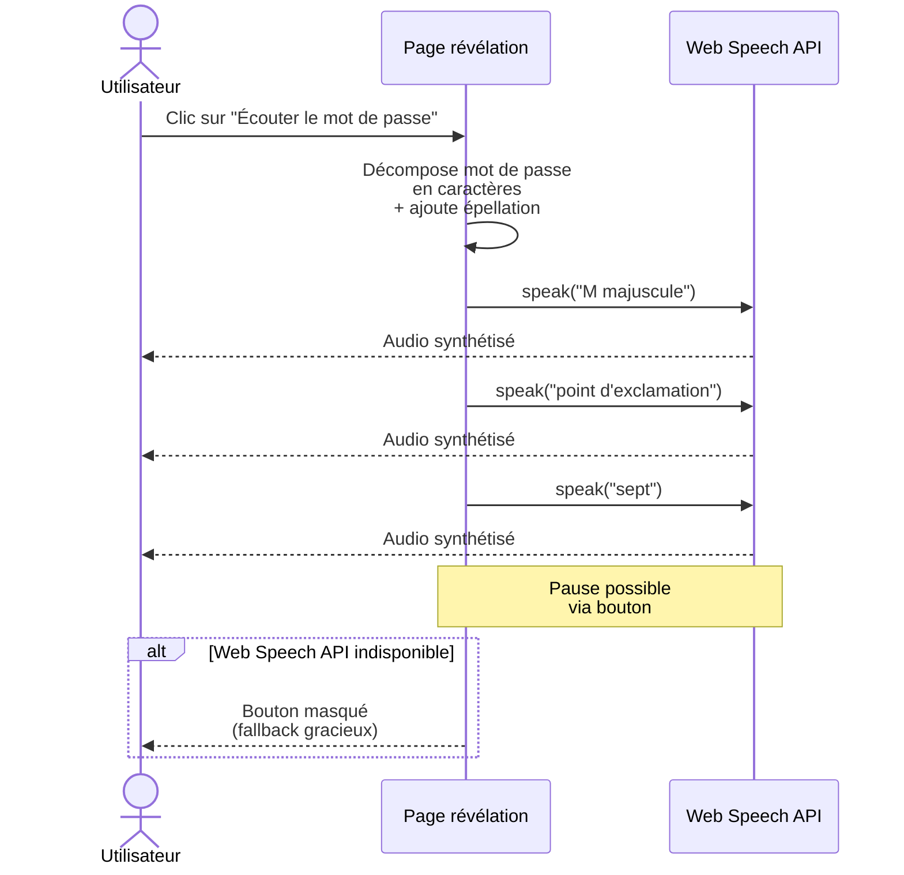

# Module J — i18n & accessibilité

**Statut** : validé
**Version** : 1.0
**Dernière mise à jour** : 2026-05-16
**Auteur** : Pascal-Louis Darmon (assisté par Daneel / Claude)
**Dépendances** : modules B (UI publique localisée), C (console admin localisée), D (templates email multilingues), L (tests d'accessibilité automatisés)

---

## 1. Purpose

Ce module spécifie l'**internationalisation (i18n)** et l'**accessibilité (a11y)** du produit SealKeeper.

— **i18n** : SealKeeper doit être utilisable dans plusieurs langues. En v0.1, deux langues sont bundlées : **français** et **anglais**. La v0.2 prévoit l'ajout d'**espagnol**, **allemand**, **italien**. Le système est conçu pour accepter des contributions communautaires via fichiers de traduction.

— **a11y** : SealKeeper vise le **niveau AA du RGAA 4.1** (équivalent **WCAG 2.1 AA**). Cela couvre la navigation clavier intégrale, le support des lecteurs d'écran, les contrastes suffisants, le redimensionnement texte, et la prise en compte des préférences système (`prefers-color-scheme`, `prefers-reduced-motion`).

**Posture directrice.** SealKeeper traite des données sensibles (mots de passe, accès aux systèmes) ; l'accessibilité n'est pas un *nice-to-have* mais une condition d'égalité de droit pour les utilisateurs en situation de handicap. Le RGAA est par ailleurs **obligatoire** pour les sites des organismes publics français (article 47 de la loi 2005-102), ce qui élargit le marché potentiel de SealKeeper.

---

## 2. Actors and use cases

| Acteur | Interaction |
|---|---|
| Utilisateur final francophone | Accède à `/` en français, reçoit l'email en français |
| Utilisateur final anglophone | Accède à `/?lang=en` ou via `Accept-Language: en` |
| Utilisateur malvoyant ou non-voyant | Utilise un lecteur d'écran (NVDA, JAWS, VoiceOver) sur les pages publiques et la console admin |
| Utilisateur ne pouvant utiliser une souris | Navigue intégralement au clavier |
| Utilisateur sensible aux animations | Bénéficie de `prefers-reduced-motion` honoré |
| Admin SealKeeper | Choisit la langue de la console et celle des emails sortants par défaut |
| Traducteur contributeur | Fournit un fichier `i18n/<locale>.json` et une PR |

---

## 3. Functional requirements

### 3.1 Internationalisation : périmètre v0.1 et v0.2

| ID | Exigence | Niveau |
|---|---|---|
| FR-J.1 | **Langues bundlées en v0.1** : français (`fr`) et anglais (`en`). Pas de packs additionnels à installer | MUST |
| FR-J.2 | **Langue par défaut** : anglais (couverture internationale par défaut), francophone par défaut si l'instance est configurée en `SK_DEFAULT_LOCALE=fr` | MUST |
| FR-J.3 | **Langues prévues en v0.2** : espagnol (`es`), allemand (`de`), italien (`it`) | 📋 v0.2 |
| FR-J.4 | **Mécanique de contribution** : ajout d'une langue = ajout d'un fichier `i18n/<locale>.json` + entrée dans la table de locales supportées (pas de compilation Go nécessaire pour les langues additionnelles) | MUST |
| FR-J.5 | **Tooling de traduction** : 📋 v0.2 — intégration Weblate ou Crowdin si volume justifie | 📋 v0.2 |

### 3.2 Format des fichiers de traduction

| ID | Exigence | Niveau |
|---|---|---|
| FR-J.6 | Format : **JSON UTF-8** avec convention **ICU MessageFormat** pour gérer pluriels, genres, sélections | MUST |
| FR-J.7 | Structure hiérarchique par section (`public`, `admin`, `email`, `errors`, `policies`) | MUST |
| FR-J.8 | Clés au format snake_case lisible (ex : `public.request.button_generate`) | MUST |
| FR-J.9 | Pas de concaténation côté code : chaque variation est une clé distincte (évite les artefacts de traduction) | MUST |
| FR-J.10 | Variables interpolées via `{{nomVar}}` (syntaxe ICU) | MUST |
| FR-J.11 | Pluriels via syntaxe ICU : `{count, plural, one {# élévation} other {# élévations}}` | MUST |
| FR-J.12 | Fichier `i18n/en.json` est la **source canonique** (la plus à jour) ; les autres locales sont alignées dessus | MUST |

**Exemple de fragment `i18n/fr.json`** :

```json
{
  "public": {
    "title": "Générateur de mot de passe sécurisé",
    "request": {
      "email_label": "Votre adresse email professionnelle",
      "button_generate": "Générer un mot de passe",
      "submitted": "Si votre adresse est autorisée, vous recevrez un email sous peu."
    }
  },
  "email": {
    "subject": "Votre mot de passe — {{companyName}}",
    "footer": "Cet email est envoyé à votre demande explicite via SealKeeper."
  },
  "errors": {
    "rate_limited_generic": "Si votre adresse est autorisée, vous recevrez un email sous peu."
  },
  "policies": {
    "elevations_count": "{count, plural, =0 {Aucune élévation} one {# élévation} other {# élévations}}"
  }
}
```

### 3.3 Détection et sélection de la langue

| ID | Exigence | Niveau |
|---|---|---|
| FR-J.13 | **Page publique** : ordre de détection de la langue : 1. paramètre URL `?lang=`, 2. cookie `sk_locale` (persistant), 3. header `Accept-Language` du navigateur, 4. langue par défaut de l'instance | MUST |
| FR-J.14 | **Sélecteur de langue visible** en pied de page sur les pages publiques | MUST |
| FR-J.15 | **Console admin** : ordre : 1. préférence du compte admin (stockée en DB), 2. langue par défaut de l'instance | MUST |
| FR-J.16 | **Emails sortants** : la langue est celle de la demande active (sauf demande explicite admin) | MUST |
| FR-J.17 | Si une chaîne n'est pas traduite dans la locale demandée → fallback sur la **locale source (`en`)** avec marquage console *« non traduit »* | MUST |
| FR-J.18 | Bibliothèques de mots / citations sont **par locale** : `library:eff_diceware_fr.txt` est utilisée pour les locales `fr`, `library:eff_diceware_en.txt` pour `en`, etc. (cf. module C) | MUST |

### 3.4 Localisation (l10n) : formats et conventions

| ID | Exigence | Niveau |
|---|---|---|
| FR-J.19 | **Dates** : format local (DD/MM/YYYY en `fr`, MM/DD/YYYY en `en-US`, YYYY-MM-DD ISO toujours accepté techniquement) | MUST |
| FR-J.20 | **Heures** : format local (24h en `fr`, 12h AM/PM en `en-US`) | MUST |
| FR-J.21 | **Nombres** : séparateurs locaux (espace fine en `fr`, virgule en `en`) | MUST |
| FR-J.22 | **Stockage** : toutes les dates/heures sont stockées en **UTC** dans la base, l'affichage est localisé | MUST |
| FR-J.23 | **Time zone admin** : par admin, configurable, défaut UTC | MUST |
| FR-J.24 | **Caractères non-ASCII** : support complet UTF-8 partout (DB, logs, audit, emails) | MUST |
| FR-J.25 | **Devises et droite-à-gauche (RTL)** : non applicable / 📋 v0.3+ pour RTL (arabe, hébreu) | 📋 v0.3+ |

### 3.5 Accessibilité — RGAA 4.1 niveau AA / WCAG 2.1 AA

| ID | Exigence | Niveau |
|---|---|---|
| FR-J.26 | **Cible : niveau AA du RGAA 4.1** (équivalent WCAG 2.1 AA). Niveau AAA non visé en v0.1 mais respect partiel encouragé | MUST |
| FR-J.27 | **Structure HTML sémantique** : utilisation correcte de `<header>`, `<main>`, `<nav>`, `<section>`, `<form>`, `<button>`, `<h1>`-`<h3>` ; pas de div générique pour des éléments structurés | MUST |
| FR-J.28 | **Hiérarchie de titres cohérente** : `<h1>` unique par page, pas de saut de niveau (h1 → h3 sans h2) | MUST |
| FR-J.29 | **Labels associés** à tous les inputs (`<label for="...">` ou `aria-labelledby`) | MUST |
| FR-J.30 | **Images** : `alt` significatif ou `alt=""` si décoratif. Pas d'image manquante d'attribut | MUST |
| FR-J.31 | **Contrastes** : minimum **4.5:1** pour texte normal, **3:1** pour gros texte (≥ 18pt ou 14pt bold) ou éléments graphiques d'interface | MUST |
| FR-J.32 | **Pas uniquement la couleur** pour transmettre une information : icône + texte + couleur en combinaison (ex : alerte rouge avec icône triangle + mot *« Erreur »*) | MUST |
| FR-J.33 | **Indicateur de focus visible** sur tous les éléments interactifs, indépendant du style `:hover` | MUST |
| FR-J.34 | **Skip link** *« Aller au contenu principal »* en première position sur chaque page (visible au focus, masqué visuellement sinon) | MUST |

### 3.6 Navigation au clavier

| ID | Exigence | Niveau |
|---|---|---|
| FR-J.35 | **100 % des actions utilisateur** sont accessibles au clavier seul (sans souris) | MUST |
| FR-J.36 | Ordre de tabulation **logique** suit l'ordre visuel et le flux narratif | MUST |
| FR-J.37 | **Pas de piège clavier** : un focus peut toujours en sortir avec Tab ou Esc | MUST |
| FR-J.38 | Modales et popups admin : focus contraint à la modale tant qu'elle est ouverte (focus trap), restauré sur l'élément qui l'a ouverte à la fermeture | MUST |
| FR-J.39 | **Raccourcis clavier** (📋 v0.2) : Ctrl+K pour ouvrir une recherche console, Esc pour fermer modale, etc. | 📋 v0.2 |
| FR-J.40 | Le bouton *« Copier »* sur la page de révélation supporte **Enter** et **Espace** | MUST |

### 3.7 Lecteurs d'écran (ARIA)

| ID | Exigence | Niveau |
|---|---|---|
| FR-J.41 | **`aria-live="polite"`** pour les changements dynamiques peu critiques (countdown, état de copie clipboard) | MUST |
| FR-J.42 | **`aria-live="assertive"`** pour les erreurs critiques (échec génération, lien expiré) | MUST |
| FR-J.43 | **`aria-label`** ou **`aria-labelledby`** sur les boutons sans texte visible (icône-seule) | MUST |
| FR-J.44 | **`aria-describedby`** pour les inputs avec aide contextuelle | MUST |
| FR-J.45 | **États ARIA** : `aria-expanded`, `aria-pressed`, `aria-selected`, `aria-current` sur les composants concernés | MUST |
| FR-J.46 | **Rôles ARIA** : `role="dialog"`, `role="alert"`, `role="status"`, `role="tablist"` sur les composants custom | MUST |
| FR-J.47 | **Composants génériques au lieu de custom** quand possible (préférer `<button>` à `<div role="button">`) | MUST |
| FR-J.48 | **Annonce du mot de passe généré** : sur la page de révélation, un attribut `aria-live="polite"` annonce *« Mot de passe affiché. Bouton Copier disponible. »* à l'arrivée sur la page | MUST |
| FR-J.49 | **Lecture épelée** du mot de passe : bouton dédié *« Écouter le mot de passe caractère par caractère »* (cf. §3.8) | MUST |

### 3.8 Synthèse vocale (lecture audio du mot de passe)

| ID | Exigence | Niveau |
|---|---|---|
| FR-J.50 | Sur la page de révélation, un **bouton *« Écouter le mot de passe »*** est disponible (texte + icône haut-parleur) | MUST |
| FR-J.51 | Le bouton déclenche la **Web Speech API SpeechSynthesis** native du navigateur | MUST |
| FR-J.52 | Lecture **caractère par caractère** : *« M majuscule, point d'exclamation, sept, b minuscule, ... »* en français et équivalent en anglais | MUST |
| FR-J.53 | Vitesse de lecture : 0.7× par défaut (plus lent que la normale), configurable via boutons +/- | MUST |
| FR-J.54 | Mise en pause et reprise possibles | MUST |
| FR-J.55 | Avertissement explicite *« La lecture audio implique l'utilisation du système de synthèse vocale local du navigateur. Aucun audio n'est transmis à un serveur externe. »* | MUST |
| FR-J.56 | Le bouton n'est pas affiché si la Web Speech API n'est pas disponible (fallback gracieux) | MUST |
| FR-J.57 | Le bouton est **non-prioritaire pour le tab order** (placé après le bouton Copier dans le flux logique) | MUST |

### 3.9 Tailles et zoom

| ID | Exigence | Niveau |
|---|---|---|
| FR-J.58 | **Zoom 200 %** sans perte de contenu ni de fonctionnalité (WCAG 1.4.4) | MUST |
| FR-J.59 | **Pas de tailles fixes en pixel** pour le texte ; utilisation de `rem`, `em`, `clamp()` | MUST |
| FR-J.60 | **Reflow horizontal** : pas de défilement horizontal sur écran 320 px de large à 100 % zoom (WCAG 1.4.10) — cf. module K mobile | MUST |
| FR-J.61 | **Texte espacement personnalisable** : si l'utilisateur applique des styles personnalisés (hauteur de ligne, interlettrage), la page reste lisible (WCAG 1.4.12) | MUST |

### 3.10 Thèmes et préférences système

| ID | Exigence | Niveau |
|---|---|---|
| FR-J.62 | **3 thèmes proposés** : clair (`light`), sombre (`dark`), haut contraste (`high-contrast`) | MUST |
| FR-J.63 | **Respect de `prefers-color-scheme`** : par défaut, suit le thème système du navigateur | MUST |
| FR-J.64 | **Toggle utilisateur** : bouton en pied de page pour passer entre les 3 thèmes, mémorisé en cookie `sk_theme` | MUST |
| FR-J.65 | **`prefers-reduced-motion`** : si l'utilisateur préfère moins de mouvement, désactiver toutes les animations CSS et transitions douces | MUST |
| FR-J.66 | **`prefers-contrast: high`** : appliquer automatiquement le thème haut contraste si demandé | SHOULD |
| FR-J.67 | Tous les thèmes respectent les contrastes RGAA AA (FR-J.31) | MUST |

### 3.11 Validation et tests

| ID | Exigence | Niveau |
|---|---|---|
| FR-J.68 | **Tests automatisés `@axe-core/playwright`** sur les pages publiques + console admin (cf. module L) | MUST |
| FR-J.69 | **Tests manuels** par échantillonnage à chaque release MINOR avec NVDA + Firefox sous Linux | MUST |
| FR-J.70 | **Audit accessibilité externe** par tiers spécialisé : 📋 v1.0 avant lancement grand public | 📋 v1.0 |
| FR-J.71 | **Déclaration de conformité RGPA** publiée sur `/accessibility` (modèle CNIL/RGAA) à partir de v0.5 | 📋 v0.5 |

---

## 4. Non-functional requirements

| Type | Cible |
|---|---|
| Conformité RGAA 4.1 niveau AA | 100 % sur pages publiques, ≥ 90 % sur console admin |
| Conformité WCAG 2.1 AA | Équivalent au RGAA AA |
| Langues bundlées v0.1 | 2 (fr, en) |
| Langues prévues v0.2 | + 3 (es, de, it) = 5 totales |
| Taille du bundle JS i18n par langue | < 10 KB gzippé |
| Latence chargement traductions | < 50 ms (incluses dans le bundle initial) |
| Coverage tests axe-core | 100 % des pages publiques + console admin |
| Annonce du mot de passe par lecteur d'écran | < 1 seconde après affichage |

---

## 5. Data model

### 5.1 Hiérarchie des locales



### 5.2 Mapping locale → bibliothèque par défaut

| Locale | Diceware par défaut | Corpus citations par défaut | Format date |
|---|---|---|---|
| `fr` | `eff_diceware_fr.txt` | `corpus_editorial_fr.txt` (Hugo, Voltaire, ...) | DD/MM/YYYY |
| `en` | `eff_diceware_en.txt` | `corpus_editorial_en.txt` (Shakespeare, ...) | MM/DD/YYYY |
| `es` (v0.2) | `eff_diceware_es.txt` | `corpus_editorial_es.txt` (Cervantes, ...) | DD/MM/YYYY |
| `de` (v0.2) | `eff_diceware_de.txt` | `corpus_editorial_de.txt` (Goethe, ...) | DD.MM.YYYY |
| `it` (v0.2) | `eff_diceware_it.txt` | `corpus_editorial_it.txt` (Dante, ...) | DD/MM/YYYY |

### 5.3 Workflow de la synthèse vocale



---

## 6. Interfaces

### 6.1 Sélecteur de langue (page publique)

Sélecteur en pied de page, format menu déroulant :

```
Langue : [FR ▼]
         FR — Français
         EN — English
```

L'utilisateur sélectionne une langue → cookie `sk_locale` posé → page rechargée dans la nouvelle locale.

### 6.2 Préférences admin

Dans la console admin → *Mon compte* :
- **Langue de la console** : sélecteur (FR, EN)
- **Time zone** : sélecteur (UTC, Europe/Paris, Europe/London, etc.)
- **Format de date** : auto (lié à la langue) ou ISO 8601

### 6.3 Toggle thème (toutes pages)

Icône en pied de page :

```
[☀️ Clair] [🌙 Sombre] [⚫ Contraste]
```

État courant surligné. Sélection mémorisée en cookie `sk_theme`. Si aucun cookie, respect de `prefers-color-scheme` du navigateur.

### 6.4 Bouton synthèse vocale (page révélation)

Sous la zone d'affichage du mot de passe :

```
[📋 Copier]  [🔊 Écouter le mot de passe (épellation)]
```

Au clic sur écouter : lecture audio démarre. Boutons additionnels apparaissent : pause, vitesse +/-.

---

## 7. Edge cases and error handling

| Cas | Réponse |
|---|---|
| Locale demandée non supportée (`?lang=zh`) | Fallback sur `en` ; cookie non posé ; warning console *« Locale non supportée, fallback en. »* |
| Clé de traduction manquante dans le fichier locale | Affichage de la chaîne en `en` (source) ; warning visible en dev mode |
| Variable interpolée manquante dans le fichier locale | Affichage de la chaîne avec `{{varName}}` brut + erreur en console JS (dev mode) |
| Web Speech API absente | Bouton masqué (FR-J.56) ; pas d'erreur |
| Navigateur sans support du thème sombre (très ancien) | Fallback sur thème clair |
| User préfère reduced-motion mais clique un toggle | Toggle fonctionne sans animation, pas de transition CSS |
| Lecteur d'écran lit le mot de passe affiché à l'écran (par défaut) | Le mot de passe est visible donc lu. Annotation `aria-live="polite"` permet de le contrôler. L'utilisateur peut copier puis effacer rapidement |
| Mot de passe contient des caractères spéciaux (`!`, `?`, etc.) | Synthèse vocale épelle correctement (*« point d'exclamation »*) en français, *« exclamation mark »* en anglais |
| Émojis ou caractères non-Latins dans bibliothèque | Support UTF-8 partout, mais corpus filtre les caractères non-imprimables. Si présents : fallback affichage hexadécimal |
| Time zone admin invalide ou inconnue | Fallback UTC, warning console |

---

## 8. Closed decisions

| # | Décision | Justification |
|---|---|---|
| D-J.1 | **2 langues bundlées en v0.1** (FR + EN) ; 3 langues additionnelles prévues v0.2 (ES, DE, IT) | Scope contrôlé, traductions humainement validables |
| D-J.2 | **Anglais comme langue source canonique** ; les autres locales s'alignent dessus | Standard de facto, communauté internationale |
| D-J.3 | **Format ICU MessageFormat JSON** (pas gettext, pas YAML) | Gère pluriels et genres, syntaxe humainement lisible, tooling JS mature |
| D-J.4 | **Détection langue** : URL > cookie > Accept-Language > défaut | Respecte la préférence utilisateur explicite, fallback intelligent |
| D-J.5 | **Cible RGAA 4.1 niveau AA** (équivalent WCAG 2.1 AA) | Standard légal France + grande majorité de l'audience |
| D-J.6 | **Synthèse vocale via Web Speech API native** ; aucun envoi audio externe | Privacy by design, fonctionne offline |
| D-J.7 | **Trois thèmes** : clair, sombre, haut contraste | Couvre les besoins courants, respect `prefers-color-scheme` natif |
| D-J.8 | **`prefers-reduced-motion` respecté** systématiquement | Posture accessibilité de base |
| D-J.9 | **Bibliothèques de mots / citations par locale** : un dictionnaire et un corpus dédiés pour chaque langue | Cohérence linguistique, qualité éditoriale |
| D-J.10 | **Times zones stockées en UTC**, affichage local par admin | Standard d'ingénierie, évite erreurs de fuseaux |
| D-J.11 | **Pas de framework JS lourd pour i18n** ; bundle léger custom (< 10 KB) en ESM moderne | Cohérent avec posture bundle léger du projet |
| D-J.12 | **RTL (arabe, hébreu) reporté v0.3+** | Demande spécifique non encore identifiée, refonte CSS non-triviale |
| D-J.13 | **Audit accessibilité externe avant v1.0 grand public** | Validation tiers nécessaire pour crédibilité |
| D-J.14 | **Déclaration de conformité RGAA publiée à partir de v0.5** | Délai de stabilisation des règles + audit externe préalable |
| D-J.15 | **Tests `@axe-core/playwright` obligatoires** en CI | Standard de facto, intégration native Playwright |
| D-J.16 | **Weblate en v0.2** comme plateforme de traduction communautaire (open source, auto-hébergeable) | Cohérent avec doctrine souveraine ; pas vital v0.1 (peu de langues) |
| D-J.17 | **Pas de synthèse vocale en console admin** ; réservée à la page de révélation utilisateur | L'admin manipule du technique, pas de mot de passe à épeler |
| D-J.18 | **Bouton "audio description" page d'accueil reporté v0.3** | Demande production audio non-triviale |
| D-J.19 | **Tests E2E en CI** : `en` principal + `fr` smoke ; full multi-locale en nightly | Couverture pragmatique sans coût CI exorbitant |
| D-J.20 | **Audit RGPA externe avant v1.0 grand public** ; auto-évaluation pour v0.1 à v0.5 | Validation tiers nécessaire pour crédibilité institutionnelle |
| D-J.21 | **Traduction automatique (DeepL, Google Translate) acceptée en draft initial seulement** ; relecture par locuteur natif obligatoire avant merge | Accélère bootstrap v0.2 sans sacrifier qualité finale |
| D-J.22 | **Variables de personnalisation par locale** gérées nativement par **ICU MessageFormat** | Pas de surcouche custom, standard mûr |
| D-J.23 | **Pas de variantes locales (`fr-CA`, `en-GB`, etc.) en v0.1/v0.2** ; ouvertes à la contribution communautaire ensuite | Scope contrôlé, qualité maîtrisée |
| D-J.24 | **Sélecteur de langue dans l'email reporté v0.2** (lien *"English version"* en pied) | Simple à ajouter quand i18n infra mûre |

---

## 9. Open questions

**Toutes les questions ouvertes ont été tranchées le 16 mai 2026** par Pascal-Louis Darmon après recommandation de Daneel. Les 9 décisions correspondantes sont consignées en §8 sous les références D-J.16 à D-J.24. Le PRD J est intégralement validé en v1.0.

Trois fonctionnalités sont reportées : Weblate v0.2, audio description page d'accueil v0.3, sélecteur de langue dans l'email v0.2.

---

## 10. References

- **Module B** — UI publique localisée
- **Module C** — console admin localisée, gestion préférences admin
- **Module D** — templates email multilingues
- **Module L** — tests d'accessibilité automatisés via @axe-core/playwright

- **RGAA 4.1** — [accessibilite.numerique.gouv.fr/methode](https://accessibilite.numerique.gouv.fr/methode/criteres-et-tests/)
- **WCAG 2.1** — [w3.org/TR/WCAG21](https://www.w3.org/TR/WCAG21/)
- **ARIA 1.2** — [w3.org/TR/wai-aria-1.2](https://www.w3.org/TR/wai-aria-1.2/)
- **ICU MessageFormat** — [unicode-org.github.io/icu/userguide/format_parse/messages](https://unicode-org.github.io/icu/userguide/format_parse/messages/)
- **Web Speech API** — [developer.mozilla.org/en-US/docs/Web/API/Web_Speech_API](https://developer.mozilla.org/en-US/docs/Web/API/Web_Speech_API)
- **prefers-color-scheme** — CSS media query
- **prefers-reduced-motion** — CSS media query
- **EFF Diceware (multilingual)** — [eff.org/dice](https://www.eff.org/dice)
- **axe-core** — [github.com/dequelabs/axe-core](https://github.com/dequelabs/axe-core)
- **Loi 2005-102** (France) — accessibilité numérique
- **Directive UE 2016/2102** — accessibilité des sites web et applications mobiles des organismes du secteur public

---

## 11. Évolution de ce document

| Version | Date | Auteur | Changements |
|---|---|---|---|
| 1.0 | 2026-05-16 | P.-L. Darmon (Daneel) | **Version validée** — 9 décisions tranchées (D-J.16 à D-J.24) : Weblate v0.2, pas de synthèse vocale en console admin, audio description page accueil v0.3, E2E EN principal + FR smoke en CI, audit RGPA externe avant v1.0, traduction auto en draft seul, variables ICU natives, pas de variantes locales en v0.1/v0.2, sélecteur de langue email v0.2 |
| 0.1 | 2026-05-16 | P.-L. Darmon (Daneel) | Création initiale — 71 FR réparties en 11 sous-sections, i18n (FR/EN bundled v0.1, +3 langues v0.2, ICU MessageFormat JSON), RGAA 4.1 AA / WCAG 2.1 AA, navigation clavier, ARIA, synthèse vocale Web Speech, 3 thèmes (clair/sombre/contraste) avec `prefers-color-scheme` et `prefers-reduced-motion`, 15 décisions tranchées, 9 questions ouvertes, 3 diagrammes Mermaid |

---

*Document maintenu dans le repo `sched75/sealkeeper` sous `docs/prd/J-i18n-accessibility.md`.*
