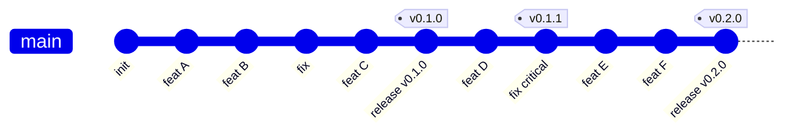
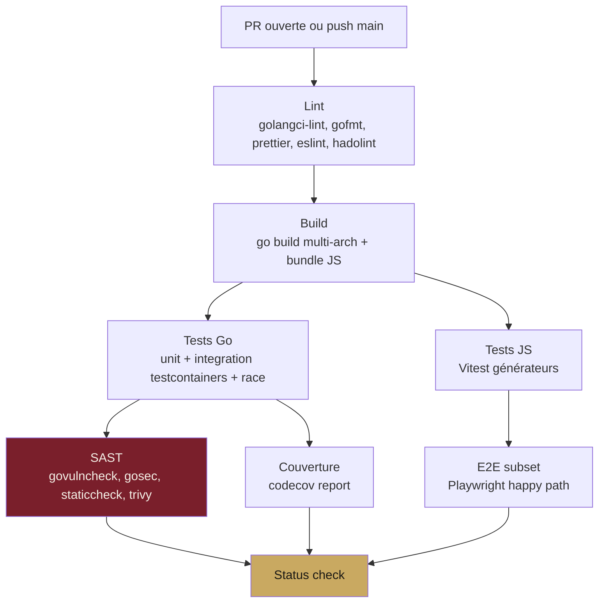
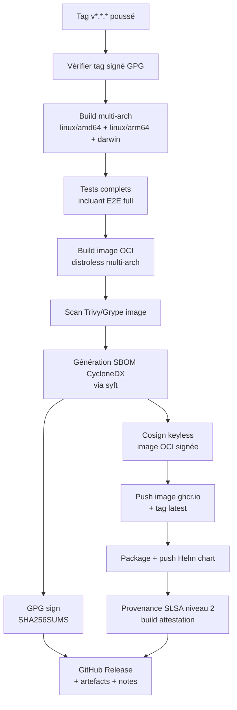

# Module L — Qualité & release

**Statut** : validé
**Version** : 1.0
**Dernière mise à jour** : 2026-05-16
**Auteur** : Pascal-Louis Darmon (assisté par Daneel / Claude)
**Dépendances** : modules A (générateur à tester), D (binaire Go à tester), G (API à tester), H (artefacts à publier) ; alimente toutes les phases de qualité

---

## 1. Purpose

Ce module spécifie la **stratégie qualité** (tests, lint, sécurité statique, fuzzing) et le **processus de release** (versioning, pipeline CI/CD, signing, SBOM) de SealKeeper.

Il définit le **contrat de qualité** que le projet s'engage à respecter à chaque release : couverture de tests, pipeline CI passant, scan de sécurité propre, artefacts signés, changelog publié. Ce module est consulté par les contributeurs (pour comprendre les attentes) et les évaluateurs (pour vérifier la rigueur du projet).

---

## 2. Actors and use cases

| Acteur | Interaction |
|---|---|
| Développeur / contributeur | Suit les conventions, fait passer les tests localement et en CI |
| Mainteneur | Tag les releases, signe les artefacts, rédige les notes de release |
| CI/CD (GitHub Actions) | Exécute le pipeline automatiquement à chaque PR et tag |
| Évaluateur de l'amont (utilisateur final) | Vérifie les checksums et signatures avant déploiement |
| Auditeur tiers | Inspecte la SBOM, vérifie la reproductibilité du build |

---

## 3. Functional requirements

### 3.1 Tests Go (backend)

| ID | Exigence | Niveau |
|---|---|---|
| FR-L.1 | Chaque package interne (`internal/*`) a un fichier de tests unitaires `*_test.go` | MUST |
| FR-L.2 | Les tests utilisent **`testing` standard + `testify/require`** pour les assertions | MUST |
| FR-L.3 | **Tests d'intégration** avec PostgreSQL via **`testcontainers-go`** : chaque test démarre un conteneur PostgreSQL éphémère | MUST |
| FR-L.4 | Tests SQLite avec fichier temporaire (`t.TempDir()`) | MUST |
| FR-L.5 | Race detector activé : tous les tests CI sont exécutés avec `go test -race` | MUST |
| FR-L.6 | **Couverture cible : ≥ 75 %** des lignes ; ≥ 80 % pour les packages critiques (`session`, `audit`, `policy`, `generation_api`) | MUST |
| FR-L.7 | Couverture rapportée à chaque PR via Codecov ou équivalent ; baisse non bloquante mais signalée | SHOULD |
| FR-L.8 | **Tests de propriété** (property-based testing) pour les fonctions cryptographiques et l'entropie via `pgregory.net/rapid` | SHOULD |
| FR-L.9 | **Fuzzing Go** activé sur les fonctions de parsing (config YAML, JSON inputs, Problem Details) | 📋 v0.2 |
| FR-L.10 | **Mutation testing** avec `go-mutesting` ou équivalent | 📋 v0.3 |

### 3.2 Tests JavaScript (bundle générateur navigateur)

| ID | Exigence | Niveau |
|---|---|---|
| FR-L.11 | Framework de tests : **Vitest** (compatible Jest, plus rapide, support natif ESM et TypeScript) | MUST |
| FR-L.12 | Tests unitaires de chaque générateur (G1, G2, G3) couvrant : composition correcte, entropie calculée conforme, edge cases (corpus vide, paramètres invalides) | MUST |
| FR-L.13 | Tests des 9 transformations (T01-T09) individuellement | MUST |
| FR-L.14 | Tests du calcul d'entropie : `calculateEntropy(policy)` cohérent avec un calcul manuel de référence | MUST |
| FR-L.15 | Tests d'invariance : 10 000 générations consécutives ne produisent pas de doublon avec une entropie cible ≥ 80 bits | MUST |
| FR-L.16 | Tests de la distribution : un mot de chaque dictionnaire doit avoir une probabilité ~égale d'apparaître sur N générations | SHOULD |
| FR-L.17 | Couverture cible JS : ≥ 90 % (le code générateur est compact, doit être quasi exhaustivement testé) | MUST |
| FR-L.18 | Pas de mocks pour WebCrypto : utiliser `node:crypto` `webcrypto` ou `crypto.randomBytes` en environnement de test Node | MUST |

### 3.3 Tests end-to-end (Playwright)

| ID | Exigence | Niveau |
|---|---|---|
| FR-L.19 | Framework : **Playwright** (TypeScript) | MUST |
| FR-L.20 | Tests E2E pour les **6 scénarios canoniques** : | MUST |
| FR-L.21 | 1. **Demande utilisateur happy path** : email → réception → révélation → copie | MUST |
| FR-L.22 | 2. **Demande utilisateur rate-limit** : 4 demandes successives, vérifier réponse identique | MUST |
| FR-L.23 | 3. **Demande utilisateur domain block** : email hors allowlist, vérifier réponse identique | MUST |
| FR-L.24 | 4. **Lien expiré** : ouvrir un lien après T+15min, vérifier message *« session expirée »* | MUST |
| FR-L.25 | 5. **Lien déjà consommé** : ouvrir deux fois le même lien | MUST |
| FR-L.26 | 6. **Login admin avec TOTP** : login complet, navigation, logout | MUST |
| FR-L.27 | **Multi-navigateurs** : Chromium, Firefox, WebKit | MUST |
| FR-L.28 | **Tests d'accessibilité automatisés** via `@axe-core/playwright` sur les pages publiques + console admin | MUST |
| FR-L.29 | Les E2E utilisent un binaire SealKeeper en mode eval + SMTP capture pour récupérer les liens | MUST |
| FR-L.30 | Captures d'écran et vidéos sauvegardées sur échec | MUST |

### 3.4 Sécurité statique (SAST) et scans

| ID | Exigence | Niveau |
|---|---|---|
| FR-L.31 | **`govulncheck`** exécuté en CI : analyse les CVE connues des dépendances Go. Échec sur CVE haute ou critique | MUST |
| FR-L.32 | **`gosec`** : linter de sécurité Go. Échec sur règles haute confiance | MUST |
| FR-L.33 | **`staticcheck`** intégré à golangci-lint | MUST |
| FR-L.34 | **`semgrep`** avec règles communautaires Go : OWASP, CWE Top 25 | SHOULD |
| FR-L.35 | **`Trivy`** ou **`Grype`** scan l'image OCI à chaque release : CVE des binaires distroless + dépendances | MUST |
| FR-L.36 | **SBOM générée automatiquement** au format CycloneDX 1.5 (binaire + image) via `syft` | MUST |
| FR-L.37 | **OWASP ZAP DAST** scan sur instance eval éphémère post-déploiement test | 📋 v0.2 |

### 3.5 Linting et formatage

| ID | Exigence | Niveau |
|---|---|---|
| FR-L.38 | **`gofmt`** et **`goimports`** appliqués automatiquement (pre-commit hook + CI check) | MUST |
| FR-L.39 | **`golangci-lint`** configuré dans `.golangci.yml` avec linters activés : `errcheck`, `govet`, `staticcheck`, `gosec`, `gocritic`, `revive`, `unused`, `gosimple`, `ineffassign`, `misspell` | MUST |
| FR-L.40 | **`prettier`** pour JavaScript, CSS, HTML, JSON, YAML, Markdown | MUST |
| FR-L.41 | **`eslint`** pour JavaScript avec config recommandée Airbnb ou Standard | MUST |
| FR-L.42 | **`yamllint`** sur les fichiers YAML (Helm chart, GitHub Actions) | SHOULD |
| FR-L.43 | **`markdownlint`** sur les fichiers Markdown du projet | SHOULD |
| FR-L.44 | **`hadolint`** sur le Dockerfile | MUST |
| FR-L.45 | **`shellcheck`** sur tous les scripts shell | MUST |

### 3.6 Pipeline CI/CD (GitHub Actions)

| ID | Exigence | Niveau |
|---|---|---|
| FR-L.46 | Pipeline défini dans `.github/workflows/` avec workflows séparés : `ci.yml` (PR + push main), `release.yml` (tag), `nightly.yml` (cron) | MUST |
| FR-L.47 | **`ci.yml`** exécute sur chaque PR et push sur `main` : lint → build → test Go → test JS → E2E (subset) → SAST → couverture | MUST |
| FR-L.48 | **`release.yml`** déclenché par tag `v*.*.*` : build multi-arch → tests complets → scan image → push image → signing → publication release GitHub + Helm chart | MUST |
| FR-L.49 | **`nightly.yml`** exécute la nuit : E2E complet multi-navigateurs, mutation testing (v0.3), SAST profond | SHOULD |
| FR-L.50 | Matrix testing : Go 1.22, 1.23 ; Linux + macOS pour les builds | MUST |
| FR-L.51 | **Caching** : modules Go, npm, Playwright browsers, Docker layers | MUST |
| FR-L.52 | **Temps de pipeline CI cible : < 15 minutes** sur PR standard | MUST |
| FR-L.53 | Status checks obligatoires pour le merge sur `main` : lint, build, tests Go, tests JS, E2E subset | MUST |
| FR-L.54 | Branches protégées : `main` interdit aux push directs, PR + 1 review minimum + checks verts | MUST |
| FR-L.55 | **Renovate** ou **Dependabot** configuré pour MAJ automatique des dépendances (PRs hebdo) | MUST |

### 3.7 Versioning et processus de release

| ID | Exigence | Niveau |
|---|---|---|
| FR-L.56 | **SemVer 2.0** strict : `MAJOR.MINOR.PATCH` (réf. FR-H.59) | MUST |
| FR-L.57 | Pré-versions : `0.x.y` jusqu'à API stability commitment ; suffixes `-alpha.N`, `-beta.N`, `-rc.N` autorisés | MUST |
| FR-L.58 | **Modèle de branchement : trunk-based** (`main` est toujours releasable) ; pas de branche `develop` ni `release-x.y` en v0.1 | MUST |
| FR-L.59 | Pour les PATCH critiques sur une version ancienne : branche `release-vX.Y` créée *à la demande*, cherry-pick depuis main | SHOULD |
| FR-L.60 | **Cadence cible** : MINOR tous les 3 mois (avril, juillet, octobre, janvier), PATCH ad-hoc selon besoin | MUST |
| FR-L.61 | **Changelogs** générés automatiquement depuis les commits (convention Conventional Commits : `feat:`, `fix:`, `docs:`, `chore:`, `refactor:`) | MUST |
| FR-L.62 | Notes de release rédigées manuellement à partir du changelog auto, incluant : highlights, breaking changes, migration steps | MUST |
| FR-L.63 | Tag Git **annoté et signé GPG** par le mainteneur | MUST |

### 3.8 Signing, SBOM, reproductibilité

| ID | Exigence | Niveau |
|---|---|---|
| FR-L.64 | **GPG signature** sur tous les artefacts binaires + checksums (`SHA256SUMS.gpg`) | MUST |
| FR-L.65 | **`cosign` keyless signing** des images OCI publiées sur ghcr.io (transparency log Rekor) | MUST |
| FR-L.66 | **SBOM CycloneDX 1.5** générée et attachée à chaque release : `sealkeeper-0.1.0-amd64.sbom.json` | MUST |
| FR-L.67 | **Provenance SLSA niveau 2** dès v0.1 (build attestation via GitHub OIDC + cosign) | MUST |
| FR-L.68 | **Reproductibilité builds** (SLSA niveau 3) — objectif v0.3 : tagging `-trimpath -buildvcs -ldflags "-X main.Version=..." `, environnement de build figé, comparaison externe attestée | 📋 v0.3 |
| FR-L.69 | Documentation **`docs/security/verification.md`** explique comment vérifier signature + SBOM + provenance | MUST |

### 3.9 Documentation maintenue

| ID | Exigence | Niveau |
|---|---|---|
| FR-L.70 | **README.md** à jour à chaque MINOR : sections Quickstart, Standards, Roadmap reflètent la release courante | MUST |
| FR-L.71 | **Site sealkeeper.eu** à jour à chaque MINOR : page changelog reflète la release, page docs reflète l'API courante | MUST |
| FR-L.72 | **PRD modules** versionnés avec le code (`docs/prd/*.md`) ; toute modification fonctionnelle a un PRD mis à jour avant le code | MUST |
| FR-L.73 | **Documentation API** auto-générée depuis OpenAPI 3.1 (module G), publiée sur sealkeeper.eu/docs/api | MUST |
| FR-L.74 | **Documentation utilisateur** : `docs/user-guide.md`, `docs/admin-guide.md`, `docs/operations/*.md` | SHOULD |
| FR-L.75 | **CONTRIBUTING.md** à jour : process développeur, conventions, checklist PR | MUST |
| FR-L.76 | **SECURITY.md** à jour : politique de divulgation responsable, contact PGP, hall of thanks | MUST |
| FR-L.77 | **CODE_OF_CONDUCT.md** : Contributor Covenant 2.1 | MUST |
| FR-L.78 | **CHANGELOG.md** à la racine du repo, format *Keep a Changelog* | MUST |

---

## 4. Non-functional requirements

| Type | Cible |
|---|---|
| **Couverture tests Go** | ≥ 75 % global, ≥ 80 % packages critiques |
| **Couverture tests JS** | ≥ 90 % (générateur) |
| **Pipeline CI durée** | < 15 minutes sur PR standard |
| **Pipeline release durée** | < 30 minutes incluant scan image + publication |
| **Flaky tests** | Zéro toléré : un test qui flake = ticket bloquant |
| **CVE haute / critique** | Zéro dans les dépendances lors d'une release |
| **Cadence MINOR** | Trimestrielle (4×/an) |
| **Cadence PATCH** | < 7 jours pour les vulnérabilités sérieuses |
| **Couverture OWASP ASVS 4.0 niveau 2** | ≥ 80 % des items adressés (tracked en doc) |
| **Time to first contribution** (nouveau dev) | < 1 heure (setup local fonctionnel) |

---

## 5. Data model

### 5.1 Modèle de branchement (trunk-based)

`main` est toujours releasable. Les features sont mergées via PR. Les releases sont des tags annotés signés GPG.

### 5.2 Pipeline CI sur Pull Request

### 5.3 Pipeline de release sur tag

---

## 6. Interfaces

### 6.1 Structure des workflows GitHub Actions

`.github/workflows/` :

- `ci.yml` — PR + push main (lint, build, test, SAST, E2E subset, couverture)
- `release.yml` — déclenché par tag `v*.*.*` (build complet, signing, publication)
- `nightly.yml` — cron quotidien (E2E full multi-navigateurs, mutation testing)
- `security.yml` — cron hebdomadaire (re-scan CVE des dépendances, audit dependencies)
- `docs.yml` — déploiement automatique du site sealkeeper.eu lors d'updates de `docs/`

### 6.2 Convention de commits

Pattern **Conventional Commits 1.0** :

- `feat: <description>` — nouvelle fonctionnalité
- `fix: <description>` — correction de bug
- `docs: <description>` — documentation
- `chore: <description>` — maintenance
- `refactor: <description>` — refactoring sans changement fonctionnel
- `test: <description>` — ajout/modif de tests
- `perf: <description>` — optimisation performance
- `ci: <description>` — modification du pipeline CI
- `BREAKING CHANGE: <description>` (dans le corps ou avec `!` après le type)

### 6.3 Checklist d'une release

Avant chaque release, le mainteneur exécute la checklist documentée dans `docs/release-checklist.md` :

1. CI vert sur `main`
2. SBOM et provenance générées
3. Image scan sans CVE haute/critique
4. CHANGELOG.md à jour
5. README.md `Roadmap` à jour
6. Site sealkeeper.eu `Changelog` mis à jour
7. PRD modules à jour si l'API a évolué
8. Tag `vX.Y.Z` annoté signé GPG
9. Push tag → déclenche `release.yml`
10. Vérification post-release : image pull ok, SBOM accessible, signature vérifiable

---

## 7. Edge cases and error handling

| Cas | Réponse |
|---|---|
| Test flaky en CI | Bloquer le merge. Investiguer et soit fixer, soit retirer. Pas de `t.Skip()` permanent |
| CVE haute découverte dans une dépendance après release | Release PATCH dans les 7 jours ; mise à jour de la dépendance ; advisory publié dans `SECURITY.md` |
| Signature GPG invalide détectée sur un artefact | Retrait immédiat de la release, advisory critique publié, investigation de l'intégrité de la chaîne |
| Build non reproductible (différence entre deux builds du même tag) | Audit complet ; SLSA niveau 3 visé pour rendre ce cas détectable systématiquement (v0.3) |
| Tag accidentellement poussé sans signature GPG | Workflow `release.yml` refuse de continuer (vérification GPG en première étape) |
| Tag poussé sur un commit non testé | Workflow refuse (commit doit avoir un CI vert ; sinon échec immédiat) |
| Pipeline CI échoue sur un test intermittent | Re-run autorisé une seule fois ; si flake confirmé → ticket bloquant |
| Image OCI push échoue (rate limit ghcr.io) | Retry avec backoff exponentiel jusqu'à 3 fois. Échec définitif = release en échec, manuel à débloquer |
| SBOM ne se génère pas (panne `syft`) | Échec de la release. Pas de release sans SBOM |
| Sapproches GitHub Actions limit minutes | Budget mensuel monitoré, plan d'urgence : runners self-hosted (homelab personnel) |
| Tests E2E timeout en CI | Cause souvent : démarrage container lent. Healthcheck doit attendre `readyz=200` avant test |

---

## 8. Closed decisions

| # | Décision | Justification |
|---|---|---|
| D-L.1 | **GitHub Actions** comme CI/CD principale | Native intégration repo, runners suffisants pour v0.1, écosystème mature |
| D-L.2 | **testcontainers-go** pour intégration PostgreSQL en tests | Standard Go, isolation totale, parallélisable |
| D-L.3 | **Playwright** pour E2E (pas Cypress, pas Selenium) | Multi-navigateurs natif, async/await, vitesse, communauté active |
| D-L.4 | **Vitest** pour tests JS (pas Jest legacy) | Plus rapide, ESM natif, compatible Jest API |
| D-L.5 | **`@axe-core/playwright`** intégré pour tests d'accessibilité automatisés | Standard de facto, complète RGAA test manuel |
| D-L.6 | **`cosign` keyless signing** pour les images OCI (transparency log Rekor) | Sigstore standard, pas de gestion de clé privée |
| D-L.7 | **SBOM CycloneDX 1.5 via syft** (pas SPDX par défaut) | Plus expressif, supporté par ecosystem cloud-native |
| D-L.8 | **SLSA niveau 2 dès v0.1**, niveau 3 visé v0.3 | Niveau 2 = build attestation, accessible immédiatement |
| D-L.9 | **Trunk-based development** (`main` toujours releasable) | Simplifie la mémoire mentale, évite les merge hell |
| D-L.10 | **Conventional Commits 1.0** pour changelog automatique | Pattern standard, outillage mature |
| D-L.11 | **Cadence MINOR trimestrielle** (avril, juillet, octobre, janvier) | Rythme soutenable, prévisible pour les utilisateurs |
| D-L.12 | **Couverture cible 75 % global / 80 % packages critiques / 90 % JS générateur** | Compromis quality / vélocité, JS doit être quasi-exhaustivement testé |
| D-L.13 | **Renovate ou Dependabot pour MAJ dépendances** | Hygiène standard, propositions de PR automatisées |
| D-L.14 | **Branches protégées `main`** : PR + 1 review + checks verts obligatoires | Pratique standard GitHub Flow |
| D-L.15 | **`govulncheck` bloquant** sur CVE haute/critique en CI | Posture sécurité ; CVE faible / moyenne = ticket non bloquant |
| D-L.16 | **Fuzzing reporté v0.2** (Go native fuzzing), mutation testing reporté v0.3 | Outils mûrs mais demandent un setup non-trivial |
| D-L.17 | **Codecov** comme provider de coverage (pas Coveralls) | UI plus claire, gratuit pour OSS, intégration native GitHub |
| D-L.18 | **Pas de monitoring CI dédié en v0.1** ; suivi manuel via GitHub Actions analytics | Datadog CI Visibility envisageable v0.3 si budget |
| D-L.19 | **Tests de charge ad-hoc en v0.1** (scripts k6 dans `tests/load/`), intégration au pipeline en v0.2 | Pas vital v0.1, demande des runners plus costauds |
| D-L.20 | **Helm chart museum statique sur sealkeeper.eu/charts** dès v0.1 ; Artifact Hub en v0.2 | Maîtrise du flux, génération via `helm repo index` |
| D-L.21 | **Smoke tests post-release** intégrés dans `release.yml` : pull image fraîche, démarrer, vérifier `/healthz` | Détecte un push d'artefact cassé immédiatement |
| D-L.22 | **Beta program à partir de v0.4** | Peu d'utilisateurs en v0.1-v0.3, demande tardive |
| D-L.23 | **DCO (Developer Certificate of Origin)** sign-off `-s` sur chaque commit (pas CLA) | Plus léger que CLA, compatible AGPL v3, pratique standard Linux Foundation |
| D-L.24 | **`.pre-commit-config.yaml` livré** dans le repo (gofmt, prettier, markdownlint, hadolint, shellcheck) ; CONTRIBUTING explique l'installation | Hygiène de qualité dès le premier commit développeur |

---

## 9. Open questions

**Toutes les questions ouvertes ont été tranchées le 16 mai 2026** par Pascal-Louis Darmon après recommandation de Daneel. Les 8 décisions correspondantes sont consignées en §8 sous les références D-L.17 à D-L.24. Le PRD L est intégralement validé en v1.0.

Trois fonctionnalités sont reportées (monitoring CI flake en v0.3 sous budget, tests de charge CI en v0.2, beta program en v0.4).

---

## 10. References

- **Module A** — générateur testé en JS
- **Module D** — binaire Go testé
- **Module E** — sécurité (SAST, signing, SBOM)
- **Module G** — API testée
- **Module H** — artefacts publiés

- **Go testing** — [pkg.go.dev/testing](https://pkg.go.dev/testing)
- **testcontainers-go** — [golang.testcontainers.org](https://golang.testcontainers.org)
- **Vitest** — [vitest.dev](https://vitest.dev)
- **Playwright** — [playwright.dev](https://playwright.dev)
- **@axe-core/playwright** — accessibilité automatisée
- **`govulncheck`** — [pkg.go.dev/golang.org/x/vuln/cmd/govulncheck](https://pkg.go.dev/golang.org/x/vuln/cmd/govulncheck)
- **`gosec`** — [github.com/securego/gosec](https://github.com/securego/gosec)
- **`golangci-lint`** — [golangci-lint.run](https://golangci-lint.run)
- **`syft`** — SBOM generator [github.com/anchore/syft](https://github.com/anchore/syft)
- **`Trivy`** — image scanner [aquasec.com/products/trivy](https://aquasec.com/products/trivy)
- **`cosign` / Sigstore** — [sigstore.dev](https://sigstore.dev)
- **SLSA framework** — [slsa.dev](https://slsa.dev)
- **CycloneDX** — [cyclonedx.org](https://cyclonedx.org)
- **Conventional Commits** — [conventionalcommits.org](https://www.conventionalcommits.org)
- **Keep a Changelog** — [keepachangelog.com](https://keepachangelog.com)
- **Developer Certificate of Origin** — [developercertificate.org](https://developercertificate.org)
- **OWASP ASVS 4.0** — Application Security Verification Standard

---

## 11. Évolution de ce document

| Version | Date | Auteur | Changements |
|---|---|---|---|
| 1.0 | 2026-05-16 | P.-L. Darmon (Daneel) | **Version validée** — 8 décisions tranchées (D-L.17 à D-L.24) : Codecov, pas de monitoring CI v0.1, charge ad-hoc v0.1, Helm chart museum v0.1 + Artifact Hub v0.2, smoke tests post-release, beta v0.4, DCO sign-off, pre-commit config livré |
| 0.1 | 2026-05-16 | P.-L. Darmon (Daneel) | Création initiale — 78 FR réparties en 9 sous-sections, stratégie de tests Go + JS + E2E, SAST complet, pipeline GitHub Actions, SemVer + trunk-based, cosign keyless + SBOM CycloneDX + SLSA niveau 2, 16 décisions tranchées, 8 questions ouvertes, 3 diagrammes Mermaid (gitgraph, CI sur PR, pipeline release) |

---

*Document maintenu dans le repo `sched75/sealkeeper` sous `docs/prd/L-quality-release.md`.*
