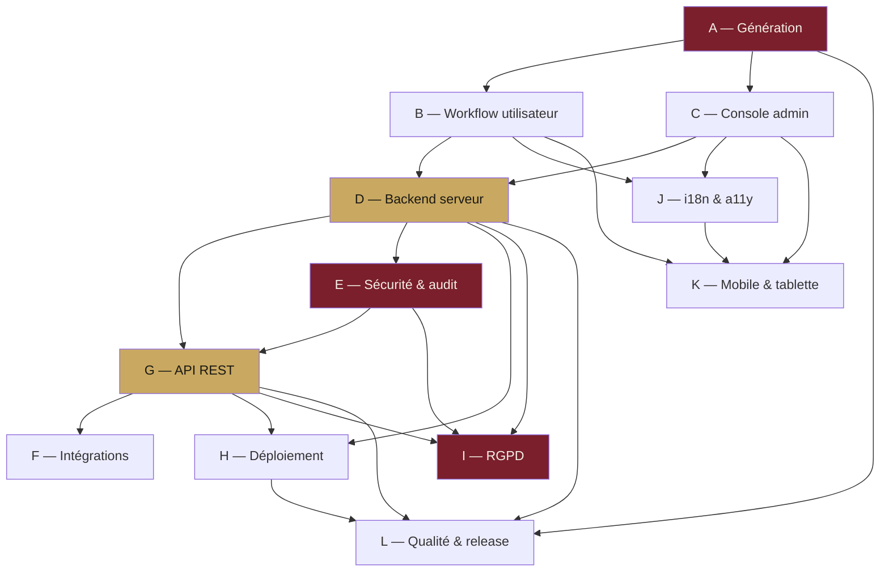

# PRD — SealKeeper

**Statut global** : ✓ figé en v1.0 (12 modules validés le 16 mai 2026)
**Dernière mise à jour** : 2026-05-16
**Mainteneur** : Pascal-Louis Darmon

---

## Qu'est-ce que ce dossier ?

Ce dossier contient le **Product Requirements Document (PRD)** complet de SealKeeper, organisé en 12 modules fonctionnels. C'est la **référence canonique** pour toute décision d'implémentation : les modules suivants sont la spécification que le code Go doit honorer.

Chaque module est un fichier Markdown autonome. La méthode, l'ordre de production et les dépendances sont consignés dans [`00-work-plan.md`](./00-work-plan.md).

---

## Index des 12 modules

| Module | Domaine | Statut | Lignes | FR | Décisions |
|---|---|---|---:|---:|---:|
| [A — Génération](./A-generation.md) | Algorithmes G1/G2/G3, transformations, calcul d'entropie, bundle JS navigateur | ✓ v1.0 | 393 | 25 | 8 |
| [B — Workflow utilisateur](./B-user-workflow.md) | Page publique, email, révélation, clipboard auto-purge, single-use link | ✓ v1.0 | 375 | 41 | 17 |
| [C — Console admin](./C-admin-console.md) | Auth admin, domaines, policies, élévations, bibliothèques, SMTP, branding | ✓ v1.0 | 532 | 99 | 27 |
| [D — Backend serveur](./D-backend.md) | Architecture Go, schéma DB, sessions, healthchecks, métriques, CLI | ✓ v1.0 | 424 | 81 | 25 |
| [E — Sécurité & audit](./E-security-audit.md) | Threat model STRIDE, HMAC audit, headers HTTP, anti-énumération | ✓ v1.0 | 436 | 75 | 24 |
| [F — Intégrations](./F-integrations.md) | Syslog 5424, Webhook JSON, Splunk HEC, Sentinel, Elastic, Grafana | ✓ v1.0 | 421 | 69 | 25 |
| [G — API REST](./G-api-rest.md) | 68 endpoints catalogués, OpenAPI 3.1, RFC 7807 Problem Details | ✓ v1.0 | 584 | 97 | 25 |
| [H — Déploiement](./H-deployment.md) | Modes eval / Docker Compose / Kubernetes, Helm chart, backup/restore | ✓ v1.0 | 508 | 82 | 24 |
| [I — RGPD & conformité](./I-rgpd-compliance.md) | Cartographie art. 30, droits 15-22, pseudonymisation art. 17.3.b, export DPO | ✓ v1.0 | 438 | 85 | 25 |
| [J — i18n & accessibilité](./J-i18n-accessibility.md) | FR/EN bundled, ICU MessageFormat, RGAA AA, synthèse vocale | ✓ v1.0 | 394 | 71 | 24 |
| [K — Mobile & tablette](./K-mobile-tablet.md) | Mobile-first, tap 44+ px, Web Vitals, console admin réduite smartphone | ✓ v1.0 | 401 | 75 | 24 |
| [L — Qualité & release](./L-quality-release.md) | Tests Go + JS + E2E, CI GitHub Actions, SLSA niveau 2, cosign | ✓ v1.0 | 397 | 78 | 24 |
| **Total** | | | **5 303** | **878** | **272** |

---

## Ordre de lecture recommandé selon profil

### Pour un développeur Go arrivant sur le projet

1. [`00-work-plan.md`](./00-work-plan.md) — vue d'ensemble, dépendances entre modules
2. [`A-generation.md`](./A-generation.md) — l'algorithme central
3. [`D-backend.md`](./D-backend.md) — architecture serveur
4. [`G-api-rest.md`](./G-api-rest.md) — contrat API
5. [`L-quality-release.md`](./L-quality-release.md) — comment contribuer

### Pour un évaluateur sécurité ou RSSI

1. [`E-security-audit.md`](./E-security-audit.md) — threat model, posture défensive
2. [`A-generation.md`](./A-generation.md) — pourquoi la génération navigateur est zero-knowledge
3. [`I-rgpd-compliance.md`](./I-rgpd-compliance.md) — RGPD intégral
4. [`H-deployment.md`](./H-deployment.md) — sécurité du déploiement
5. [`L-quality-release.md`](./L-quality-release.md) — SAST, SBOM, signing

### Pour un DPO ou juriste

1. [`I-rgpd-compliance.md`](./I-rgpd-compliance.md) — RGPD complet, articles 30, 13-22, 17.3.b, 28, 32, 33-34, chapitre V
2. [`E-security-audit.md`](./E-security-audit.md) — sécurité du traitement (art. 32)
3. [`F-integrations.md`](./F-integrations.md) — sous-traitants potentiels (SIEM)
4. [`B-user-workflow.md`](./B-user-workflow.md) — information utilisateur, anti-énumération

### Pour un designer ou UX

1. [`B-user-workflow.md`](./B-user-workflow.md) — workflow utilisateur final
2. [`C-admin-console.md`](./C-admin-console.md) — console admin
3. [`J-i18n-accessibility.md`](./J-i18n-accessibility.md) — i18n + a11y RGAA AA
4. [`K-mobile-tablet.md`](./K-mobile-tablet.md) — responsive, performance mobile

### Pour un DevOps ou SRE

1. [`H-deployment.md`](./H-deployment.md) — modes de déploiement, Helm, K8s
2. [`F-integrations.md`](./F-integrations.md) — intégrations SIEM, Prometheus, Grafana
3. [`D-backend.md`](./D-backend.md) — config, healthchecks, métriques
4. [`L-quality-release.md`](./L-quality-release.md) — CI/CD, release process

---

## Graphe de dépendances entre modules

**Modules fondateurs** (en sombre) : A (algorithme), E (sécurité), I (conformité).
**Modules pivots techniques** (en doré) : D (backend), G (API).

---

## Méthodologie de spécification

Chaque PRD module suit la même structure répétable :

1. **Purpose** — pourquoi ce module existe
2. **Actors and use cases** — qui interagit avec ce module
3. **Functional requirements** — FR numérotées (FR-X.1, FR-X.2, ...) avec niveau MUST / SHOULD / MAY / 📋 vN
4. **Non-functional requirements** — performance, sécurité, accessibilité
5. **Data model** — schémas, structures, diagrammes Mermaid
6. **Interfaces** — UI mockups, contrats API, événements
7. **Edge cases and error handling** — cas limites
8. **Closed decisions** — décisions architecturales avec justification (D-X.1, D-X.2, ...)
9. **Open questions** — décisions en attente (vide en v1.0)
10. **References** — modules dépendants, RFC, normes, articles RGPD
11. **Évolution de ce document** — changelog

**Niveaux d'exigence.**

- **MUST** — exigence bloquante pour la release
- **SHOULD** — exigence recommandée, peut être tradeoff motivé
- **MAY** — optionnel, à l'appréciation du contributeur
- **📋 v0.2, v0.3, v0.4+** — reporté à une version ultérieure

**Décisions architecturales.** Les décisions importantes (D-X.N) sont consignées dans chaque module avec justification, et reflètent un consensus auteur (Pascal-Louis Darmon) — Daneel (Claude) au 16 mai 2026.

---

## Bilan de la spécification

- **5 303 lignes** de spécification
- **878 exigences fonctionnelles** numérotées
- **272 décisions architecturales** documentées avec justification
- **~30 diagrammes Mermaid** (architecture, séquences, workflows, ER, déploiement, CI/CD)
- **12 modules autonomes** avec dépendances explicites

**Standards visés** :
- ANSSI B1 / B2 / B3 (force des mots de passe)
- OWASP ASVS 4.0 niveau 2
- RGAA 4.1 AA / WCAG 2.1 AA
- Lighthouse Mobile ≥ 90
- SLSA niveau 2 dès v0.1, niveau 3 visé v0.3
- RGPD UE 2016/679 (couverture intégrale applicable au logiciel)
- AGPL v3 (licence du produit)

---

## Comment proposer une modification du PRD

Le PRD est **versionné avec le code** dans le repo. Toute modification suit le processus standard :

1. Ouvrir une **issue** sur GitHub décrivant le besoin de modification
2. Discussion technique → décision (consigner en `adr/` si décision majeure)
3. **Pull Request** modifiant le ou les PRD concernés
4. Incrémenter la version du PRD module : `1.0` → `1.1` (modification mineure), `2.0` (refonte)
5. Mettre à jour le changelog §11 du module
6. Revue + merge
7. Implémentation Go suit

**Pas de modification de PRD sans PR.** Le PRD est un document vivant mais traçable.

---

## Liens utiles

- [Plan de travail détaillé](./00-work-plan.md) — méthode, ordre, calendrier
- [Site SealKeeper](https://sealkeeper.eu) — présentation publique
- [Repo GitHub](https://github.com/sched75/sealkeeper) — code source
- [SECURITY.md](../../SECURITY.md) — politique de divulgation responsable
- [CONTRIBUTING.md](../../CONTRIBUTING.md) — guide contributeur
- [CHANGELOG.md](../../CHANGELOG.md) — historique des releases

---

*PRD co-rédigé par Pascal-Louis Darmon et Daneel (Claude / Anthropic) le 16 mai 2026.*
*Distribué sous la licence AGPL v3 du projet SealKeeper.*
